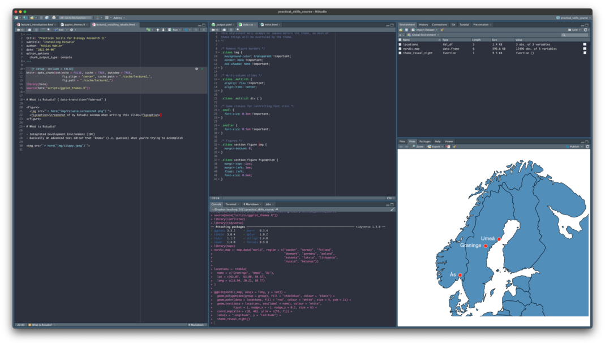
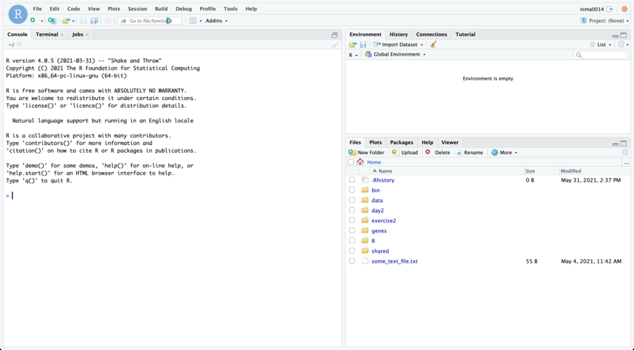
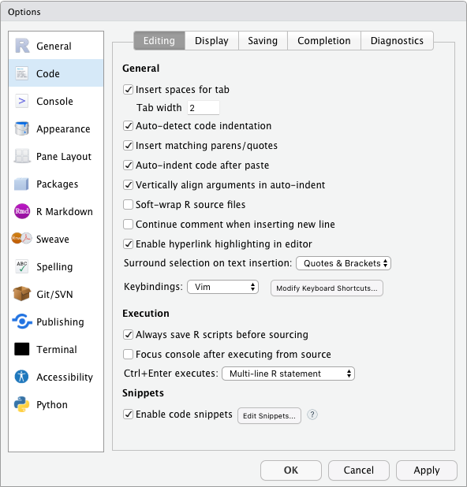

```{r setup, include = FALSE}
source(here::here("scripts/setup.R"))
setup_presentation("rstudio")
```

# What is RStudio?

- Integrated Development Environment (IDE)
- Basically an advanced text editor that knows
  - The languague you are writing in
  - Can run the code that you write, interactively
  - Can display any plots that you generate
  - Can display help for any functions in the language
  - And much, much more

---

# What is RStudio?

.figure.center[

.caption[
Screenshot of my Rstudio window when writing this slide
]]

---

# What is RStudio?

- Open source
- Freely available
  - Also commercial options available
- RStudio doesn't come with R; it has to be installed separately

---

# Install RStudio

- Main website: <https://www.rstudio.com/>

Go to <https://www.rstudio.com/products/rstudio/download/#download> and download the installer for your platform, run it and follow the instructions.

---

# Interface

.center[]

---

# Interface

.overlay-container.center[


<!-- <svg class="overlay" viewBox="-1 -1 162 92"> -->
<!-- <rect y="6" width="85" height="83" fill="transparent" stroke="red"> -->
<!-- </svg> -->
]

.center[Console]
.small.center[Where you can type commands interactively]

---

# Interface

.overlay-container.center[


<!-- <svg class="overlay" viewBox="-1 -1 162 92"> -->
<!-- <rect x="87" y="6" width="73" height="27" fill="transparent" stroke="red"> -->
<!-- </svg> -->
]

.center[Environment]
.small.center[Variables that have been defined in your session]

---

# Interface

.overlay-container.center[


<!-- <svg class="overlay" viewBox="-1 -1 162 92"> -->
<!-- <rect x="87" y="34" width="73" height="55" fill="transparent" stroke="red"> -->
<!-- </svg> -->
]

.center[Files]
.small.center[File system navigator]

---

# Customising RStudio

.pull-left[
RStudio is very customisable, both when it comes to appearances and function.
Take some time to set it up to your liking.

- Default panes
- Pane locations
- Editor behaviour
- Interface colours
- Syntax highlighting
]

.pull-right[

]

???

You might not know now what you like, but that's hopefully something that you will get a better idea of throughout the course.