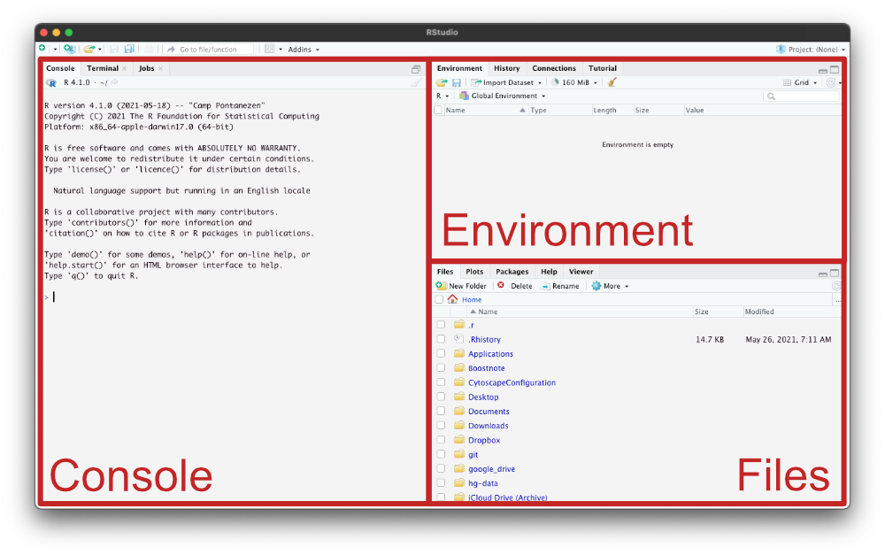

layout: true

```{r setup, echo = FALSE, message = FALSE, warning = FALSE}
source(here::here("scripts/setup.R"))
setup_presentation("rstudio", filename = "03_rstudio.Rmd")
```

---

# What is RStudio?

- Integrated Development Environment (IDE)
- Basically an advanced text editor that knows
  - The language you are writing in
  - Can run the code that you write, interactively
  - Can display any plots that you generate
  - Can display help for any functions in the language
  - And much, much more

---

# What is RStudio?

.figure.center[

.caption[
Screenshot of my Rstudio window when writing this slide
]]

---

# What is RStudio?

- Open source
- Freely available
  - Also commercial options available
- RStudio doesn't come with R; it has to be installed separately

---

# Install RStudio

- Main website: <https://www.rstudio.com/>

Go to <https://www.rstudio.com/products/rstudio/download/#download> and download the installer for your platform, run it and follow the instructions.

---

# Interface

.center[]

---

# Interface

.overlay-container.center[

]

.center[Console]
.small.center[Where you can type commands interactively]

---

# Interface

.overlay-container.center[

]

.center[Environment]
.small.center[Variables that have been defined in your session]

---

# Interface

.overlay-container.center[

]

.center[Files]
.small.center[File system navigator]

???

There are many more panes in RStudio, and we'll talk about these as we get to them in the coming weeks.

---

# Customising RStudio

.pull-left[
RStudio is very customisable, both when it comes to appearances and function.
Take some time to set it up to your liking.

- Default panes
- Pane locations
- Editor behaviour
- Interface colours
- Syntax highlighting
]

.pull-right[

]

???

You might not know now what you like, but that's hopefully something that you will get a better idea of throughout the course.

---

# Some useful defaults

.center[

]

???

By not saving the workspace when we exit, and not loading any workspace by default, we will save ourselves some headaches.
In short, this means that RStudio won't save your entire session — and it can become **big** — to disk, and that it won't try to load any existing workspaces.
This will lead to less clutter, and fewer headaches.

---

# Suggested reading

- [Chapter 1 in R for Data Science](https://r4ds.had.co.nz/introduction.html)
- After having installed R and RStudio, type `help.start()` in the console and click "An Introduction to R".
  - This is a massive document with *a lot* of information. Skim whatever parts you find interesting, but mostly just know that this document exists.