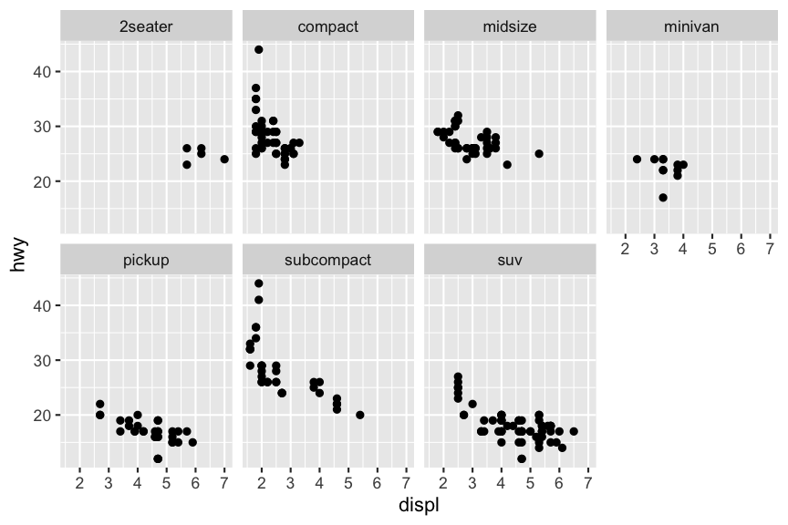
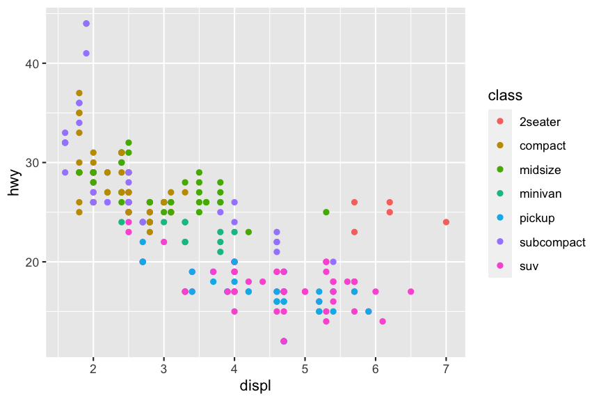
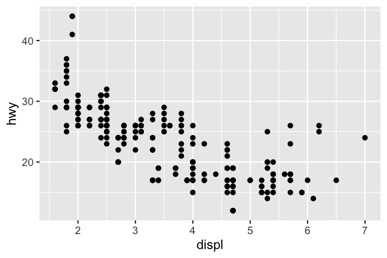

```{r setup, include = FALSE}
source(here::here("scripts/setup.R"))
setup_presentation("data_visualisation_with_ggplot2")
```

# ggplot2

.pull-left[
An R package for creating graphics in a declarative fashion.

Based on the Grammar of Graphics, which we will talk more about next week.

Useful both for quickly visualising a dataset for exploratory purposes, but also produces publication-quality figures.

It is possible to create graphics using the base functionality of R, but this has a very steep learning curve, and requires a lot of fiddling.
This is something that we will not go over.
]

.pull-right.left[

]

---

# Prerequisites

We need to install the ggplot2 package before we can start using it.

```{r install_ggplot2, eval = FALSE}
install.packages("ggplot2")
```

An R package is an extension of the base R language, and something that we will talk more about next week.

---

# A basic example

.left-column[
## The data
]

.right-column[
`mpg` is an example dataset included in the ggplot2 package that contains fuel efficiency data for a number of cars.

.small[
```{r mpg_data, re}
mpg
```
]

.note.yellow[
`r icons::icon_style(icons::fontawesome("lightbulb"), scale = 2)`
You can get more information about the `mpg` data by running the command `?mpg` in the console.
]
]

---

# A basic example

.left-column[
## The data
## The plot
]

.right-column[
```{r basic_plot}
library(ggplot2)
ggplot(data = mpg) +
  geom_point(mapping = aes(x = displ, y = hwy))
```
]

---

# A basic example

.left-column[
## The data
## The plot
## The library call
]

.right-column[
```{r basic_plot_library, eval = FALSE}
library(ggplot2) #<<
ggplot(data = mpg) +
  geom_point(mapping = aes(x = displ, y = hwy))
```

Loads the ggplot2 package.
This we only have to do once in each session.
]

---

# A basic example

.left-column[
## The data
## The plot
## The library call
## The initialisation
]

.right-column[
```{r basic_plot_init, eval = FALSE, fig.height = 3, fig.width = 4.5}
library(ggplot2)
ggplot(data = mpg) + #<<
  geom_point(mapping = aes(x = displ, y = hwy))
```

Initialises an empty plot using the `mpg` data.

```{r basic_plot_init2, echo = FALSE, fig.height = 3, fig.width = 4.5}
ggplot(data = mpg)
```

]

---

# A basic example

.left-column[
## The data
## The plot
## The library call
## The initialisation
## The points
]

.right-column[
```{r basic_plot_points, eval = FALSE, fig.height = 3, fig.width = 4.5}
library(ggplot2)
ggplot(data = mpg) +
  geom_point(mapping = aes(x = displ, y = hwy)) #<<
```

Add a layer of points to the plot.
The `aes` (aestethics) maps variables in our data to properties of the plot, and here we set the variable `displ` (engine displacement in litres) as our x-variable and `hwy` (miles per gallon on highway) as our y-variable.

```{r basic_plot_points2, echo = FALSE, fig.height = 3, fig.width = 4.5}
ggplot(data = mpg) +
  geom_point(mapping = aes(x = displ, y = hwy))
```
]

---

# A general scheme

.big[
```{r, eval = FALSE}
ggplot(data = <DATA>) +
  <GEOM_FUNCTION>(mapping = aes(<MAPPINGS>))
```
]

- `<DATA>`: A data frame with the data we want to visualise
- `<GEOM_FUNCTION>`: The graphical layer that will represent our data
- `<MAPPINGS>`: Mappings between the data and the aesthetics of the plot

---

# Aesthetic mappings

.left-column[
## What are they?
]

.right-column[
Associations between the data and the visual properties (aesthetics) of the plot.

Different geoms have different aesthetics that are required to be set:

- `geom_point`: `x`, `y`
- `geom_histogram`: `x`
- `geom_segment`: `x`, `xend`, `y`, `yend`

.pull-left[
```{r aesthetic_example_df, echo = FALSE}
set.seed(1234)
d <- tibble(var1 = seq(5),
            var2 = var1 + rnorm(5))
d
```
]

.pull-right[
```{r aestetic_example_plot, echo = FALSE}
ggplot(d) +
  geom_segment(data = d %>% slice(3),
               aes(x = 0, xend = var1, y = var2, yend = var2),
               colour = "steelblue", lwd = 1,
               arrow = arrow(angle = 20,
                             length = unit(0.2, "in"),
                             type = "closed")) +
  geom_segment(data = d %>% slice(3),
               aes(x = var1, xend = var1, y = 0, yend = var2),
               colour = "forestgreen", lwd = 1,
               arrow = arrow(angle = 20,
                             length = unit(0.2, "in"),
                             type = "closed")) +
  geom_text(data = d %>% slice(3),
            aes(x = var1, y = var2 / 2),
            label = "y", nudge_x = 0.25,
            size = 12, colour = "forestgreen") +
  geom_text(data = d %>% slice(3),
            aes(x = var1 / 2, y = var2),
            label = "x", nudge_y = 0.5,
            size = 12, colour = "steelblue") +
  geom_point(aes(var1, var2))
```
]
]

---

# Aesthetic mappings

.left-column[
## What are they?
## Types of aesthetics
]

.right-column[
- Positions (`x`, `y`, ...)
- Outline colour (`colour`)
- Fill colour (`fill`)
- Shape (`shape`)
- Transparency (`alpha`)
- Size (`size`)

The specific geom_function that is used will determine exactly which ones are available and how they will behave.

.note.yellow[
`r icons::icon_style(icons::fontawesome("lightbulb"), scale = 2)`
For aesthetics that have different spelling in British English compared to American English (e.g. `colour` and `color`), both variants are available, so you can choose whichever style you prefer.
]
]

---

# Aesthetic mappings

.left-column[
## What are they?
## Types of aesthetics
## Multiple aesthetics
]

.right-column[
```{r multiple_aes}
ggplot(data = mpg) +
  geom_point(mapping = aes(x = displ, y = hwy,
                           colour = class))
```
]
  
---

# Aesthetic mappings

.left-column[
## What are they?
## Types of aesthetics
## Multiple aesthetics
]

.right-column[
```{r multiple_aes2}
ggplot(data = mpg) +
  geom_point(mapping = aes(x = displ, y = hwy,
                           colour = class,
                           shape = drv))
```
]
  
---

# Aesthetic mappings

.left-column[
## What are they?
## Types of aesthetics
## Multiple aesthetics
]

.right-column[
```{r multiple_aes3, eval = FALSE}
ggplot(data = mpg) +
  geom_point(mapping = aes(x = displ, y = hwy,
                           colour = class,
                           shape = drv))
```

```{r multiple_aes4, echo = FALSE}
ggplot(data = mpg) +
  geom_point(mapping = aes(x = displ, y = hwy,
                           colour = class,
                           shape = drv)) +
  geom_point(data = mpg %>% slice(36),
             mapping = aes(x = displ, y = hwy),
             pch = 1, size = 5, colour = "red", stroke = 2)
```

.small[
```{r multiple_aes_data, echo = FALSE}
mpg %>% slice(36) %>% knitr::kable()
```
]
]

---

# Aesthetic mappings

.left-column[
## What are they?
## Types of aesthetics
## Multiple aesthetics
## Manual aesthetics
]

.right-column[
Aesthetics can also be set manually by declaring them *outside* of the `aes` call.

```{r manual_aes}
ggplot(data = mpg) +
  geom_point(mapping = aes(x = displ, y = hwy), colour = "blue")
```
]

---

# Aesthetic mappings

.left-column[
## What are they?
## Types of aesthetics
## Multiple aesthetics
## Manual aesthetics
]

.right-column[
.note.red[
`r icons::icon_style(icons::fontawesome("exclamation-triangle"), scale = 2)`
A common mistake when trying to set aesthetics manually is to put these *inside* the `aes` call.
This will result in ggplot2 interpreting this as a constant related to the dataset, and apply this to all rows, and then set the scales for this aesthetic automatically.
]

```{r manual_aes2}
ggplot(data = mpg) +
  geom_point(mapping = aes(x = displ, y = hwy, colour = "blue"))
```
]

---

# Aesthetic mappings

.left-column[
## What are they?
## Types of aesthetics
## Multiple aesthetics
## Manual aesthetics
## Summary
]

.right-column[
When mapping a variable to an aesthetic, ggplot2 takes care of everything else: setting an appropriate scale and sets up a legend.

Very flexible system for quickly visualising structure in your data. If a variable exists in your dataset, it can be mapped to an aesthetic.

What if a variable that you are interested in is not in the dataset?
We will get to ways of solving this next week.
]

---

# Manual aesthetics

.left-column[
## Points
]

.right-column[
```{r point_types, echo = FALSE, fig.height = 5, fig.widht = 5}
tibble(x = seq(25)) %>% 
  ggplot(aes(x = 0, y = 0)) +
  facet_wrap(vars(x)) +
  geom_point(pch = seq(25), colour = "black", fill = "red", size = 5) +
  theme(axis.title = element_blank(),
        axis.text = element_blank(),
        axis.ticks = element_blank(),
        plot.background = element_blank(),
        panel.background = element_blank(),
        panel.grid = element_blank(),
        strip.text = element_text(size = 12))
```

Some points only have outlines (1&ndash;14), some are solid (15&ndash;20), and some have separate stroke and fill colours (21&ndash;25).
]

---

# Manual aesthetics

.left-column[
## Points
## Lines
]

.right-column[
```{r line_types, echo = FALSE, fig.height = 3, fig.widht = 5}
tibble(x = seq(6)) %>% 
  ggplot() +
  facet_wrap(vars(x)) +
  geom_segment(aes(x = 0, xend = 1, y = 0, yend = 0),
               lty = seq(6), size = 2) +
  theme(axis.title = element_blank(),
        axis.text = element_blank(),
        axis.ticks = element_blank(),
        plot.background = element_blank(),
        panel.background = element_blank(),
        panel.grid = element_blank(),
        strip.text = element_text(size = 12))
```
]

---

# Manual aesthetics

.left-column[
## Points
## Lines
## Colours
]

.right-column[
```{r colours_fn_call, eval = FALSE}
colours()
```

```{r colours, echo = FALSE, fig.height = 15, fig.width = 15, cache = TRUE}
tibble(x = factor(colours(), levels = colours())) %>% 
  ggplot() +
  facet_wrap(vars(x)) +
  geom_tile(aes(x = 0, y = 0, width = 1, height = 1), fill = colours()) +
  theme(axis.title = element_blank(),
        axis.text = element_blank(),
        axis.ticks = element_blank(),
        plot.background = element_blank(),
        panel.background = element_blank(),
        panel.grid = element_blank(),
        strip.text = element_text(size = 12))
```
]

---

# Manual aesthetics

.left-column[
## Points
## Lines
## Colours
]

.right-column[
Colours can also be specified using the `rgb` function, which generates a hexidecimal colour value.

```{r rgb}
rgb(0.8, 0.3, 0.1)
```

If you are fluent in hexadecimal, you can also specify colours directly as such.

```{r rgb_plot, fig.height = 3, fig.width = 4}
ggplot(data = mpg) +
  geom_point(mapping = aes(x = displ, y = hwy), colour = "#CC4D1A")
```
]

---

# Facets

.left-column[
## What are they?
]

.right-column[
Another way of mapping variable to aesthetics is by using facets.
This is based on the concept of ["small multiples"](https://en.wikipedia.org/wiki/Small_multiple): many panels of a figure that share scales and axes, allowing for easy comparison.

.center[]

.smaller.center[
The Horse in Motion &mdash; Eadweard Muybridge, 1878
]
]

???

The Horse in Motion is probably one of the oldest examples of the concept of small multiples.

---

# Facets

.left-column[
## What are they?
## `facet_wrap`
]

.right-column[
When we have single categorical variable with many different values that we want to facet on, we generally use `facet_wrap`.
This will create one sub-plot for each level of the faceting variable.

```{r facet_example}
ggplot(data = mpg) +
  facet_wrap(facets = vars(class), nrow = 2) +
  geom_point(mapping = aes(x = displ, y = hwy))
```
]

---

# Facets

.left-column[
## What are they?
## `facet_wrap`
]

.right-column[
Compare these two versions.
They are visualising the same relationship (engine size vs fuel efficiency), and they are grouped by the class of car.
The difference is that one uses facets, and the other uses colour.
Which one is easier to read?

.pull-left[

]

.pull-right[

]
]

---

# Facets

.left-column[
## What are they?
## `facet_wrap`
## `facet_grid`
]

.right-column[
If we instead have two categorical variables that should be faceted, we can use `facet_grid`.
One variable will then represent the rows and the other the columns.

```{r facet_grid_example}
ggplot(data = mpg) +
  facet_grid(rows = vars(drv), cols = vars(cyl)) +
  geom_point(mapping = aes(x = displ, y = hwy))
```
]

???

Here we have the `drv` variable, the type of drivetrain of the cars, as rows and the number of cylinders representing the columns.
Note that all facets have the same scales.

What do you think it means if a facet is empty?

---

# Geometric objects

???

So far we have talked about how we can map different variables to aesthetics in our plot, but we've only looked at scatter plots, i.e. points, so far.
What if we want to represent our data differently?

--

.pull-left[
.center[
```{r, echo = FALSE}
knitr::include_graphics("figures/data_visualisation_with_ggplot2_basic_plot-1.png", dpi = 192)
```
]
]

???

Consider this figure, that we now have seen a few times.

--

.pull-right[
.center[
```{r smooth_geom_example, echo = FALSE, fig.show = 'asis'}
ggplot(data = mpg) +
  geom_smooth(mapping = aes(x = displ, y = hwy))
```
]
]

???

And now consider this.
The underlying data and the variables on the axes are the same, but they look quite different.
The reason for this is that they are using different geoms.

--

.pull-left.center[
`geom_point`
]

--

.pull-right.center[
`geom_smooth`
]

---

# Geometric objects

.left-column[
## What are they?
]

.right-column[
The geometrical object that is used to represent the underlying data.

Every geom function takes a `mapping` argument, but the aesthetics that you can set vary between them.
For example, you can set the shape for `geom_point`, but that wouldn't make sense for `geom_line`.
]

--

.right-column[
Geoms roughly correspond to the type of plot we want to create:

- Scatter plot: `geom_point`
- Line plot: `geom_line`
- Histogram: `geom_histogram`
- Boxplot: `geom_boxplot`
]

--

.right-column[
The [ggplot2 cheat sheet](https://www.rstudio.com/resources/cheatsheets/) is a great way of getting an overview of the over 40 geoms that are available.
]

--

.right-column[
.note.yellow[
`r icons::icon_style(icons::fontawesome("lightbulb"), scale = 2)`
You can use the help to get more information about a certain geom: `?geom_smooth`.
]
]

---

# Geometric objects

.left-column[
## What are they?
## Aesthetics
]

.right-column[
Many geoms, such as `geom_smooth`, uses a single geometric object to visualise multiple observations.
Setting an aesthetic such as linetype for `geom_smooth` to a categorical variable will create a geometric object for each level of that variable.

```{r geom_smooth_aes, fig.show = "hold", out.width = "50%"}
ggplot(data = mpg) +
  geom_smooth(mapping = aes(x = displ, y = hwy, linetype = drv))

ggplot(data = mpg) +
  geom_smooth(mapping = aes(x = displ, y = hwy, colour = drv))
```
]

---

# Geometric objects

.left-column[
## What are they?
## Aesthetics
## Grouping
]

.right-column[
An aesthetic that can be useful for these types of geoms is `group`.
This will group observations according to a categorical variable, but not change any other aesthetic for those groups, and it will thus not create a legend either.

```{r geom_grouping, fig.show = "hold", out.width = "50%"}
ggplot(data = mpg) +
  geom_smooth(mapping = aes(x = displ, y = hwy, linetype = drv))

ggplot(data = mpg) +
  geom_smooth(mapping = aes(x = displ, y = hwy, group = drv))
```
]

---

# Statistical transformations

.left-column[
## The bar chart
]

.right-column[
Here we introduce a new dataset: `diamonds`.
This contains data on more than 50,000 diamonds.

Here we create a bar chart of the diamond cut qualities.
Notice how we only specify the `x` aesthetic, but still we have a y-axis our figure.
How come?

```{r bar_chart}
ggplot(data = diamonds) +
  geom_bar(mapping = aes(x = cut))
```
]

---

# Statistical transformations

.left-column[
## The bar chart
## `stat_count`
]

.right-column[
By default, `geom_bar` uses a statistical transformation in order to produce the variables needed for the plot.

.held.smaller[
```{r, echo = FALSE, results = 'hold'}
mpg %>%
  group_by(manufacturer) %>%
  slice_head(n = 2) %>%
  head(10) %>% 
  select(manufacturer) %>% 
  knitr::kable()

htmltools::div(icons::icon_style(icons::fontawesome("long-arrow-alt-right"), scale = 3))

mpg %>%
  group_by(manufacturer) %>%
  summarise(count = n()) %>%
  head() %>%
  knitr::kable()

htmltools::div(icons::icon_style(icons::fontawesome("long-arrow-alt-right"), scale = 3))

htmltools::div(htmltools::img(src = "figures/data_visualisation_with_ggplot2_bar_chart-1.png"))
```
]
]

---

# Statistical transformations

.left-column[
## The bar chart
## `stat_count`
## Default stats
]

.right-column[
All geoms perform some type of statistical transformation (`stat`) of the data before plotting it.
For a scatter plot, the transformation function simply returns the values that are supplied.

All geoms have a default `stat`, and all statistical transformations have a default `geom`:

- `geom_point`: `stat_identity`
- `geom_smooth`: `stat_smooth`
- `geom_histogram`: `stat_bin`
- `geom_boxplot`: `stat_boxplot`
- `geom_bar`: `stat_count`

.note.yellow[
`r icons::icon_style(icons::fontawesome("lightbulb"))`
Again, check the help to see what the default `stat` is for a geom, e.g. `?geom_bar`.
]

]

---

# Statistical transformations

.left-column[
## The bar chart
## `stat_count`
## Default stats
]

.right-column[
```{r stat_plotting}
ggplot(data = mpg) +
  stat_identity(mapping = aes(x = displ, y = hwy))
```
]

---

# Positions

.left-column[
## The bar chart again
]

.right-column[
When mapping the fill aesthetic for a bar chart to variable different from the x variable, the chart will by default be stacked.

```{r stacked_bar_chart}
ggplot(data = diamonds) +
  geom_bar(mapping = aes(x = cut, fill = clarity))
```
]

---

# Positions

.left-column[
## The bar chart again
## The position argument
]

.right-column[
We can change this behaviour by modifying the `position` parameter.
Looking at the help page for `geom_bar`, we see that the default is `"stacked"`.
Other possible values for bar charts are `"identity"`, `"dodge"`, and `"fill"`.
]

---

# Positions

.left-column[
## The bar chart again
## The position argument
### `"identity"`
]

.right-column[
```{r bar_chart_position_identity}
ggplot(data = diamonds) +
  geom_bar(mapping = aes(x = cut, fill = clarity),
           position = "identity")
```

.note.yellow[
`r icons::icon_style(icons::fontawesome("lightbulb"), scale = 2)`
Note that the position argument goes *outside* of `aes`.
It is an argument to the geom, not to the mapping.
]
]

---

# Positions

.left-column[
## The bar chart again
## The position argument
### `"identity"`
]

.right-column[
```{r bar_chart_position_identity_alpha}
ggplot(data = diamonds) +
  geom_bar(mapping = aes(x = cut, fill = clarity),
           position = "identity", alpha = 0.2)
```

.note.yellow[
`r icons::icon_style(icons::fontawesome("lightbulb"), scale = 2)`
Note that the position argument goes *outside* of `aes`.
It is an argument to the geom, not to the mapping.
]
]

---

# Positions

.left-column[
## The bar chart again
## The position argument
### `"identity"`
### `"dodge"`
]

.right-column[
```{r bar_chart_position_dodge}
ggplot(data = diamonds) +
  geom_bar(mapping = aes(x = cut, fill = clarity),
           position = "dodge")
```
]

---

# Positions

.left-column[
## The bar chart again
## The position argument
### `"identity"`
### `"dodge"`
### `"fill"`
]

.right-column[
```{r bar_chart_position_fill}
ggplot(data = diamonds) +
  geom_bar(mapping = aes(x = cut, fill = clarity),
           position = "fill")
```
]

---

# Positions

.left-column[
## The bar chart again
## The position argument
### `"identity"`
### `"dodge"`
### `"fill"`
### `"jitter`"
]

.right-column[
A position adjustment that doesn't work for bar charts, but can be useful for scatter plots, is `"jitter"`.
Let's take a look at our previous scatter plot using the `mpg` data.

```{r, echo = FALSE}

```
]

???

If you are really observant, you will see that there are 126 points in this figure...

--

.right-column.small[
```{r}
mpg
```
]

???

while there are 234 observations in the data.

This is something that is referred to as overplotting: several observations having the same value.
The problem with this is that we from this figure can't tell how these are distributed.
Is one combination of values more common than others, or are they evenly spread out?

---

# Positions

.left-column[
## The bar chart again
## The position argument
### `"identity"`
### `"dodge"`
### `"fill"`
### `"jitter`"
]

.right-column[
Adding jitter to the plot will add some noise to each point, and this will help avoid overplotting.
A consequence of this, however, is that the points then don't exaclty represent the underlying data.

```{r geom_point_jitter}
ggplot(data = mpg) +
  geom_point(mapping = aes(x = displ, y = hwy),
             position = "jitter")
```
]

???

While being inaccurate at small scales, it really improves the bigger picture.

---

# Recommended exercises

[R for Data Science: Data visualisation](https://r4ds.had.co.nz/data-visualisation.html)

- [3.2.4 First steps](https://r4ds.had.co.nz/data-visualisation.html#exercises)
- [3.3.1 Aesthetic mappings](https://r4ds.had.co.nz/data-visualisation.html#exercises-1)
- [3.5.1 Facets](https://r4ds.had.co.nz/data-visualisation.html#exercises-2)
- [3.6.1 Geometric objects](https://r4ds.had.co.nz/data-visualisation.html#exercises-3)
- [3.7.1 Statistical transformations](https://r4ds.had.co.nz/data-visualisation.html#exercises-4)
- [3.8.1 Position adjustments](https://r4ds.had.co.nz/data-visualisation.html#exercises-5)

???

The content of this lecture was heavily inspired by this chapter of the book, so you will likely recognise quite a few things.