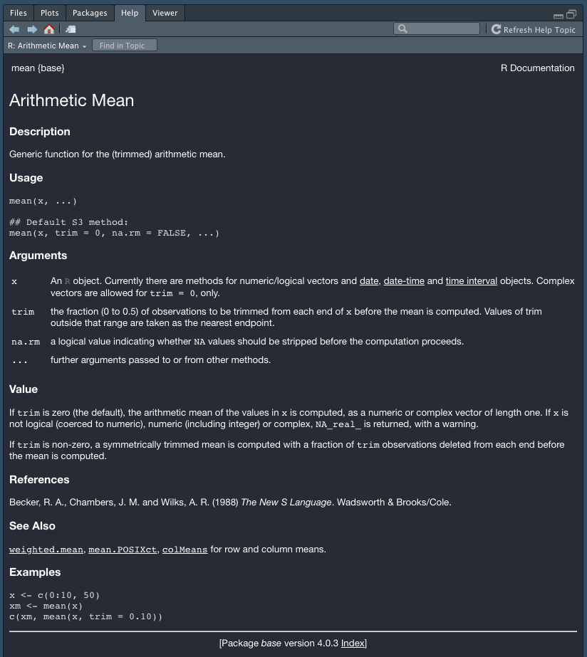

```{r setup, include = FALSE}
source(here::here("scripts/setup.R"))
setup_presentation("how_to_get_help")
```

# Learning goals

- How to find help for R functions
- How to find package documentation

---

# Getting help

We've already seen that we can use `?` to get help:

```{r, eval = FALSE}
?mean
```



---

# Anatomy of a help page

.left-column[
## Header
]

.right-column[
.note.midnight.midnight[
mean {base}

## Arithmetic Mean
]
]

???

I will go over some of the most common sections that can be found on these help pages.
Sometimes you might not find all of these, and sometimes you might find other sections that describes the functionality in more detail.

First you will have the name of the function.
Sometimes, multiple functions are documented on the same page.
Then this will either be the name of one of the functions on that page, or just a short name related to the contents.

Inside the curly braces is the name of the package where this function is found.

---

# Anatomy of a help page

.left-column[
## Header
## Description
]

.right-column[
Name of the function and package together with the title of the help page.

.note.midnight[
### Description

Generic function for the (trimmed) arithmetic mean.
]
]

---

# Anatomy of a help page

.left-column[
## Header
## Description
## Usage
]

.right-column[
Short description of how to call the function, its parameters and defaults.

.note.midnight[
### Usage

```
mean(x, ...)

## Default S3 method:
mean(x, trim = 0, na.rm = FALSE, ...)
```
]
]

---

# Anatomy of a help page

.left-column[
## Header
## Description
## Usage
## Arguments
]

.right-column[
Detailed description of the arguments of the function.

.note.midnight[
### Arguments

```{r help_arguments, echo = FALSE}
tags$div(
  tags$div(
    class = "row",
    style = "display: flex; margin-top: 0.5em;",
    tags$div(
      tags$code("x"),
      style = "min-width: 30%;"
    ),
    tags$div(
      tags$p(
        "An", tags$code("R"), "Object. Currently there are methods for numeric/logical vectors and date, date-time and time interval objects. Complex vectors are allowed for ", tags$code("trim = 0"), ", only.",
        style = "margin: 0;")
    )
  ),
  tags$div(
    class = "row",
    style = "display: flex; margin-top: 0.5em;",
    tags$div(
      tags$code("trim"),
      style = "min-width: 30%;"
    ),
    tags$div(
      tags$p(
        "the fraction (0 to 0.5) of observations to be trimmed from each end of ", tags$code("x"), " before the mean is computed. Values of trim outside that range are taken as the nearest endpoint.",
        style = "margin: 0;")
    )
  ),
  tags$div(
    class = "row",
    style = "display: flex; margin-top: 0.5em;",
    tags$div(
      tags$code("na.rm"),
      style = "min-width: 30%;"
    ),
    tags$div(
      tags$p(
        "a logical value indicating whether ", tags$code("NA"), " values should be stripped before the computation proceeds.",
        style = "margin: 0;")
    )
  ),
  tags$div(
    class = "row",
    style = "display: flex; margin: 0.5em 0;",
    tags$div(
      tags$code("..."),
      style = "min-width: 30%; margin: 0 0 0.5em 0;"
    ),
    tags$div(
      tags$p(
        "further arguments passed to or from other methods",
        style = "margin: 0 0 0.5em 0;")
    )
  )
)
```
]
]

---

# Anatomy of a help page

.left-column[
## Header
## Description
## Usage
## Arguments
## Details
]

.right-column[
The "Details" section can sometimes give a more detailed explanatio of some of the function arguments.
The `mean` function does not have such a section.
]

---

# Anatomy of a help page

.left-column[
## Header
## Description
## Usage
## Arguments
## Details
## Value
]

.right-column[
The return value of the function

.note.midnight[
### Value

If `trim` is zero (the default), the arithmetic mean of the values in `x` is computed, as a numeric or complex vector of length one. If `x` is not logical (coerced to a numeric), numeric (including integer) or complex, `NA_real_` is returned, with a warning.

If `trim` is non-zero, a symmetrical trimmed mean is computed with a fraction of `trim` observations deleted from each end before the mean is computed.
]
]

---

# Anatomy of a help page

.left-column[
## Header
## Description
## Usage
## Arguments
## Details
## Value
## References
]

.right-column[
Any references related to the implementation, good for diving deeper into the functionality.

.note.midnight[
### References

Becker, R. A., Chambers, J. M. and Wilks, A. R. (1988) *The New S Language*. Wadsworth & Brooks/Cole.
]
]

---

# Anatomy of a help page

.left-column[
## Header
## Description
## Usage
## Arguments
## Details
## Value
## References
## See also
]

.right-column[
Related functions.

.note.midnight[
### See Also

`weighted.mean`, `mean.POSIXct`, `colMeans` for row and column means.
]
]

---

# Anatomy of a help page

.left-column[
## Header
## Description
## Usage
## Arguments
## Details
## Value
## References
## See also
## Examples
]

.right-column[
Examples of how to use the function. Can be copy-pasted into the console.

.note.midnight[
### Examples

```
x <- c(0:10, 50)
xm <- mean(x)
c(xm, mean(x, trim = 0.10))
```
]
]

---

# Getting to the help page

```{r, eval = FALSE}
?mean
```

--

```{r, eval = FALSE}
help(mean)
# ... or
help("mean")
```

--

The following will search for the keyword "mean" among all help pages, regardless whether the package is loaded or not.

```{r, eval = FALSE}
??mean
```

--

In the editor (or in the console), set the caret onto a function call and press <kbd>F1</kbd> on the keyboard.

--

We can also use the graphical user interface to get to the help.
Basically does the same thing as `??`.


---

# Getting to the help page

## Package not loaded

```{r, warning = TRUE}
?pheatmap
```

--

```{r, eval = FALSE}
library(pheatmap) # load the package containing the function
?pheatmap
```

or

```{r, eval = FALSE}
?pheatmap::pheatmap
```


---

# Getting to the help page

## Package not installed

```{r, warning = TRUE, error = TRUE}
?pheatmap
?pheatmap::pheatmap
```

--

```{r, eval = FALSE}
install.packages("pheatmap")
library(pheatmap)
?pheatmap
```

---

# Vignettes

The help pages are useful if you know what function you are after.

A vignette is a longer guide to a package that guides more than the function documentation.

--

List all vignettes:

```{r, eval = FALSE}
vignette()
```

--

List vignettes for a specific package:

```{r, eval = FALSE}
vignette(package = "ggplot2")
```

--

Open a specific vignette:

```{r, eval = FALSE}
vignette("ggplot2-specs", package = "ggplot2")
```

--

To see the vignette of a package that is not installed, go to its CRAN or Bioconductor page.

---

# CRAN page // ggplot2

```{r, echo = FALSE}
knitr::include_url("https://cran.r-project.org/web/packages/ggplot2/index.html", height = "500px")
```

---

# Bioconductor page // qvalue

```{r, echo = FALSE}
knitr::include_url("https://bioconductor.org/packages/release/bioc/html/qvalue.html", height = "500px")
```


