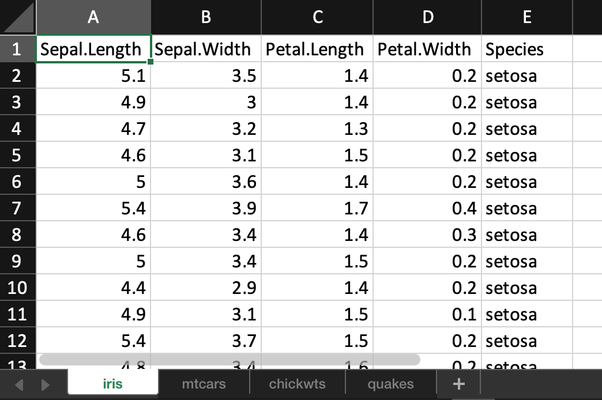
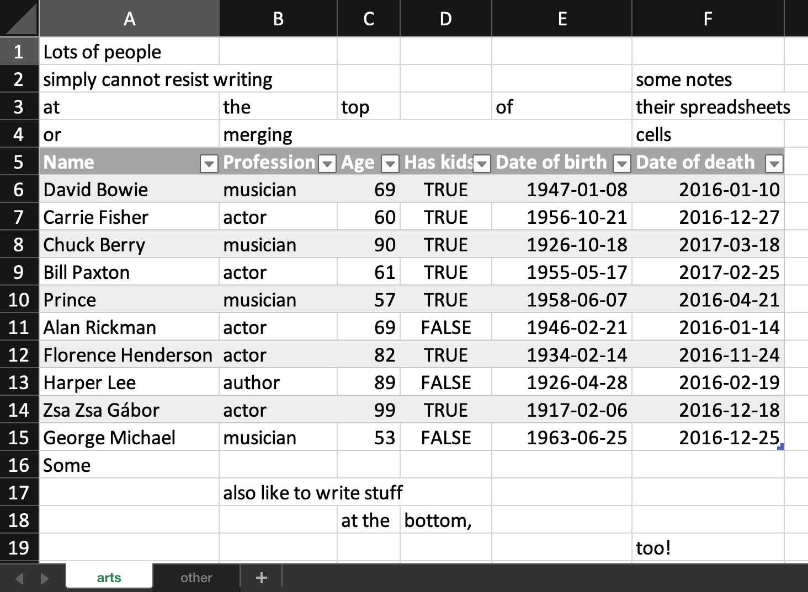

```{r setup, include = FALSE}
source(here::here("scripts/setup.R"))
setup_presentation("loading_data_into_r")
```

# Importing data into R

So far we have looked at how data can look before we load it into R, and how it looks when it is already loaded into R, but how do we actually import the data into R?

Here we will look at two different packages for reading (and writing) data:

- The readr package
- The readxl package

---

# Data formats

.left-column[
## Data formats
]

.right-column[
Data can come in many different formats.
One of the first things we have to consider is whether the data is rectangular or not.
]

---

# Data formats

.left-column[
## Data formats
### Rectangular data
]

.right-column[
Each value is associated with an observation and a variable.
Missing values (`NA`) are allowed.

- Gene expression
- Sequence alignments
- Phenotype data

This is usually what we want to work with, but there exceptions.
]

---

# Data formats

.left-column[
## Data formats
### Rectangular data
### Non-rectangular data
]

.right-column[
Also sometimes referred to as unstructured data.

- Images
- Sounds
- GenBank files
- Data from APIs (Application Programming Interfaces)
  - JSON (Javascript Object Notation)
  - XML (Extensible Markup Language)

We will not go into how to handle these types of data in this course.
]

---

# Data formats

.left-column[
## Data formats
### Rectangular data
### Non-rectangular data
## Flat files
]

.right-column[
While not being a data format in itself, **flat file** is a term that you might come across.
All of the data you will be importing into R will be contained in flat files.
These are files that might have relations within the dataset, or relations to other datasets, but there is nothing in the files themselves that keep track of these relationships.

The opposite of a flat file would be a **structured file**, or a **hierarchical file**, where any relationships are constrained.
A typical example of this would be any proper database management system, such as MySQL, SQLite or MongoDB.
]

---

# File formats

.left-column[
## CSV
]

.right-column[
Comma-separated values (CSV) is a very popular file format for storing and sharing data.
The file format has quite a few siblings that we will introduce soon.
As the name implies, values in the file are separated by commas.

Here's an example of how the first few line of the `flights` data could look as a CSV file:

```{r, echo = FALSE, results = "asis"}
cat("```\n")
cat(format_csv(head(nycflights13::flights)))
cat("...")
cat("\n```")
```
]

---

# File formats

.left-column[
## CSV
]

.right-column[
One caveat with CSV files is that they're not always comma-separated (!).
For example, if you are using Microsoft Excel set up with a Swedish locale, the fields will be separated by semicolons (`;`) instead.
The reason for this is that the comma is used as the decimal point for decimal numbers.
This is quite common throughout Europe, but there are ways around this.

```{r, echo = FALSE, results = "asis"}
cat("```\n")
cat(format_csv2(head(nycflights13::flights)))
cat("...")
cat("\n```")
```
]

---

# File formats

.left-column[
## CSV
## TSV
]

.right-column[
Another very common file format, that is very closely related to CSV, is the tab-separated values (TSV) file format.
As you might guess, the values in this format are separated by tab characters instead of commas.

```{r, echo = FALSE, results = "asis"}
cat("```\n")
cat(format_tsv(head(nycflights13::flights)))
cat("...")
cat("\n```")
```
]

---

# File formats

.left-column[
## CSV
## TSV
## Fixed width
]

.right-column[
A special case of a delimited file is a fixed-width file.
Instead of the fields being separated by a single character (like a comma or a tab), all fields have the same width.

```{r, echo = FALSE, results = "asis"}
cat("```\n")
nycflights13::flights %>% 
  head() %>% 
  mutate(across(everything(), as.character)) %>% 
  add_row(year = "year", month = "month", day = "day", dep_time = "dep_time", 
          sched_dep_time = "sched_dep_time", dep_delay = "dep_delay", arr_time = "arr_time", 
          sched_arr_time = "sched_arr_time", arr_delay = "arr_delay", carrier = "carrier", 
          flight = "flight", tailnum = "tailnum", origin = "origin", dest = "dest", 
          air_time = "air_time", distance = "distance", hour = "hour", 
          minute = "minute", time_hour = "time_hour",
          .before = 1) %>% 
  mutate(across(everything(), format)) %>% 
  format_tsv(col_names = FALSE) %>% 
  cat()
cat("...")
cat("\n```")
```
]

---

# File formats

.left-column[
## CSV
## TSV
## Fixed width
## Excel
]

.right-column[
The file formats we've been looking at so far have all been plain text.
There is also the possibility to import Excel files directly into R.

.note.yellow[
`r note_fa("lightbulb")`
Remember to keep the caveats of formatting in Excel in mind whenever trying to import these types of files.
]
]

---

# A note on file extensions

File extensions, i.e. the last part of the filename (e.g. `.txt`, `.csv`, `.xlsx`), can be useful in order to quickly know what type of file you are dealing with.
However, this is not something that in itself affects the contents of the file.
If you rename `my_data.csv` to `my_data.exe`, R could not care less.
The contents of the file is still the same.

Many operating systems enforce extensions quite strictly, and can sometimes change the way the operating system handles the file, for example what the default program for opening the file should be.

Having said that, using file extensions is a great way of keeping track of what is what, but it is not the be-all and end-all when it comes to the actual format of the file.

---

# readr and readxl

The [readr](https://readr.tidyverse.org) and [readxl](https://readxl.tidyverse.org) packages are both part of the tidyverse, and they contain all functions we need to read all these different file types.
readr is a core member of the tidyverse, so it will be loaded when loading the tidyverse:

```{r, eval = FALSE}
library(tidyverse)
```

readxl is *not* a core member, so this package has to be loaded directly:

```{r, eval = FALSE}
library(readxl)
```


.tile.spaced[]

---

# Importing data

.left-column[
## Introduction
]

.right-column[
Starting with the plain-text formats, the readr package is the first choice for importing.

- `read_csv`: importing CSV files
- `read_csv2`: importing CSV files where comma is used decimal point
- `read_tsv`: importing TSV files
- `read_fwf`: importing fixed-width files

The structure of the functions in the readr package are very similar, so I will focus on `read_csv` and point out where the other functions differ.
]

---

# Importing data

.left-column[
## Introduction
## Filename
]

.right-column[
The first, and single most important argument for `read_csv` is of course the name of the file.

.small[
```{r, message = TRUE}
heights <- read_csv("data/heights.csv")
```
]

Whenever we use the `read_*` functions, a column specification is printed.
This can be very useful to see how the file is interpreted, and to spot any issues with the file format.
]

---

# Importing data

.left-column[
## Introduction
## Filename
## Header
]

.right-column[
Instead of giving a file name, we can also supply an inline CSV file.
This can be useful for demonstrations, testing, or for creating reproducible examples.

```{r}
read_csv("year,month,day,temperature
2021,8,10,19
2021,8,11,22
2021,8,12,16")
```

As you can see, the first row in the file is by default considered the **header** of the file.
These will become the column names in the resulting tibble.
]

---

# Importing data

.left-column[
## Introduction
## Filename
## Header
### No header
]

.right-column[
Sometimes, it might be necessary to modify the default behaviour, for example when there is no header in the data:

```{r}
read_csv("2021,8,10,19
2021,8,11,22
2021,8,12,16")
```
]

---

# Importing data

.left-column[
## Introduction
## Filename
## Header
### No header
]

.right-column[
We can change the behaviour with the `col_names` argument.
By setting it to `FALSE`, column names will be generated for us:

```{r}
read_csv("2021,8,10,19
2021,8,11,22
2021,8,12,16", col_names = FALSE)
```
]

---

# Importing data

.left-column[
## Introduction
## Filename
## Header
### No header
]

.right-column[
We can also specify the names manually:

```{r}
read_csv("2021,8,10,19
2021,8,11,22
2021,8,12,16",
col_names = c("year", "month", "day", "temperature"))
```
]

---

# Importing data

.left-column[
## Introduction
## Filename
## Header
### No header
### Extra metadata
]

.right-column[
It is not uncommon for files to contain extra information before the actual data in the file.
Those lines can be avoided with `skip`.
It takes a number, and that number of lines will be ignored.

```{r}
read_csv("Temperature was measured using a very cheap
thermometer from Clas Ohlson at noon
year,month,day,temperature
2021,8,10,19
2021,8,11,22
2021,8,12,16", skip = 2)
```

]

---

# Importing data

.left-column[
## Introduction
## Filename
## Header
### No header
### Extra metadata
]

.right-column[
Other times, the metadata has the appearence of a comment with the line starting with a special character, typically `#`.
All lines, no matter where they are found in the file, can be ignored with `comment`.

```{r}
read_csv("# Temperature was measured using a very cheap
# thermometer from Clas Ohlson at noon
year,month,day,temperature
2021,8,10,19
2021,8,11,22
# I'm not sure about the next observation...
2021,8,12,16", comment = "#")
```
]

---

# Importing data

.left-column[
## Introduction
## Filename
## Header
### No header
### Extra metadata
### Missing data
]

.right-column[
If missing data is reprsented in the file, we have to make sure that it is also properly represented after being imported.
This can be accomplished with the `na` argument.
By default it considers an empty value or the string `"NA"` to be missing values, but we can use whatever we like.

```{r}
read_csv("year,month,day,temperature
2021,8,10,19
2021,8,11,22
2021,8,12,.", na = ".")
```
]

---

# Importing data

.left-column[
## Introduction
## Filename
## Header
### No header
### Extra metadata
### Missing data
## Excel
]

.right-column[
All the readr functions behave very similarly, but reading Excel data is a little bit different.

.small[
```{r}
library(readxl)
readxl_example("datasets.xlsx")
```
]


]

---

# Importing data

.left-column[
## Introduction
## Filename
## Header
### No header
### Extra metadata
### Missing data
## Excel
]

.right-column[
The main function in the readxl package that we would use is `read_excel`.
]

.right-column.small[
```{r}
xlsx_example <- readxl_example("datasets.xlsx")
read_excel(xlsx_example)
```
]

---

# Importing data

.left-column[
## Introduction
## Filename
## Header
### No header
### Extra metadata
### Missing data
## Excel
### Sheets
]

.right-column[
In Excel, we can have multiple sheets in the same document.
By default, `read_excel` reads the first sheet.
This behaviour we can change by manipulating the `sheet` argument, and we can either give the sheet name, or a number.
]

.right-column.small[
```{r}
read_excel(xlsx_example, sheet = "mtcars")
```
]

.right-column[
We can also list the sheets in a document.

```{r}
excel_sheets(xlsx_example)
```
]

---

# Importing data

.left-column[
## Introduction
## Filename
## Header
### No header
### Extra metadata
### Missing data
## Excel
### Sheets
### Data ranges
]

.right-column[
We can specify a range of cells that should be read.

```{r, eval = FALSE}
readxl_example("deaths.xlsx")
```


]

---

# Importing data

.left-column[
## Introduction
## Filename
## Header
### No header
### Extra metadata
### Missing data
## Excel
### Sheets
### Data ranges
]

.right-column.small[
```{r}
read_excel(readxl_example("deaths.xlsx"), range = "A5:F15")
```
]


---

# Parsing

.left-column[
## Introduction
]

.right-column[
You will inevitably encounter issues at some point when trying to import data into R.
In order to understand what is going wrong, we have to know a little bit of how readr works under the hood.

As you might have noticed in the previous examples, when importing data the types of the columns in the imported data has been determined automatically, even though there is no distinction between a number and a string in a text file.
The process of translating the text in the files to variables with correct types is called **parsing**.

.small[
```{r, message = TRUE}
read_csv("data/heights.csv")
```
]
]

---

# Parsing

.left-column[
## Introduction
## Vector parsing
]

.right-column[
There are a number of functions that readr uses in order to parse data:

- `parse_integer`
- `parse_logical`
- `parse_number`
- `parse_double`
- `parse_character`
- `parse_date`
- `parse_datetime`
- `parse_time`

They all accept a character vector, and from those tries to convert the text to the type the function indicates.
]

---

# Parsing

.left-column[
## Introduction
## Vector parsing
]

.right-column[
```{r}
parse_integer(c("1", "2", "15"))
parse_logical(c("TRUE", "FALSE", "T", "0"))
parse_number(c("1", "3.14", "1e-6"))
parse_date(c("2021-08-10", "1632-11-06", "1986-02-07"))
parse_time(c("13:37", "20:23:15", "9:15 pm"))
```
]

---

# Parsing

.left-column[
## Introduction
## Vector parsing
]

.right-column[
If a value is not possible to convert to the given type, an error will be generated and the value will be `NA`.

```{r, warning = TRUE}
parse_integer(c("1", "2", "five"))
```
]

---

# Parsing

.left-column[
## Introduction
## Vector parsing
## File parsing
]

.right-column[
So far we have given the parsing functions more or less what they expect, but in order to parse a file, readr has to guess what type each column should be.
It does this by looking at the first 1000 values in the file and applying some heuristics.

```{r}
guess_parser(c("1", "2", "3"))
guess_parser(c("TRUE", "FALSE", "F"))
guess_parser("2012-11-13T20:15")
guess_parser("Practical skills for biology research")
```
]

---

# Parsing

.left-column[
## Introduction
## Vector parsing
## File parsing
### Identifying problems
]

.right-column[
Depending on the file, these guesses can sometimes be wrong.
For example, if you have a file where the first 1000 rows contain missing values in a column, or a file where the first 1000 rows are a special case.
]

---

# Parsing

.left-column[
## Introduction
## Vector parsing
## File parsing
### Identifying problems
]

.right-column.small[
```{r, warning = TRUE, message = TRUE}
challenge <- read_csv(readr_example("challenge.csv"))
challenge
```
]

---

# Parsing

.left-column[
## Introduction
## Vector parsing
## File parsing
### Identifying problems
]

.right-column.small[
```{r, warning = TRUE, message = TRUE}
problems(challenge)
```
]

--

.right-column[
Looking at this, we see that there are a lot of problems with the `y` column, and the first issue is seen on row 1001.
It expects a logical value, but it looks like this column actually contains a date.
]

---

# Parsing

.left-column[
## Introduction
## Vector parsing
## File parsing
### Identifying problems
]

.right-column[
Every `parse_*` function has a corresponding `col_*` function.
]

.right-column.small[
```{r, warning = TRUE, message = TRUE}
challenge <- read_csv(readr_example("challenge.csv"),
                      col_types = cols(y = col_date()))
challenge
tail(challenge)
```
]

---

# Parsing

.left-column[
## Introduction
## Vector parsing
## File parsing
### Identifying problems
]

.right-column[
In this particular example we were a bit unlucky.
If we would have looked at row more before guessing the type, we would have guessed correctly.
This is also something we can change by modifying the `guess_max` argument.
]

.right-column.small[
```{r, warning = TRUE, message = TRUE}
challenge <- read_csv(readr_example("challenge.csv"),
                      guess_max = 1001)
tail(challenge)
```
]

???

You might get surprised at how often you are unlucky throughout your data science venture. `r emo::ji("grinning face")`

---

# Writing data

.left-column[
## Introduction
]

.right-column[
Writing data is in many ways less complicated than reading data.
If you have followed the best practices in order to keep your dataset tidy, then saving it to a file will be straightforward.

The readr package not only contains functions for reading data, but also for writing data.

- `write_csv`
- `write_tsv`
- `write_delim`

Files written by these functions will in most cases behave nicely and wll likely be easy to read back into R, either by you or someone else.
]

---

# Writing data

.left-column[
## Introduction
## Arguments
]

.right-column[
Two arguments are required in order to write a file:

1. The tibble you want to save
2. A file name

```{r}
write_csv(challenge, "data/challenge.csv")
```
]

---

# Writing data

.left-column[
## Introduction
## Arguments
## Metadata
]

.right-column[
When writing a text file, any type information is lost.

```{r, echo = FALSE}
options("tibble.print_min" = 4)
options("tibble.print_max" = 5)
```

.small[
```{r, tibble.print_max = 5, message = TRUE}
challenge
challenge2 <- read_csv("data/challenge.csv")
challenge2
```
]
]

---

# Writing data

.left-column[
## Introduction
## Arguments
## Metadata
]

.right-column[
If we want to have a representation of our data that keeps the metadata in addition to the data, we can use the functions `write_rds` and `read_rds`.
These functions don't handle plain text files, but binary files that keeps track of the R object itself.

`write_rds`, takes a tibble and a file name and saves a binary representation of the file.

```{r}
write_rds(challenge, "data/challenge.rds")
```

When reading it back with `read_rds`, we get the whole R object, in this case a data frame.

```{r}
read_rds("data/challenge.rds")
```
]

---

# Suggested reading

- [R for Data Science: Data import](https://r4ds.had.co.nz/data-import.html)
- [RStudio data import cheat sheet](https://github.com/rstudio/cheatsheets/blob/master/data-import.pdf)