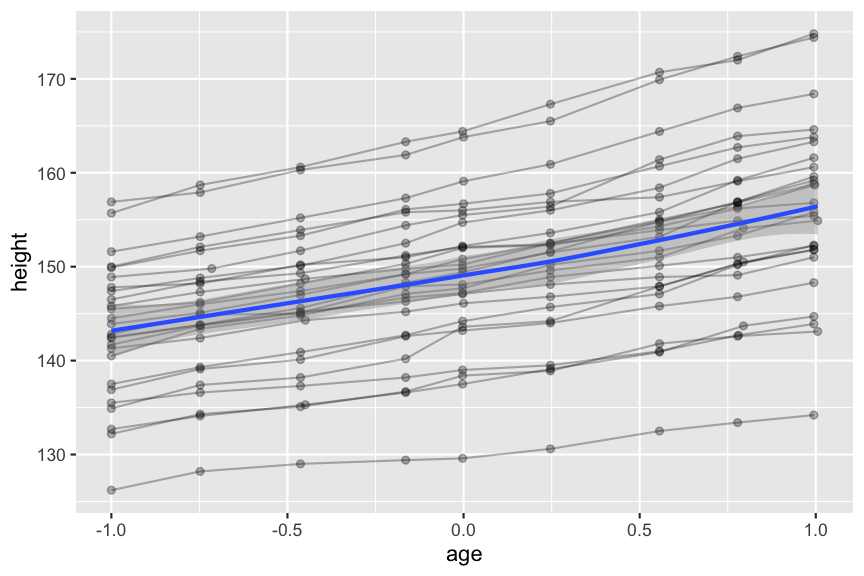

layout: true

```{r setup, echo = FALSE, message = FALSE, warning = FALSE}
source(here::here("scripts/setup.R"))
setup_presentation("advanced_plotting_the_grammar_of_graphics", filename = "12_advanced_plotting_the_grammar_of_graphics.Rmd")
```

---

# The Grammar of Graphics

.pull-left[
- A set of rules that define the components of a language
- Allows us to describe the components of any graphic
- First proposed by Leland Wilkinson in 1999
- Built upon by [Hadley Wickham: The Layered Grammar of Graphics](https://vita.had.co.nz/papers/layered-grammar.html)
- Implemented in ggplot2
]

.pull-right[

[](https://ggplot2-book.org)
]

???

We've already talked a little bit about the grammar of graphics, but today we will dive a little bit deeper into these concepts.
The goal of this lecture is to give you a bit of a deeper dive into the grammar of graphics.
My hope is that you will go away feeling like you understand what happens behind the scenes in ggplot2.
I don't expect you to know exactly how to produce every single figure that I will show you, but I hope that you will know where to look for help when you want to create a certain figure in the future.

---

# Components of ggplot2

.pull-left[
## Basic components

- Data
- Aesthetic mappings
- Scales
- Geometric objects
- Statistical transformations
- Facets
- Coordinate system
]

???

- The base is always the data. Without data, there is nothing to visualise.
- Second, we have to decide how certain aspects of our data should be represented in the graphic.
- Scales map values in the data space to values in the aesthetic space, including colour, shape, and size.
- What type of geometric object, or geom, should represent our data? Bars? Points? Boxplots?
- Statistical transformations can be used to show tendencies of the data, like means, variance, etc.
- Facets can be used to split our graphics into small multiples, something we've talked a bit about already.
- Finally, we have the coordinate system. Is it cartesian coordinates? Polar coordinates? Are we representing a map?

--

.pull-right[
## Layers

1. Data
2. Aesthetic mappings
3. A statistical transformation
4. A geometric object
5. A position adjustment
]

???

Some of these parts can further be organised in **layers**.

--

.pull-right[
## Themes

Fine control of the appearance of the plot.
]

???

There are a bunch of built-in themes, plenty to find online, and it's quite easy to create a theme of your own.
Note that creating a theme that is effective and at the same time pretty to look at is very time consuming and difficult.
At least for me.

---

# What the grammar doesn't do

- It doesn't suggest which graphic to use. This is something you have to figure out yourself. The focus is on producing the plots you want, but you have to decide *what* you want.
- It doesn't necessarily produce that make sense. Just as with written language, grammar helps us form sentences that are correct, but they don't necessarily have to make sense.
> The angry table climbs the boiling ocean.

???

This sentence is grammatically correct, but it doesn't make any sense.
The same is true for figures: we can create something that makes no sense at all.

--

```{r nonsense_plot, echo = FALSE, fig.align = "center"}
ggplot(mpg, aes(x = displ, y = hwy, colour = trans)) + 
  geom_path() +
  theme(legend.position = "none")
```

???

Here's an example of just that.
The code that created this figure follows the grammar of graphics, but due to the underlying data, it doesn't really make any sense.
Most often when we get figures that doesn't make sense, it's usually due to a mistake.
We'll go through some common examples of these later today.

---

# The basics

.pull-left[
```{r first_scatter}
ggplot(mpg, aes(x = displ, y = hwy)) +
  geom_point()
```

- Data: the `mpg` tibble
- Aesthetic mapping: engine size mapped to x position, fuel efficiency to y position.
- Layer: points
]

--

.pull-right[
The call to `ggplot` sets up the base of the plot.
It defines the **data** that it will work on, as well as what variables in the data should be represented in the plot, through the **aesthetic mapping**.
]

--

.pull-right[
`geom_point` constitutes a **layer**.
Layers are added to the plot with `+`.
]

???

The line break after the plus is not something that is strictly needed, but I think that it improves readability.

--

.pull-right[
Almost all plots that you make will map values to x and/or y position, so the first two unnamed arguments to `aes` will be mapped to `x` and `y`.

```{r, eval = FALSE}
ggplot(mpg, aes(displ, hwy)) +
  geom_point()
```
]

---

# Geometric objects

Geometric objects usually have one of three purposes:

--

## 1. Display the data

This is mainly what we've been looking at so far, where each data point is represented in the graphic.

--

## 2. Summarise the data

Often it is useful to display a statistical summary of the data.
Many times it is useful to plot these on top of the actual data.

--

## 3. Display metadata

These are layers that give context to the raw data.
For spatial data, this could be a map that is put in the background.
If we instead have text annotations we might want to make them pop in order to catch the attention of the viewer.
In that case, it should be the last layer that we add.

---

# Geometric objects

The geometric objects (or **geoms**) to a large extent decides what the plot will contain, and is usually the first thing we think about when deciding how we want to represent the data.

```{r, echo = FALSE}
options(knitr.kable.NA = "")
tribble(
  ~Chart, ~Geom, ~Notes,
  "Scatterplot", "`geom_point`", NA,
  "Bubble chart", "`geom_point`", "point size mapped to a variable",
  "Line chart", "`geom_line`", NA,
  "Barchart", "`geom_bar`", NA,
  "Boxplot", "`geom_boxplot`", NA,
  "Density", "`geom_density`", NA,
  "Histogram", "`geom_histogram`", NA,
  "Histogram", "`geom_bar`", "stat set to `\"bin\"`",
) %>% knitr::kable(format = "pipe")
```

--

Once we start to combine different geoms in the same plot, they don't really have a name.
As you get more comfortable with the grammar of graphics, you will see that most of your plots likely will fall into this category.

???

In this table we also see that a histogram can be represented in two ways: either by the histogram geometric object, or by the bar geometric object.
The difference between these two is what **statistical transformation** is being used.

---

# Common geoms

.held.center[
```{r common_geoms, echo = FALSE, results = "hold", fig.height = 3, fig.width = 3}
geom_df <- tribble(
  ~x, ~y, ~label,
  3, 2, "a",
  1, 4, "b",
  5, 6, "c"
)

plot <- ggplot(geom_df, aes(x, y, label = label)) + labs(x = NULL, y = NULL)

plot + geom_point() + ggtitle("geom_point")
plot + geom_text() + ggtitle("geom_text")
plot + geom_line() + ggtitle("geom_line")
plot + geom_path() + ggtitle("geom_path")
plot + geom_col() + ggtitle("geom_col/geom_bar")
plot + geom_area() + ggtitle("geom_area")
plot + geom_polygon() + ggtitle("geom_polygon")
plot + geom_tile() + ggtitle("geom_raster/geom_tile")
```
]

---

# Collective geoms

Collective geoms are those that represent multiple observations in a single graphical object.
Lines and paths could be considered collective geoms, but the individual segments of a line connects two observations.
We can control the way that observations are connected in the graphics using the **group** aesthetic.

--

```{r}
data(Oxboys, package = "nlme")
head(Oxboys)
```

???

For these examples I will use the dataset `Oxboys` from the nlme package.
It contains the heights and centered ages of 26 boys that's been measured on nine occasions.

---

# No grouping variable

```{r line_wo_group}
ggplot(Oxboys, aes(age, height)) +
  geom_line() +
  geom_point()
```

???

Here's an example where we don't have a discrete variable in the plot, and if we don't specify a grouping, then lines will be drawn between all observations.
In this case, since we're using `geom_line`, they will be drawn from left to right.

---

# With a grouping variable

```{r line_w_group}
ggplot(Oxboys, aes(age, height, group = Subject)) +
  geom_line() +
  geom_point()
```

???

Here, we instead explicitly specify the grouping variable to be the `Subject`.
Then there will be a single line for each level of that discrete variable.

---

# Overriding grouping

```{r oxboys_boxplot}
ggplot(Oxboys, aes(Occasion, height)) +
  geom_boxplot()
```

???

Let's say that we would like to plot lines for the individual subjects on top of this.

---

# Overriding grouping

```{r oxboys_line_wrong_grouping}
ggplot(Oxboys, aes(Occasion, height)) +
  geom_boxplot() +
  geom_line(colour = "firebrick", alpha = 0.5)
```

???

Ok, so this didn't really work.
The grouping is correct for the boxplots, but not for the lines.
There we would like the grouping to be by `Subject` instead.

---

# Overriding grouping

```{r oxboys_line_correct_grouping}
ggplot(Oxboys, aes(Occasion, height)) +
  geom_boxplot() +
  geom_line(aes(group = Subject), colour = "firebrick", alpha = 0.5)
```

???

Here we set the grouping explicitly for the line layer, and then we get the plot we wanted.

---

# Aesthetics for collective geoms

What if we have a collective geom where we want to map a certain variable to an aesthetic, which observation is then chosen?

```{r line_aesthetics}
ggplot(geom_df, aes(x, y, colour = label)) +
  geom_path(aes(group = 1), size = 5) +
  geom_point(size = 10)
```

???

So, for a line or path, the first observation in each pair determines the aesthetic.
In this particular example, you see that the first line segment has the same colour as the first point, and the second segment the same colour as the second point.
Since there is no third segment, this then doesn't have any colour.
The point is still coloured though.

For more complex geoms, such as `geom_area` or `geom_polygon`, it is not obvious how this would work.

---

class: title

# Summarising geoms

???

So, the geoms that we've looked at so far represent the raw data in a graphical form.
Now we will look at geoms that summarise data in one way or another.

---

# Different types of summarise

We have a number of different types of summarise that we can use, depending on our data:

- Discrete x, range: `geom_errorbar`, `geom_linerange`
- Discrete x, range & center: `geom_crossbar`, `geom_pointrange`
- Continuous x, range: `geom_ribbon`
- Continuous x, range & center: `geom_smooth`

```{r}
set.seed(12345)
summary_df <- tibble(
  x = rep(1:3, each = 10),
  y = map2(c(3, 10, 7), c(1.2, 0.5, 1.0), ~ rnorm(10, mean = .x, sd = .y)) %>% flatten_dbl()
)

summary_plot <- ggplot(summary_df, aes(x, y)) + labs(x = NULL, y = NULL)
```

---

# Summarising geoms

.held.center[
```{r summarising_plots, echo = FALSE, results = "hold", fig.height = 3, fig.width = 3}
summary_plot + geom_errorbar(stat = "summary") + ggtitle("geom_errorbar")
summary_plot + geom_linerange(stat = "summary") + ggtitle("geom_linerange")
summary_plot + geom_crossbar(stat = "summary") + ggtitle("geom_crossbar")
summary_plot + geom_pointrange(stat = "summary") + ggtitle("geom_pointrange")
summary_plot + geom_smooth(stat = "summary") + ggtitle("geom_smooth")
summary_plot + geom_ribbon(stat = "summary") + ggtitle("geom_ribbon")
```
]

---

# Adding a trend to heights

In order to get a summary across all our observations, we have to remove the grouping for `geom_smooth`.

```{r heights_trend}
ggplot(Oxboys, aes(age, height, group = Subject)) +
  geom_line(alpha = 0.3) +
  geom_point(alpha = 0.3) +
  geom_smooth(group = 1)
```

---

# Adding a trend to heights

This could also be accomplished by only grouping `geom_line`:

```{r, eval = FALSE}
ggplot(Oxboys, aes(age, height)) + 
  geom_line(aes(group = Subject), alpha = 0.3) +
  geom_point(alpha = 0.3) +
  geom_smooth()
```



---

# Statistical transformations

We saw earlier that a histogram can be produced either with `geom_histogram` or with `geom_bar`.
A bar chart can also be produced with either of these geoms.
The main difference between these is what the default statistical transformation (or **stat**) is.

.pull-left[
```{r diamond_depth_bar}
ggplot(diamonds, aes(depth)) +
  geom_histogram(stat = "count") +
  ggtitle("geom_histogram with stat_count")
```
]

.pull-right[
```{r diamond_depth_hist}
ggplot(diamonds, aes(depth)) +
  geom_bar(stat = "bin") +
  ggtitle("geom_bar with stat_bin")
```
]

???

One could argue that from a semantical perspective, only one of these should be used for either of these plot types, though.
This is mostly to demonstrate the flexibility of the grammar.

The default stat for `geom_histogram` is `stat_bin`.
What that does is that it cuts up the x variable (`depth` in this case) into a bunch of intervals, and then it counts the number of observations that fall within that bin.

The default stat for `geom_bar` is `stat_count`.
This simply counts the number of occurences for each individual value of the x variable, without any binning.
If we change the stat in `geom_bar` to `"bin"`, then we will get a histogram.
Similarly, if we change the stat for `geom_histogram` to `"count"`, then we get a bar chart.

---

# Summaries and stats

.left-column[
## Input data
]

.right-column[
The summarising geoms can work on two different types of datasets:

1. Datasets where you have all observations.
2. Datasets that are summaries of all observations.

.pull-left[
```{r, echo = FALSE}
summary_df
```
]

.pull-right[
```{r, echo = FALSE}
summarised_df <- summary_df %>% 
  group_by(x) %>% 
  summarise(mean_y = mean(y),
            sd = sd(y)) %>% 
  rename(y = mean_y)
summarised_df
```
]
]

???

These two tables represent the same data, but the left one has all observations, while the right one is a summary where, for each value of `x`, y has been boiled down to the mean value and the standard deviation.

I *always* prefer to work with datasets where I have all observations, and I will demonstrate why on the next slide.

---

# Summaries and stats

.left-column[
## Input data
## `stat_identity`
]

.right-column[
The summarising geoms that represent intervals (`geom_crossbar`, `geom_errorbar`, `geom_linerange`, `geom_pointrange`) have `stat_identity` as the default stat.
The purpose of this stat is to take the values from the aesthetic mappings as they are, and not process them further.
This means that the data has to contain the actual values that represent the range, i.e. already summarised observations.

```{r summary_stat_identity}
ggplot(summarised_df) +
  geom_crossbar(aes(x, y,
                    ymin = y - sd,
                    ymax = y + sd))
```
]

---

# Summaries and stats

.left-column[
## Input data
## `stat_identity`
## `stat_summary`
]

.right-column[
If we want to use data where we have all observations available, we have to summarise it somehow.
This can either be done manually (as shown earlier), or we can use `stat_summary`.
What this does is to take the input data and summarising it, creating the variables that we need: `y`, `ymin`, and `ymax`.

```{r summary_mean_se, message = TRUE}
ggplot(summary_df) +
  geom_crossbar(aes(x, y), stat = "summary")
```
]

???

Here we get a message saying that we haven't defined the function that should be used for summarising the data, and that it defaults to `mean_se`.
This function will then return a tibble with `y` being the mean value of `y`, `ymin` being `y - se(y)`, and `ymax` being `y + se(y)`.

---

# Summaries and stats

.left-column[
## Input data
## `stat_identity`
## `stat_summary`
## Summary function
]

.right-column[
We can specify our own summary function using the `fun.data` argument.
In this example we use `mean_sdl`, which by default calculates the mean &pm; 2 standard deviations.

```{r summary_mean_sdl}
ggplot(summary_df) +
  geom_crossbar(aes(x, y), stat = "summary", fun.data = mean_sdl)
```
]

---

# The Anscombe quartet

A classic dataset that demonstrates the potential pitfalls with summarising data is [the Anscombe Quartet](https://en.wikipedia.org/wiki/Anscombe%27s_quartet).

```{r, echo = FALSE}
anscombe_tbl <- anscombe %>% 
  pivot_longer(everything(),
               names_to = c(".value", "set"),
               names_pattern = "(.)(.)") %>% 
  arrange(set) %>% 
  mutate(set = factor(set, labels = c("I", "II", "III", "IV")))
```

```{r anscombe_scatter, echo = FALSE, fig.width = 10, fig.height = 3, out.width="100%"}
ggplot(anscombe_tbl, aes(x, y)) +
  facet_grid(cols = vars(set)) +
  geom_smooth(method = "lm", formula = y ~ x, se = FALSE, fullrange = TRUE) +
  geom_point() +
  geom_text(data = (anscombe_tbl %>% group_by(set) %>% summarise(r = cor(x, y), mean = mean(y), sd = sd(y))),
            aes(label = str_c("r = ", format(r, digits = 2),
                              "\nmean y = ", format(mean, digits = 2),
                              "\nsd y = ", format(sd, digits = 2))),
            x = 5, y = 12.5, hjust = 0, vjust = 1)
```

???

The data behind the Anscombe Quartet is available in R.

Summarising the data is not a problem in itself, as long as you show what the underlying raw data looks like.
In the next lecture on dos and dont's of data visualisation, I will go through some more examples of this.

---

# Datasaurus

```{r datasaurus, echo = FALSE, fig.height = 3.5, fig.width = 3.5, fig.align = "center"}
datasauRus::datasaurus_dozen %>% 
  ggplot(aes(x, y)) +
  geom_point() +
  gganimate::transition_states(dataset, transition_length = 2,
                               state_length = 3, wrap = TRUE)
```

[Same Stats, Different Graphs](https://www.autodesk.com/research/publications/same-stats-different-graphs)

???

This is another set of datasets that look vastly different, but their summary statistics are nearly identical.
The mean x and y, their standard deviation, and their Pearson correlation are all the same.
If you would have been handed these in a summarised form, e.g. mean and standard deviation, and been asked to compare them, the would look identical.
This is however pretty far from the truth.

---

# Summarising distributions

```{r datasaurus_boxplot, echo = FALSE, fig.height = 2.5, out.width = "100%"}
datasauRus::box_plots %>%
  pivot_longer(everything(), names_to = "dataset", values_to = "value") %>%
  arrange(dataset) %>% 
  ggplot(aes(x = value)) +
  geom_boxplot(aes(y = 0), alpha = 0.5, fill = "skyblue", colour = "steelblue", size = 2) +
  geom_point(aes(y = 0), position = position_jitter(), alpha = 1/5) +
  labs(x = "x") +
  theme(axis.title.y = element_blank(),
        axis.text.y = element_blank(),
        axis.ticks.y = element_blank()) +
  gganimate::transition_states(dataset, transition_length = 4,
                               state_length = 6, wrap = TRUE)
```

[Same Stats, Different Graphs](https://www.autodesk.com/research/publications/same-stats-different-graphs)

???

This is a similar example of one-dimensional data where we represent the data as points and as a boxplot.
As you can see the, points in many of these cases have a clear structure, but this is something that the boxplot doesn't pick up.

---

class: title

# Stepping through a ggplot

---

# Final result

```{r walkthrough_final_plot, fig.align = "center", fig.width = 7, fig.height = 5}
ggplot(mpg, aes(displ, hwy, colour = factor(cyl))) +
  geom_point()
```

---

# Aesthetic mappings

When mapping variables in our data to aesthetics of the plot, what happens is that a new tibble is being created in the background.

```{r, eval = FALSE}
ggplot(mpg, aes(displ, hwy, colour = factor(cyl))) +
  geom_point()
```

We map `displ` to `x`, `hwy` to `y`, and `cyl` (converted to a factor) to colour.
This would be like going from the table on the left to the table on the right below.

.held.space-around.smaller[
```{r, echo = FALSE, results = "hold"}
mpg %>%
  head(15) %>% 
  knitr::kable() %>% 
  kableExtra::column_spec(3, background = "#FED294") %>% 
  kableExtra::column_spec(5, background = "#B9B3FF") %>% 
  kableExtra::column_spec(9, background = "#C7FFB2")

mpg %>% 
  select(x = displ, y = hwy, colour = cyl) %>% 
  mutate(colour = factor(colour)) %>% 
  head(15) %>% 
  knitr::kable() %>% 
  kableExtra::column_spec(1, background = "#FED294") %>% 
  kableExtra::column_spec(2, background = "#B9B3FF") %>% 
  kableExtra::column_spec(3, background = "#C7FFB2")
```
]

???

However, this is a somewhat simplified view of things.
Conveniently, we don't have to refer to the variables as `x`, `y`, and `colour`, but we can still refer to their original names `displ`, `hwy`, and `cyl`.

---

# Scales

Now that we have the data, we need to translate the values into something that the computer can represent graphically, so pixel positions and actual colour values, and this is done through the process of **scaling**.
The horizontal position, vertical position, and colour will have to be scaled in this example.

Scaling `x` and `y` is easy in this case, since just a linear scaling.
We want to convert the values of `x` and `y` to fit in the range $[0, 1]$.
The reason that pixel positions are not calculated here is that this is done later in the process by the drawing system together with the coordinate system (or **coord**) that we decide to use.

--

.tile.spaced[
Colours are a bit more complicated, and there are a number of ways of doing it.
If you imagine a three-dimensional space of colours, the values mapped to `colour` in our data are then mapped to points in this space, determining the actual colour.
The mapping can be done in a number of ways though.

```{r cyl_colour_wheel, echo = FALSE, fig.width = 3, fig.height = 3}
tibble(r = seq(0, 1, length = 130),
       th = seq(0, 2*pi, length = 130)) %>% 
  expand(r, th) %>% 
  mutate(x = r * sin(th),
         y = r * cos(th),
         z = hcl(h = 360*th / (2*pi),
                 c = 100 * r,
                 l = 65)) %>% 
  ggplot(aes(x, y, colour = z)) +
  geom_point() +
  scale_colour_identity() +
  coord_fixed() +
  geom_point(data = tibble(x = sin(seq(0, 2*pi, length = 5)),
                           y = cos(seq(0, 2*pi, length = 5))),
             mapping = aes(x, y),
             inherit.aes = FALSE, shape = 1, size = 3, stroke = 1) +
  theme(
    axis.title = element_blank(),
    axis.text = element_blank(),
    axis.line = element_blank(),
    axis.ticks = element_blank(),
    panel.background = element_blank(),
    panel.grid = element_blank()
  )
```

```{r cyl_colour_example, echo = FALSE, fig.width = 4, fig.height = 3}
ggplot(mpg, aes(displ, hwy, colour = factor(cyl))) +
  geom_point()
```
]

???

The default colour palette for discrete variables is based on the colour wheel that you see here.
In this case, we have four levels of our variable (4, 5, 6, or 8 cylinders), and the colours are then choosen by placing four points evenly spaced around the edge.

---

# Plot data so far

```{r echo = FALSE}
mpg %>% 
  select(x = displ, y = hwy, colour = cyl) %>% 
  mutate(colour = factor(colour),
         across(c(x, y), scales::rescale),
         colour = scales::hue_pal()(4)[as.integer(colour)]) %>% 
  head(20) %>% 
  knitr::kable(digits = 3)
```

---


# Geometric objects

Different geometric objects have different parameters that have to be set.
Some are required to be supplied, while others have default values.

.pull-left[
From the help page of `geom_point`:

> `geom_point()` understands the following aesthetics (required aesthetics are in bold):
> - **`x`**
> - **`y`**
> - `alpha`
> - `colour`
> - `fill`
> - ...

On the right we add a couple of aesthetics that are constant across the dataset.
For `geom_point` the default shape of the points will be 19, which is a solid circle.
The default size is 1 mm, and the alpha (opacity) is 1.
]

.pull-right[
```{r, echo = FALSE}
mpg %>% 
  select(x = displ, y = hwy, colour = cyl) %>% 
  mutate(colour = factor(colour),
         across(c(x, y), scales::rescale),
         colour = scales::hue_pal()(4)[as.integer(colour)],
         shape = 19,
         size = 1,
         alpha = 1) %>% 
  head(20) %>% 
  knitr::kable(digits = 3)
```
]


---

class: title

# Some common things we want to do

???

So now we've talked about the components that go into a ggplot, and also gone through a simplified process of how a ggplot is created.
But what if we want to change these defaults?
What if we don't like the default colour scheme, or the figure legend has horrible labels?
Or what if the journal we want to publish in has a weird font requirement for the figures?

[Should this paragraph be a slide of its own?]
What I've seen many times throughout my academic career is that I would go about to produce a figure that is almost there, and then someone else would proceed to import it into something like Adobe Illustrator or Inkscape and modify things as needed.
The drawback of doing that is that if something changes about the base figure, all these manual changes are lost, and you have to go through this, likely undocumented, process again.

---

# Set colours manually

.pull-left.small[
We can set colours fully manually...

```{r manual_colour1}
ggplot(iris, aes(Sepal.Length, Sepal.Width, colour = Species)) +
  geom_point(size = 2) +
  scale_colour_manual(
    values = c(virginica = "red",
               versicolor = "green",
               setosa = "blue")
  )
```
]

???

It really helps to have a good understanding of the grammar of graphics when wanting to do things like this.

First we need to know what scale it is that we want to change.
Is it `colour`, or is it `fill`?
Is it continuous or discrete?

--

.pull-right.small[
... or we can use some of the palettes that are available.

```{r manual_colour2}
ggplot(iris, aes(Sepal.Length, Sepal.Width, colour = Species)) +
  geom_point(size = 2) +
  scale_colour_manual(
    values = colorspace::qualitative_hcl(3, palette = "Dark 3")
  )
```
]

---

# Setting legend labels

.pull-left.small[
```{r legend_labels1}
iris %>%
  mutate(Species = str_c("Iris ", Species)) %>%
  ggplot(aes(Sepal.Length, Sepal.Width, colour = Species)) +
  geom_point(size = 2)
```
]

???

There are multiple ways we could achieve this (as with many other things in R).
We can either change the underlying variable

--

.pull-right.small[
```{r legend_labels2, eval = FALSE}
ggplot(iris, aes(Sepal.Length, Sepal.Width, colour = Species)) +
  geom_point(size = 2) +
  scale_colour_discrete(
    labels = c(setosa = "Iris setosa",
               virginica = "Iris virginica",
               versicolor = "Iris versicolor")
  )
```
]

---

# Combining multiple figures

[The cowplot package](https://wilkelab.org/cowplot/index.html) is very useful for combining multiple ggplots.

```{r cowplot_demo, fig.height = 3}
library(cowplot)

plot1 <- ggplot(mpg, aes(displ, hwy)) +
  geom_point()
plot2 <- ggplot(mpg, aes(factor(cyl), displ)) +
  geom_boxplot() +
  geom_point(position = position_jitter(height = 0, width = 0.25),
             alpha = 1/5)

plot_grid(plot1, plot2, labels = c("A", "B"))
```

???

We've already looked at faceting, or small multiples, but this only works well if the variables are common across all facets.
If we want to combine plots that are related, but don't share variables, we need a different approach.
The same generally applies if you want to combine different types of plots.

---

# Too long x-axis labels

.left-column[
## The problem
]

.right-column[
When having a categorical variable on the x-axis, depending on the width of the plot and the number of levels of the variable, the labels might overlap.

```{r overlapping_x_labels}
ggplot(mpg, aes(manufacturer)) +
  geom_bar()
```
]

---

# Too long x-axis labels

.left-column[
## The problem
## Dodging labels
]

.right-column[
```{r overlapping_x_labels_dodge}
ggplot(mpg, aes(manufacturer)) +
  geom_bar() +
  scale_x_discrete(guide = guide_axis(n.dodge = 2))
```
]

---

# Too long x-axis labels

.left-column[
## The problem
## Dodging labels
## Rotating labels
]

.right-column[
```{r overlapping_x_labels_label_rot}
ggplot(mpg, aes(manufacturer)) +
  geom_bar() +
  scale_x_discrete(guide = guide_axis(angle = 40))
```
]

---

# Too long x-axis labels

.left-column[
## The problem
## Dodging labels
## Rotating labels
## Rotating the coordinate system
]

.right-column[
```{r overlapping_x_labels_coord_rot}
ggplot(mpg, aes(manufacturer)) +
  geom_bar() +
  coord_flip()
```
]

---

# Suggested reading

## If you're interested in data visualisation

- [Flowing Data: a blog on data visualisation by Nathan Yau](https://flowingdata.com)
- [Information is Beautiful](https://informationisbeautiful.net/)

???

- Nathan Yau is a statistician specialising in data visualisation.
He has also written a couple of books on the topic that I haven't had time to read yet.

- Information is Beautiful is a website with inspiring visualisations, often treating current topics.
Founded by David McCandless, a writer and designer, who has also written two books on the topic.