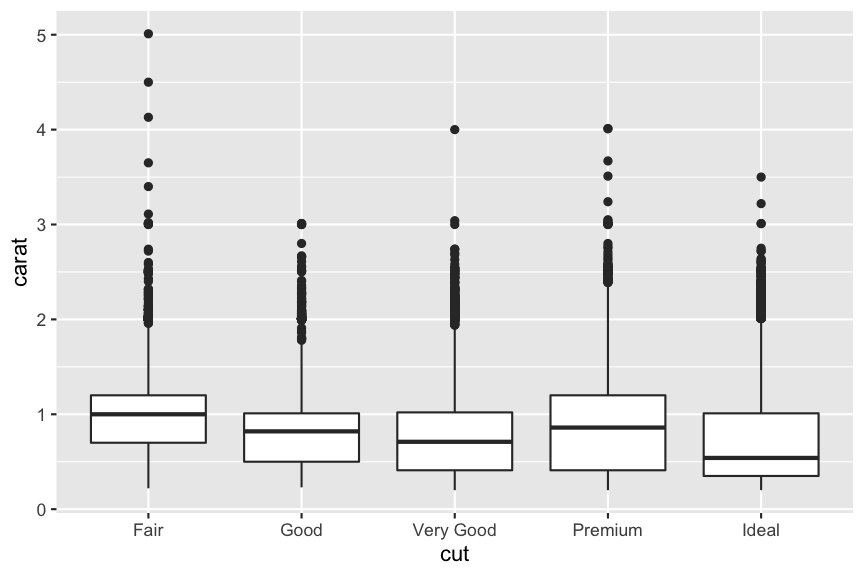

layout: true

```{r setup, echo = FALSE, message = FALSE, warning = FALSE}
source(here::here("scripts/setup.R"))
setup_presentation("advanced_plotting_dos_and_donts", filename = "13_advanced_plotting_dos_and_donts.Rmd")
knitr::opts_chunk$set(fig.align = "center")
```

---

# Don't use dynamite plots

```{r dynamite}
ggplot(diamonds, aes(cut, carat)) +
  geom_errorbar(stat = "summary", width = 0.25, fun.data = mean_sdl, fun.args = list(mult = 1)) +
  geom_bar(stat = "summary", fun = mean)
```

???

This is a type of plot that you probably have produced at one point already, and one that you frequently see in publications, and it's one of my favourite things to whine about.

Dynamite plots are bar plots with error bars, and they look like dynamites with a fuse.
I wish they would just blow up and stop existing.
Bar plots are for count data, not for summarising multiple observations.

---

# Do use boxplots

```{r boxplot}
ggplot(diamonds, aes(cut, carat)) +
  geom_boxplot()
```

???

Boxplots give you more information about the underlying data.
It tells you then median of the data, as well as the spread both above and below the median, as well if there are any potential outliers.

---

# Do use violin plots

```{r violin_plot}
ggplot(diamonds, aes(cut, carat)) +
  geom_violin()
```

???

Violin plots give you even more information.
Here we can see that the distributions of the data are not very uniform, and that there might be factors we should take into account, but we haven't.

---

# Do show all the data

```{r all_data}
ggplot(diamonds, aes(cut, carat)) +
  geom_point(alpha = 1/20, position = position_jitter(width = 0.25)) +
  geom_violin(colour = "firebrick", alpha = 0.5)
```

???

Here we add all the points underneath the violin plots, and we can see that the reason for the bumpy distributions is likely due to preferential sizing of the diamonds.

---

# Don't use pie charts

```{r pie_chart}
ggplot(diamonds, aes(x = factor(1), fill = cut)) +
  geom_bar(position = "fill", width = 1) +
  coord_polar(theta = "y")
```

???

Pie charts are difficult to produce in ggplot, for a reason: they're often not the best choice.
It is very hard to compare the sizes of the sectors in the chart. For example, which of "Very Good" and "Premium" is the biggest?

---

# Do use bar charts

```{r barchart}
ggplot(diamonds, aes(cut, fill = cut)) +
  geom_bar()
```

???

This is a case where a bar chart is much simpler, and also easier to read.
Here it is very obvious that there are more "Premium" cuts than "Very Good" cuts.

---

# Do describe plotting parameters in figure captions

.center[

]

> The hinges of the box represent the first and third quartile around the median (the line).
> The whiskers stretch to the last value within 1.5 IQR from the upper and lower hinge, respectively.
> Obeservations outside this range are considered outliers, and are plotted as points.

???

This is especially important if we are talking about any type of graphical representation that summarises the underlying data.
Also, if you add something like jitter or decrease the opacity of points in order to avoid overplotting, then also make this clear.

For example, there are many ways you could make a boxplot in terms of what range of the data the box itself defines, as well as what the whiskers define.
It can be a bit dangerous relying on defaults, since you will produce the figures routinely, but only roughly know what the different parts of the plot represent.
Be sure to consult the help pages for the different geoms and stats that you use in order to figure out what exactly is going on.

---

# Do make your figures accessible

.left-column[
## Colours
]

.right-column[
- Use colours that are colour blind friendly, for example, don't use red and green as contrasting colours.
  - [Run your figures through a colour blind simulator](http://hclwizard.org:3000/cvdemulator/), or check out the [colorblindr R package](https://github.com/clauswilke/colorblindr).
- Use a sequential colour scale for continuous data.
- Use a diverging colour scale when zero is included.
- Use a qualitative colour scale for categorical data.
- [colorspace package](http://colorspace.r-forge.r-project.org/index.html)
- [RColorBrewer](https://www.r-graph-gallery.com/38-rcolorbrewers-palettes.html)
]

???

Accessibility could be a course on its own, but here are some things that we can keep in mind when creating graphics, especially if we intend to share them with others.

---

# colorspace palettes

.left-column[
## Colours
]

.right-column[
### Palettes from the colorspace package

```{r colorspace_palettes, echo = FALSE, fig.height = 8, fig.width = 14}
colorspace::hcl_palettes(plot = TRUE)
```
]

---

# Do make your figures accessible

.left-column[
## Colours
]

.right-column[
```{r iris_sepal_length}
p <- ggplot(iris, aes(Sepal.Length, fill = Species)) +
  geom_area(stat = "density", position = "fill")
p
```
]

---

# Do make your figures accessible

.left-column[
## Colours
]

.right-column[
```{r iris_sepal_length_colorblindr, fig.width = 8, fig.height = 5, out.width = "100%"}
colorblindr::cvd_grid(p)
```
]

???

This is an example of how things can look for someone that has problems with percieving colours.

---

# Do make your figures accessible

.left-column[
## Colours
## Font sizes
]

.right-column[
- Make sure fonts are sized appropriately depending on figure size and where it will be presented.
- Can be controlled by `theme`.

```{r sepal_length_text_size}
ggplot(iris, aes(Sepal.Length, fill = Species)) +
  geom_area(stat = "density", position = "fill") +
  theme(text = element_text(size = 24))
```

]

---

# Do make your figures accessible

.left-column[
## Colours
## Font sizes
## Redundant coding
]

.right-column[
Redundant coding is when we map a single variable to multiple aesthetics in a plot.
It could for example be mapping a categorical variable to colour *and* shape in a scatter plot.

```{r redundant_coding}
ggplot(mpg, aes(displ, hwy, colour = drv, shape = drv)) +
  geom_point(size = 3)
```
]

???

By having redundancy in the presentation, we will enable more people to access the material.
It could be that some have difficulties distinguishing between different colours, or they might print your figure in black and white.

---

# Do label your axes

.pull-left[
```{r no_labels_example}
ggplot(mpg, aes(displ, hwy, colour = factor(cyl))) +
  geom_point()
```
]

.pull-right[
```{r with_labels_example}
ggplot(mpg, aes(displ, hwy, colour = factor(cyl))) +
  geom_point() +
  scale_colour_discrete(name = "Cylinders") +
  labs(x = "Engine displacement (litres)",
       y = "Highway fuel economy (miles/gallon)")
```
]

???

I know that I have been sloppy with this in my slides, and part of the reason is to keep the code short and concise.
You should always put meaningful labels on your plots, especially if you are sharing your work with others.
This includes proper axis labels, including units, that are easy to understand.
Also make sure that legends are labelled appropriately.

Which of these plots is more understandable?

---

# Don't make 3D plots

.center[

]

???

The majority of any figures that you make will be represented in two dimensions, either on paper or on a computer screen.
Then don't try to introduce a third dimension to this.
Since a piece of paper doesn't have any depth, trying to compare two points becomes really hard, not to say impossible, most of the time.

---

.center[

]

