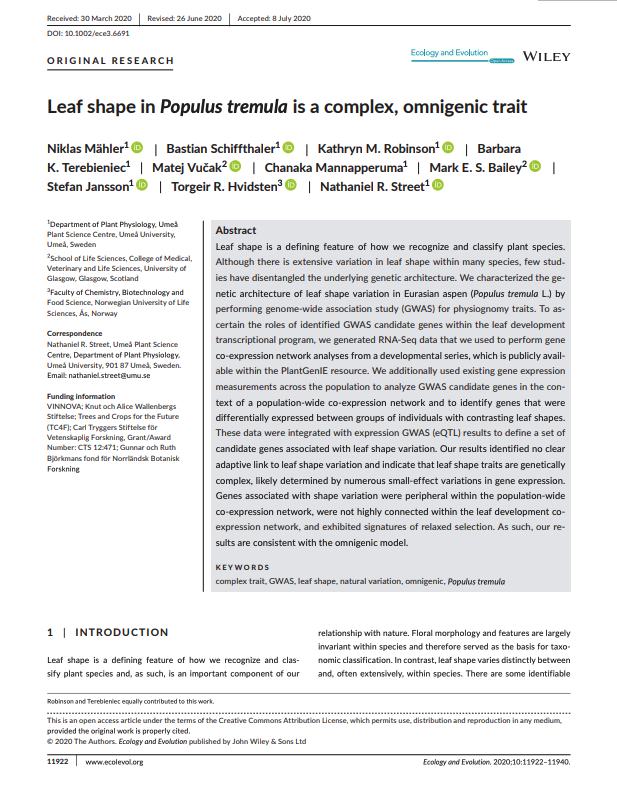
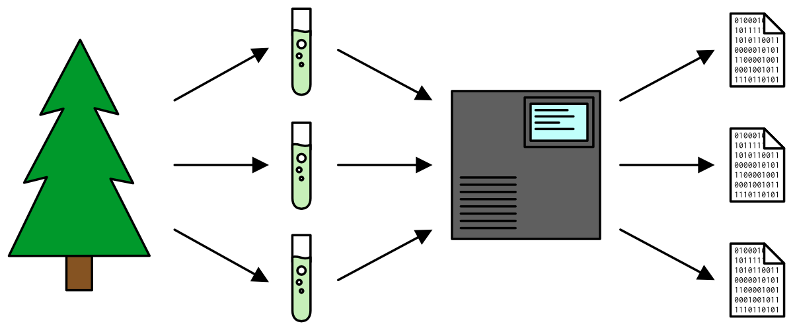
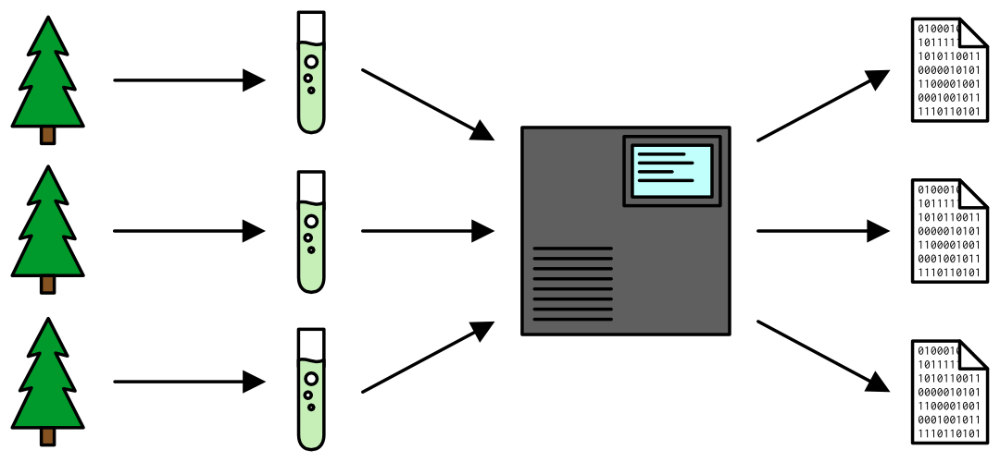

layout: true

```{r setup, echo = FALSE, message = FALSE, warning = FALSE}
source(here::here("scripts/setup.R"))
setup_presentation("data_quality_control", filename = "14_data_quality_control.Rmd")
```

---

# What we'll learn

- How to determine whether your data is of sufficient quality.
- How to see whether there are factors that haven't been accounted for.

---

# What is good quality data?

- It is readable

???

This is something that we treated talking about tidy data.
The earlier in the process that the data is tidied, the better.

--
- It is complete

???

We have enough data for our intents and purposes.
There might be a couple of missing values, and that's ok, as long as you have enough redundancy so that those missing values don't become a problem.

--
- It is accurate

???

The data represents what we think it represents.

--
- The FAIR principles

???

This is somewhat related to data quality as well.
While it doesn't address the quality of the actual data points, it addresses more general concerns regarding data quality.
Is the data findable?
Is it accessible?
Is it interoperable?
Is it reproducible?

We will talk more about the FAIR principles later in the course.

Many of these things we don't really have to think about while we analyse the data, but rather something that should be thought about when designing the experiment and when finally publishing your results together with your data.

---

# How do we check our data?

- Check that it roughly behaves according to your expectations.

???

If it doesn't, chances are that something has gone wrong.
If you are the person that have collected the data, or at least is in close collaboration with whomever did it, you likely know the data pretty well, and you should take your gut feeling seriously.

--
- Assess variation on different levels

???

Without variation we cannot use our data for analysis, since variation is the foundation for statistical testing.
However, we have to assess that we have variation where it we benefit from it, and that other types of variation are minimised.

Just as an aside, once we have collected our data, we cannot do anything about the variation that is already in there.
These are things that need to be addressed in the design of the experiment.

--
- Identify batch or sampling effects.

???

It might be that sampling has been performed across several days, or measurements have been done using different machines.
These are metadata that should be part of your dataset, and you have to look at your data taking these variables into account.
Are the patterns you're seeing in your data real, or are they due to one of these variables.

--
- Identify any confounding variables.

???

If two variables are confounded, it means that we have two factors in our experimental setup that we cannot separate.
For example, imagine that we have measured a certain characteristic of our samples using two different machines, and the samples were exposed to two different chemicals.
Let's say we use one machine to measure the samples that were exposed to the first chemical, and the other machine for the samples exposed to the second chemical.
If we see a systematic difference between the two batches of measurements, we cannot say whether this is an effect of the chemical (i.e. a biological effect), or if it is an effect of the machine (i.e. a techinal effect).

If we realise that we have confounded variables, there's nothing we can do about it, other than to repeat the experiment.
Therefore it is *very* important to consider these things when designing your experiments.

--
- An understanding of where the data comes from and what it is supposed to present is critical in order to assess their quality.

???

If we don't know where the data comes from or what it is supposed to represent, it will be really difficult to assess their quality.
There are some basic things we can do in order to get a rough idea, but without a proper understanding, any analyses will be difficult to interpret.

---

class: quote

> “There are no routine statistical questions, only questionable statistical routines.”
> .source[— Sir David Cox]

???

What I mean with this is that there is no one workflow when it comes to data QC that is applicable to everything.
Every dataset is unique, and every dataset can have its own set of problems.
Usually, datasets with the same type of data will behave similarly.
For example, RNA-sequencing datasets will typically have some characteristics in common that would have to be looked into.
However, a dataset like the one we will look at today might have a different set of issues that we have to consider.

---

# Example dataset: leaf shape

For the remainder of this lecture, I will use a dataset from a paper from our group.
It is data on leaf shape from aspen trees.
The three main variables in this dataset are

- **Circularity:** How circular the leaves are, from 0 to 1. Zero is a straight line, and 1 is a perfect circle.
- **Indent depth:** The median depth in mm of the indents on the leaf margin.
- **Area:** Leaf area in mm<sup>2</sup>.

.pull-left-75.small[
```{r}
leaves <- read_tsv(here("data/leaves.tsv"),
                   col_types = cols(
                     .default = col_number(),
                     site = col_factor(),
                     block = col_factor(),
                     clone = col_factor(),
                     leaf = col_factor(),
                     position = col_factor(),
                     metacol = col_factor(),
                     metarow = col_factor(),
                     population = col_factor()
                   )) %>% 
  mutate(leaf = fct_inseq(leaf))
leaves
```
]

.pull-right-25.framed[
[](https://doi.org/10.1002/ece3.6691)
]

---

# Example dataset: leaf shape

.pull-left[
The trees were collected from all over Sweden and then grown in two common gardens: one in Ekebo and one in Sävar.
Leaves were collected from these common gardens in two different years: 2008 and 2011.

The sites and the sampling years are also represented by the variables `site` and `year`.
]

.pull-right[
```{r common_garden_map, echo = FALSE, fig.height = 6, out.width = "100%"}
library("rnaturalearth")
library("rnaturalearthdata")
world <- ne_countries(scale = "medium", returnclass = "sf")
gardens <- tribble(
  ~name, ~lat, ~long,
  "Ekebo", 55.95, 13.11,
  "Sävar", 63.90, 20.55
)
ggplot(world) +
  geom_sf(size = 0.2) + 
  coord_sf(xlim = c(5, 27), ylim = c(54, 70)) +
  geom_point(data = gardens, aes(long, lat), size = 2) +
  geom_text(data = gardens, aes(long, lat, label = name),
            hjust = 0, size = 5, nudge_x = 0.5, vjust = 0.4) +
  labs(x = "Longitude", y = "Latitude")
```
]

---

# Exploring the data

.left-column[
## Distributions
]

.right-column[
Everything has a distribution.

```{r height_distribution, echo = FALSE, fig.width = 8, fig.height = 4, out.width = "100%"}
height_df <- bind_rows(
  tibble(sex = "female",
         height = seq(120, 230, by = 0.5),
         p = dnorm(height, mean = 162.1, sd = 0.14 * sqrt(5971))),
  tibble(sex = "male",
         height = seq(120, 230, by = 0.5),
         p = dnorm(height, mean = 175.9, 0.20 * sqrt(5647)))
)

ggplot(height_df) +
  geom_polygon(aes(height, p/2, group = sex), position = "stack", fill = "steelblue") +
  labs(x = "Height (cm)", y = "Density",
       title = "Height of people aged 20+ in the United States",
       subtitle = "Data from the CDC")
```

[CDC: Percentile Data Files with LMS Values](https://www.cdc.gov/growthcharts/percentile_data_files.htm)
]

???

This is an example using the height of adults in the United States.
The x-axis is the height in centimetres, and the y-axis represents the frequency.
It's more likely to find a person of average height, and the further out towards the edges we get, the heights get more extreme.
As they get more extreme, we also see that they also get less and less likely to observe.

---

# Exploring the data

.left-column[
## Distributions
]

.right-column[
Everything has a distribution.

```{r height_distribution_sex, echo = FALSE, fig.width = 8, fig.height = 4, out.width = "100%"}
ggplot(height_df) +
  geom_polygon(aes(height, p, fill = sex), colour = "black", alpha = 0.5) +
  labs(x = "Height (cm)", y = "Density",
       title = "Height of people aged 20+ in the United States",
       subtitle = "Data from the CDC") +
  scale_fill_manual(values = c(female = "forestgreen",
                               male = "gold"),
                    labels = str_to_title) +
  theme(legend.title = element_blank())
```

[CDC: Percentile Data Files with LMS Values](https://www.cdc.gov/growthcharts/percentile_data_files.htm)
]

???

If you looked closely at the previous figure, you would have seen that it wasn't perfectly symmetrical.
This was due to it consisting of two separate distributions: the heights of females and the height of males.

Now, these figures are not based on all the measurements that were made, only on the mean and standard deviation of the actual measurements.

---

# Exploring the data

.left-column[
## Distributions
]

.right-column[
.pull-left[
```{r area_histogram}
ggplot(leaves, aes(area)) +
  geom_histogram()
```
]

.pull-right[
```{r area_density}
ggplot(leaves, aes(area)) +
  geom_density()
```
]
]

???

Visualising your data is probably the first step we should take when assessing the quality.
What types of plots are useful depends on our data.

For histograms, you always get a message saying: `stat_bin()` using `bins = 30` . Pick better value with `binwidth`.

--

.right-column[
Look for the unexpected:

- What are the most common values?
- What are the least common values?
- Are there clusters of values?
]

???

Sometimes things can hide in a distribution like this, so you have to look for the unexpected.
In this example it looks like we have a little bump on the side of the main peak.
This could be due to random chance, or it could possibly be explained by something in our data.

---

# Exploring the data

.left-column[
## Distributions
## Grouping
]

.right-column[
```{r area_histogram_site}
ggplot(leaves, aes(area, fill = site)) + 
  geom_histogram(alpha = 0.7, position = "identity")
```
]

???

Histograms on top of each other can be hard to read, especially if we have more than two distributions.

---

# Exploring the data

.left-column[
## Distributions
## Grouping
]

.right-column[
```{r area_freqpoly_site}
ggplot(leaves, aes(area, colour = site)) + 
  geom_freqpoly()
```
]

???

This is much easier to read, but again, with more than two it still becomes a bit hard.

---

# Exploring the data

.left-column[
## Distributions
## Grouping
]

.right-column[
```{r area_freqpoly_facet, fig.height = 6}
ggplot(leaves, aes(area, colour = site)) + 
  facet_grid(rows = vars(site, year)) +
  geom_freqpoly()
```
]

???

Enter small multiples.

Here it becomes really clear that the distribution of leaf area in each garden is bimodal, i.e. it really consists of two different distributions.
The variance looks to be roughly similar, but especially for the Ekebo garden, we see that the mean areas are different.

---

# Exploring the data

.left-column[
## Distributions
## Grouping
]

.right-column.small[
.pull-left-60[
```{r area_freqpoly_facet_means, fig.height = 5.5}
ggplot(leaves, aes(area, colour = site)) + 
  facet_grid(rows = vars(site, year)) +
  geom_freqpoly() +
  geom_vline(data = leaves %>%
               group_by(site, year) %>%
               summarise(mean_area = mean(area)),
             aes(xintercept = mean_area),
             linetype = "dashed", alpha = 0.5, size = 1)
```
]

.pull-right-40[
```{r}
leaves %>%
  group_by(site, year) %>% 
  summarise(mean_area = mean(area),
            sd_area = sd(area),
            n = n())
```
]
]

???

We can further illustrate this by adding the mean value to these figures.

Now that we have seen that there is a difference in leaf area between these gardens and sampling years, is this something that we would expect, and can we find a reasonable explanation for it?

Part of the explanation could then be the trees have grown during the two years (we would hope so), and thus produced larger leaves.
This would be supported by the fact that the mean leaf area has increased for both populations.
Furthermore, in this particular case, Ekebo is located in the south of Sweden, while Sävar is just outside of Umeå.
The southern population would have had a longer growing period, meaning that in theory, these trees should have been larger than the northern population in 2011, possibly accounting for the difference between the two populations.

The trees were planted in 2004, so the difference in size cannot be the whole story.
If that would have been the case, then we should have seen larger leaves in the southern population in 2008, but this is not the case.

Anyway, there is not really anything very strange going on, but we will have to keep in mind that the variance in this dataset is actually smaller than it seems, and that garden and year are important factors we have to consider in any downstream analysis.
We learned something about our data!

---

# Exploring the data

.left-column[
## Distributions
## Grouping
]

.right-column.small[
In these common gardens, the trees were grown in a [block design](https://en.wikipedia.org/wiki/Blocking_%28statistics%29#Randomized_block_design).
This makes the `block` variable a good candidate to look at in more detail to see whether the position in the field mattered.

```{r leveas_block_effect, fig.height = 5}
library(ggridges)
ggplot(leaves, aes(y = block, x = area, fill = site)) +
  facet_grid(rows = vars(site, year)) +
  geom_density_ridges() +
  theme(legend.position = "none")
```
]

???

You could imagine that a block could be closer to a stream so the trees get more water, or that a block is shaded by some surrounding structure part of the day.
These are things that could affect our experiment.

Note that this is just a visual inspection.
Sometimes it might be really hard to see small effects, and for this we should use appropriate statistical models.
This is however not something we will bring up at this time.

From this, it is not obvious that there is any difference between the blocks when it comes to leaf area.

---

# Exploring the data

.left-column[
## Distributions
## Grouping
## Outliers
]

.right-column[
```{r diamonds_histogram}
ggplot(diamonds, aes(y)) +
  geom_histogram(binwidth = 0.5)
```
]

???

An outlier is an observation that falls far away from the majority of all observations.

Here we're looking at the diamonds dataset again.
We don't really see the outliers themselves due to the size of the dataset, but a giveaway is that the x-axis scale goes way off to the right.

---

# Exploring the data

.left-column[
## Distributions
## Grouping
## Outliers
]

.right-column[
```{r diamonds_histogram_zoom}
ggplot(diamonds, aes(y)) +
  geom_histogram(binwidth = 0.5) +
  coord_cartesian(ylim = c(0, 100))
```
]

???

Here we've used the `ylim` (so, y limit) parameter in `coord_cartesian` to limit the y-axis to between 0 and 100.
Then we can see that there are some observations that stand out.
There are some at 0, some around 30 and some around 60.
Let's use dplyr to fish these out to see what's going on.

---

# Exploring the data

.left-column[
## Distributions
## Grouping
## Outliers
]

.right-column[
```{r}
filter(diamonds, y > 20 | y < 2) %>% 
  select(price, carat, x, y, z) %>% 
  arrange(y)
```
]

???

So, y is one of the dimensions of the diamond, in millimeters.

Having a dimension that is zero is not really possible, so these must be measurements that have gone wrong.

If we look at the larger values, these diamonds would be enourmous, and also pretty misshapen.
Furthermore, the price of these is way too low if they would really be that big.
This all indicates that we should disregard these values.

In this case it is pretty obvious that these values are wrong, but other times it might not be so obvious.
Most of the time, outliers are just errors of some kind, but sometimes they can be new science.
Therefore you shouldn't just exclude outliers routinely.
Instead, do your analysis with and without the outliers.
If they don't affect the analysis much, then exclude them.
If they do, however, you probably want to find out why they are there, and if you exclude them, you should make that very clear when presenting your results.

---

# Exploring the data

.left-column[
## Distributions
## Grouping
## Outliers
## Other weird values
]

.right-column[
```{r leaf_circularity_histogram}
ggplot(leaves, aes(x = circularity)) +
  geom_histogram(binwidth = 0.01) +
  annotate("rect", xmin = 1, xmax = 1.15, ymin = 0, ymax = 60,
           colour = "firebrick", fill = NA, size = 1) +
  annotate("text", x = 1.1, y = 40, label = "??", colour = "firebrick",
           size = 16, angle = -30)
```

]

???

So, back to our leaf shape data.
Remember how I said that circularity should be between 0 and 1?
If that's the case, then what are these values doing here?

These values can't really be considered outliers, but they theoretically they shouldn't be possible.
In this particular example, I had to talk to my colleagues that worked much closer to this data than what I did.

---

# Exploring the data

.left-column[
## Distributions
## Grouping
## Outliers
## Other weird values
]

.right-column[
.pull-left[
If the perimeter and area metrics of the leaf doesn't match up well, then we might get values that are not 100% correct.

$$
C = \frac{4\pi{}A}{P^2}
$$

This seems to be a somewhat common issue in the image analysis community.
]

.pull-right[

]
]

???

It turns out that this is probably due to some imperfections in the calculation of the perimeter of the leaf, which then leads to this discrepancy.
Since the distribution in this case looks ok, we can probably leave these values as they are.
The main characteristic is still there: the larger the value, the more circular the leaves are.
Unless we need to be more precise than that, this data is good for us.

---

# Biological vs technical replication

When performing an experiment, we have to consider what constitutes biological replication and what is technical replication.

.pull-left[
## Technical replication

Replicates from the same biological sample that should yield identical results if the measurement procedure was perfect.

.center[


n = 1
]
]

.pull-right[
## Biological replication

Replicates from biological samples that we would expect to exhibit biological variation.

.center[


n = 3
]
]

???

The purpose of technical replicates is to assess the variability in the measurement technique.
This could either be the variability of an instrument, or this in combination with variability in terms of the human factor, e.g. inconsistent pipetting.
Furthermore, depending of what type of variability you want to assess, you might need different types of technical replicates.

It is not always that technical replication is needed.
For example, if a platform is known to have very high technical replicability, and it has been shown time and time again, then it might be a waste of time to produce technical replicates.
RNA-sequencing is an example of such a technology.
Then it is better to spend your time and money on more biological replicates for greater statistical power in your analysis.

---

# Biological vs technical replication

It is important to distinguish between these two types of replicates in your analyses.
If a method handles replicates, this almost always refers to biological replicates.

**Technical replicates don't tell you anything about the biological relevance of your study.**

If the technical variation is high, to the point where it starts to hide biological variation, it is probably worth investigating what the reason for the high technical variation is.

[Blainey, et al. 2014 Nature Methods](https://doi.org/10.1038/nmeth.3091)

---

# Suggested reading

- [Blainey, et al. 2014 Nature Methods](https://doi.org/10.1038/nmeth.3091)
- [Introduction to Statistics in R](https://www.bioinformatics.babraham.ac.uk/training/R_Statistics/Introduction%20to%20Statistics%20with%20R%20manual.pdf)
- [Statistical Modeling: Experiments](https://dtkaplan.github.io/SM2-bookdown/experiment.html)
- [An Introduction to Statistical Learning](https://www.statlearning.com/)

## Exercise

Do you have replication in your datasets?
If you do, what type of replication is it?
What is the sample size?
Experiment with plotting the distribution of your data points, both globally, but also within different groups of the data.