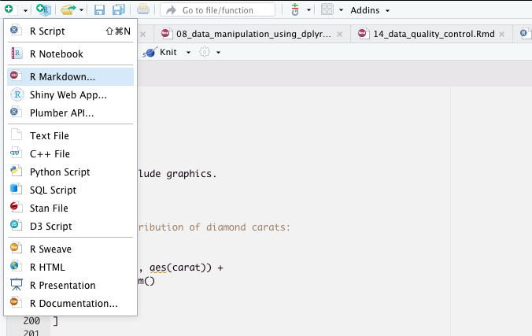
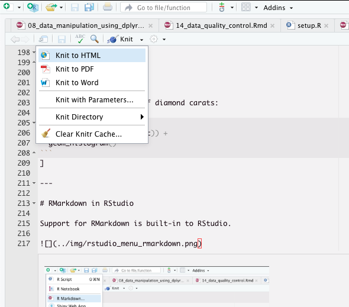
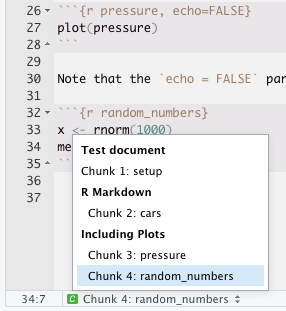
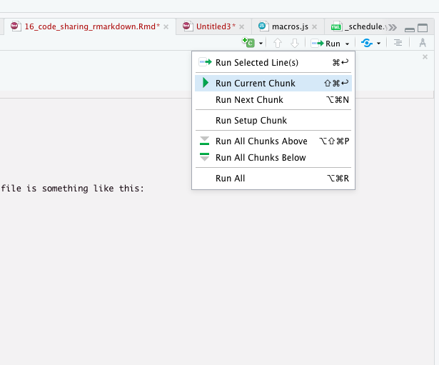

layout: true

```{r setup, echo = FALSE, message = FALSE, warning = FALSE}
source(here::here("scripts/setup.R"))
setup_presentation("code_sharing_rmarkdown", filename = "16_code_sharing_rmarkdown.Rmd")
```

---

# First: What is Markdown?

The name markdown is a take on the work markup, as in HTML (Hyper-Text Markup Language).

.center[`r icons::icon_style(icons::fontawesome("markdown"), scale = 10)`]

It is a mini-language for typesetting documents, making it easy to create headings, paragraphs, inserting images, hyperlinks, etc.

[The Markdown Guide](https://www.markdownguide.org/)

---

# [Markdown syntax](https://www.markdownguide.org/basic-syntax/)

## Headings

.pull-left[
```md
# First level

## Second level

### Third level

#### Fourth level
```
]

.pull-right[
# First level

## Second level

### Third level

#### Fourth level
]

---

# [Markdown syntax](https://www.markdownguide.org/basic-syntax/)

## Emphasis

.pull-left[
```md
This is **bold** text.

This is *italic* text.

This is ***bold and italic*** text.
```
]

.pull-right[
This is **bold** text.

This is *italic* text.

This is ***bold and italic*** text.
]

---

# [Markdown syntax](https://www.markdownguide.org/basic-syntax/)

## Lists

.pull-left[
```md
- First  item
- Second  item
- Third item

1. First item
2. Second item
3. Third item
```
]
.pull-right[
- First  item
- Second  item
- Third item

1. First item
2. Second item
3. Third item
]

---

# Rendering Markdown

The Markdown file format (file extension `.md`) is just a text file format.
In order to produce a proper document, we have to run it through an interpreter.
Nowadays, this is something that is often built-in into editors that support Markdown, including RStudio.

.pull-left.small[
```md
# This is a heading

 **Lorem** ipsum dolor sit amet, consecteturadipiscing elit.
Morbi blandit at augue eu accumsan. Nullam pharetra tortor non
leo sollicitudin, sed efficitur arcu auctor. Nullam quis magna
dapibus, volutpat libero eu, convallis mi.

- Lorem
- ipsum
- dolor

## References

[Lorem ipsum generator](https://www.lipsum.com/)
```
]

.pull-right.small[
# This is a heading

**Lorem** ipsum dolor sit amet, consecteturadipiscing elit.
Morbi blandit at augue eu accumsan. Nullam pharetra tortor non
leo sollicitudin, sed efficitur arcu auctor. Nullam quis magna
dapibus, volutpat libero eu, convallis mi.

- Lorem
- ipsum
- dolor

## References

[Lorem ipsum generator](https://www.lipsum.com/)
]

---

# R Markdown

R Markdown is a flavour of Markdown where we can include R code that can execute as we render the document.

.pull-left[
````md
I took a bunch of random numbers

```{r}`r ''`
x <- rnorm(10)
```

And I calculated the mean

```{r}`r ''`
mean(x)
```
````
]

.pull-right[
I took a bunch of random numbers

```{r}
x <- rnorm(10)
```

And I calculated the mean

```{r}
mean(x)
```
]

???

As you can see here, whatever is produced in one code chunk will be kept in the environment of the document, so to say, while it's being rendered.
This means that we can use variables that we have defined in a code chunk later in the document.

---

# R Markdown

We can even include graphics.

.pull-left[
````md
Here's the distribution of diamond carats:

```{r}`r ''`
ggplot(diamonds, aes(carat)) +
  geom_histogram()
```
````
]

.pull-right[
Here's the distribution of diamond carats:

```{r diamonds_histogram}
ggplot(diamonds, aes(carat)) +
  geom_histogram()
```
]

---

# R Markdown in RStudio

Support for R Markdown is built-in to RStudio.

.pull-left[

]

.pull-right[

]

---

# R Markdown preamble

When we create a new R Markdown document, we get an example document, and the first thing in the file is something like this:

```yaml
---
title: "My first R Markdown document"
author: "Niklas Mähler"
date: "9/16/2021"
output: html_document
---
```

This is a **preamble**, and it helps out in creating the title for our rendered document.
It can also be used to control the default format of our rendered document, as well as a whole bunch of other parameters.
For more information on this, check out the [R Markdown Cheat Sheet](https://github.com/rstudio/cheatsheets/blob/master/rmarkdown-2.0.pdf).

---

# Code chunks

.left-column[
## Introduction
]

.right-column[
We can create chunks of code in our document, that is executed when we compile the document.
These are initiated with three backticks, followed by `{r}`.
This tells the compiler that this is R code that it should execute.

````md
```{r}`r ""`
x <- rnorm(1000)
mean(x)
```
````
]

---

# Code chunks

.left-column[
## Introduction
## Labels
]

.right-column[
We can label our chunks like this

````md
```{r random_numbers}`r ""`
x <- rnorm(1000)
mean(x)
```
````

This can be very helpful, especially when having a larger document


]

---

# Code chunks

.left-column[
## Introduction
## Labels
## Options
]

.right-column[
There are a lot of options that we can set for code chunks.
All available options you can find in the [knitr documentation](https://yihui.org/knitr/options/#chunk-options).

They are written in the form of `tag = value`:

````md
```{r random_numbers, echo = TRUE, eval = FALSE}`r ""`
x <- rnorm(1000)
mean(x)
```
````

Some useful options are

- `echo`: Whether to render the code chunk or not.
- `eval`: Whether to actually execute the code in the chunk.
- `include`: Whether to render the chunk *and* its output.
- `fig.width`/`fig.height`: Control the size of figures.
- `message`: Whether or not to render messages.
- `warning`: Whether or not to render warnings.
- `fig.align`: How figures should be aligned on the page.
]

---

# Code chunks

.left-column[
## Introduction
## Labels
## Options
## Global options
]

.right-column[
Something that I find is a nice setup is to have a configuration chunk as the first chunk in the document.

````md
```{r setup, include = FALSE}`r ''`
knitr::opts_chunk$set(echo = FALSE, fig.width = 5, fig.height = 3,
                      message = FALSE, warning = FALSE,
                      fig.align = "center")
```
````
]

---

# Running code chunks

If a document gets big, or it contains long-running calculations, it can take quite some time to render (or **knit**).
We can run individual code chunks RStudio without knitting the whole document.

.center[

]

???

I'm very fond of keyboards, and keyboard shortcuts, so I almost never use the menus.

Now I will do a bit of a live demo of some R Markdown functionality.

---

# R Markdown references

- [RStudio R Markdown](https://rmarkdown.rstudio.com/): Contains the basics to get started.
- [R Markdown: The Definitive Guide](https://bookdown.org/yihui/rmarkdown/): The guide to everything R Markdown.
- [knitr](https://yihui.org/knitr/): The rendering engine for R Markdown where you can dig into the fine details.
- [R Markdown Cheat Sheet](https://github.com/rstudio/cheatsheets/blob/master/rmarkdown-2.0.pdf)

???

When it comes to the relly fine-grained nuances of R Markdown and knitr, don't think about that now.
I'm just throwing this out there so you know where to look in case you would be interested.
Also, if you continue to use RStudio and R Markdown, you will almost inevitably end up needing these references.

---

# Coding standards

.center[

]

A coding standard (or coding style) describes how source code should be written.
There are usually many different ones, and it is often the case that a workplace or a project group adopts their own coding standard.

What standard to use is not really that important.
The important thing is that everyone involved use the same coding standard.

[The tidyverse style guide](https://style.tidyverse.org/)

???

When sharing code, it is always good if the barrier for reading and being able to understand the code is as low as possible. 
This is something that can be helped by a coding standard.

---

# [The tidyverse style guide](https://style.tidyverse.org/)

As far as it is possible, don't reuse names of common functions or variables.

```{r, eval = FALSE}
# Bad
T <- FALSE
c <- 10
mean <- function(x, ...) sum(x, ...)
```

Variable and function names should use only lowercase letters, numbers, and `_`.
Use underscores (`_`) (so called snake case) to separate words within a name.

```{r, eval = FALSE}
# Good
day_one
day_1

# Bad
DayOne
dayone
```

---

# [The tidyverse style guide](https://style.tidyverse.org/)

Use line breaks to make your code easier to read.

```{r, eval = FALSE}
iris %>%
  group_by(Species) %>%
  summarise(
    Sepal.Length = mean(Sepal.Length),
    Sepal.Width = mean(Sepal.Width),
    Species = n_distinct(Species)
  )
```

```{r, eval = FALSE}
# Good
ggplot(aes(x = Sepal.Width, y = Sepal.Length, color = Species)) +
  geom_point() +
  labs(
    x = "Sepal width, in cm",
    y = "Sepal length, in cm",
    title = "Sepal length vs. width of irises"
  ) 

# Bad
ggplot(aes(x = Sepal.Width, y = Sepal.Length, color = Species)) +
  geom_point() +
  labs(x = "Sepal width, in cm", y = "Sepal length, in cm", title = "Sepal length vs. width of irises") 
```


???

Here are some examples from the style guide, but I encourage you to skim through it yourself.

---

# Suggested reading

- [The tidyverse style guide](https://style.tidyverse.org/)
- [R Markdown: The Definitive Guide](https://bookdown.org/yihui/rmarkdown/)
- [knitr documentation](https://yihui.org/knitr/)
- [R Markdown Cheat Sheet](https://github.com/rstudio/cheatsheets/blob/master/rmarkdown-2.0.pdf)