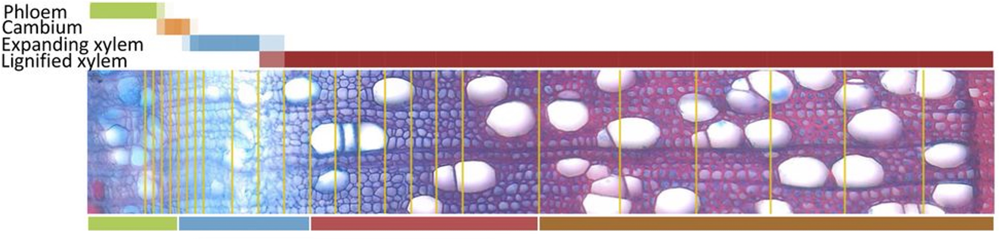
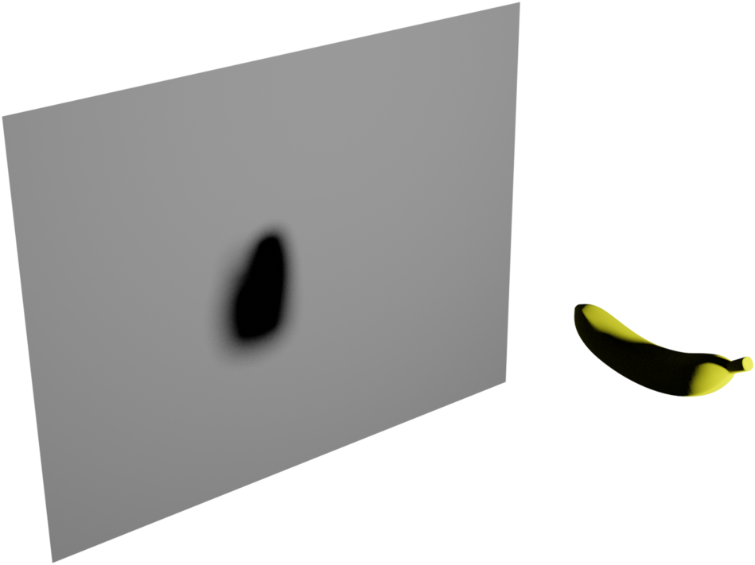
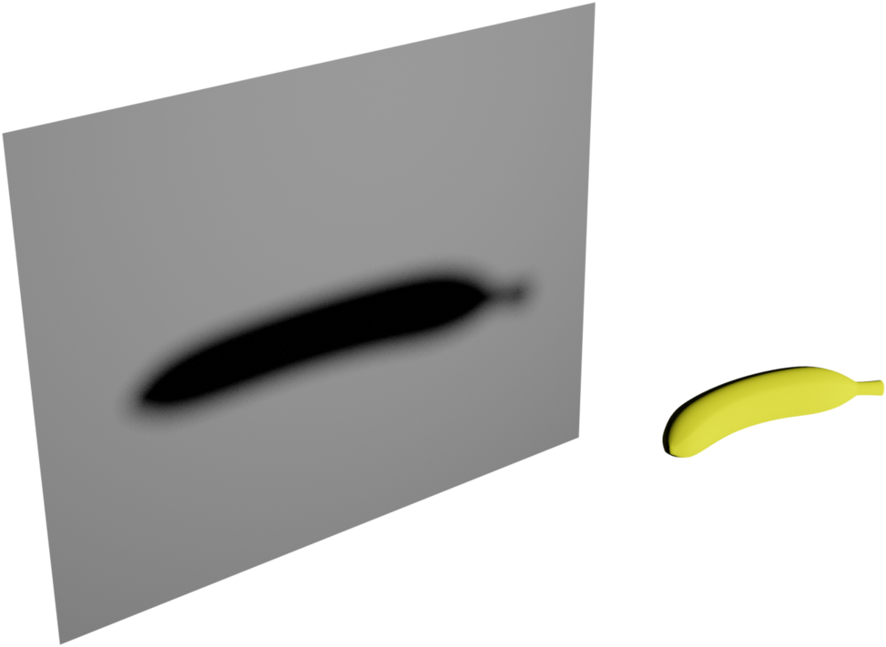
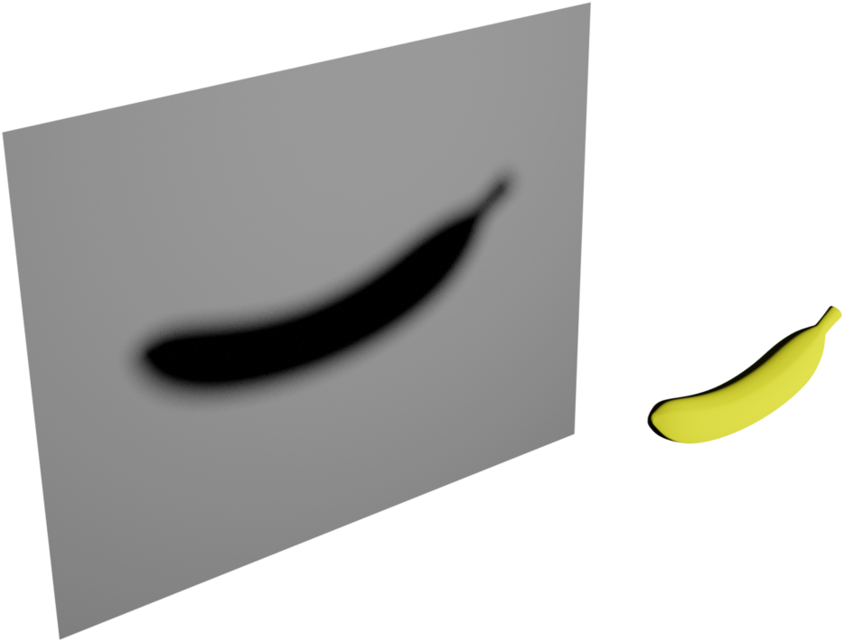

layout: true

```{r setup, echo = FALSE, message = FALSE, warning = FALSE}
source(here::here("scripts/setup.R"))
setup_presentation("quality_control_and_visualisation_of_large_scale_data", filename = "19_quality_control_and_visualisation_of_large_scale_data.Rmd")

aspwood_txt_file <- here("data/aspwood/AspWood_tpm.txt")
aspwood_rds_file <- here("data/aspwood/aspwood.rds")
if (!fs::file_exists(aspwood_txt_file)) {
  aspwood_txt_file <- "ftp://anonymous@plantgenie.org/Data/PopGenIE/Populus_tremula/v2.2/Expression/AspWood_tpm.txt"
}

if (!fs::file_exists(aspwood_rds_file)) {
  aspwood <- read_delim(aspwood_file,
                        col_names = c("gene", "sample", "tpm"),
                        col_types = "ccd",
                        delim = " ") %>% 
    separate(sample, c("tree", "slice"))
  write_rds(aspwood, aspwood_rds_file)
} else {
  aspwood <- read_rds(aspwood_rds_file)
}
```

---

# Learning goals

After this lecture, you should have

- A basic understanding of dimensionality reduction techniques.
- Know a few different ways that large datasets can be visualised.

---

# How does QC differ from smaller datasets?

We've looked at quality control for "small" datasets, but what do we do differently for larger datasets?

Some of the problems unique for larger datasets:

- The sheer size of the data
- Large number of variables

???

- The size of the dataset can make it unruly to manage. We talked a bit about this in the previous lecture, but this can quickly escalate into quite elaborate computer science problems, and this is not the venue for this. Also, with the capacity of computers today, it's quite seldom that we encounter these types of issues.
- The large number of variables makes it difficult to get an overview.

---

class: title

# What do we focus on?

---

# Observations?

- Do our samples group like we would expect them to?
- Are there outliers in the context of the whole dataset?

???

A whole sample can be an outlier, based on the whole dataset.
It might be, in the case of biological samples, that it has a genotype that is vastly different from the rest of the data, for example.

---

# ... or variables?

- Are there unexpected correlations among the variables?
- Are there outliers for only some of the variables?

???

We can also have outliers for just one or a few variables for a sample.
This might not be enough to classify the whole sample as an outlier, but how should we treat these?
Set them to missing?

---

# Example dataset of the day — AspWood

.pull-left[
This is a gene expression dataset from the wood of aspen (*Populus tremula*).
For a single year ring, micrometer-thin slices were cut, and RNA was extracted from these slices and sequenced.

- ~35 thousand genes
- 5 trees
- 137 samples
]

.pull-right[


I will show you both the raw counts from this data, as well as the normalised gene expression data.
]

---

# Removing useless variables

.left-column[
## Useless variables
]

.right-column[
Since we have a lot of variables in our big datasets, we need to make sure that we only include variables that are informative.
Examples of variables that are uninformative are

- Variables with no or very low variance
- Highly correlated variables
- Variables with many missing values
]

???

Depending on what type of data we have, it might not make sense to remove highly correlated variables.
For example, in the case of gene expression, these might be involved in the same process, but not be redunant at all.
Imagine a biosynthesis pathway with two enzymes where one of them uses the product of the other enzyme as substrate.
The expression of these genes might be highly correlated, but it doesn't make sense to remove either of them.

Also, in all of these cases there is the question of "what is low variance", or what are "many missing values".
In the end, thresholds like these become arbitrary.
Just be sure to document them.

---

# Removing useless variables

.left-column[
## Useless variables
## No variance
]

.right-column[
.pull-left.small[
```{r}
gene_stats <- aspwood %>% 
  group_by(gene) %>% 
  summarise(tpm_mean = mean(tpm),
            tpm_var = var(tpm))

zero_var_genes <- gene_stats %>% 
  filter(tpm_var == 0) %>% 
  pull(gene)

aspwood <- aspwood %>% 
  filter(!gene %in% zero_var_genes)
```
]

.pull-right.small[
```{r aspwood_gene_variance}
ggplot(gene_stats, aes(tpm_var)) +
  geom_histogram(bins = 100) +
  scale_x_log10() +
  labs(x = "TPM variance",
       y = "Number of genes")
```
]
]

---

class: title

# Visualisation techniques

---

# Heatmaps

Heatmaps are ubiquitous in biology research, often used to visualise things such as gene expression.

This is one of the few types of plots that I don't usually try to create in ggplot2 since it requires a couple of different packages for the different components, and then we have to puzzle these together. If you want to customise all aspects of a heatmap, it might however be a good option.

Other options are

- `stats::heatmap`: built-in function for producing heatmaps.
- `gplots::heatmap.2`: an extension of the standard `heatmap` function.
- `pheatmap::pheatmap`: an even more feature-rich function.

---

# Heatmaps — `pheatmap`

```{r aspwood_pheatmap1, fig.align = "center"}
random_genes <- unique(aspwood$gene) %>% sample(100)
aspwood_mat <- aspwood %>% 
  filter(gene %in% random_genes) %>% 
  pivot_wider(names_from = gene, values_from = tpm) %>% 
  unite(sample, c(tree, slice)) %>% 
  column_to_rownames("sample") %>% 
  as.matrix()

library(pheatmap)
pheatmap(t(aspwood_mat))
```

---

```{r aspwood_pheatmap2}
pheatmap(t(aspwood_mat), scale = "row",
         clustering_distance_rows = "correlation",
         clustering_distance_cols = "correlation")
```

```{r aspwood_pheatmap3}
variable_genes <- aspwood %>% 
  group_by(gene) %>% 
  summarise(expr_var = var(tpm)) %>% 
  top_n(500, expr_var)

aspwood_mat2 <- aspwood %>% 
  filter(gene %in% variable_genes$gene) %>% 
  pivot_wider(names_from = gene, values_from = tpm) %>% 
  unite(sample, c(tree, slice)) %>% 
  column_to_rownames("sample") %>% 
  as.matrix()

pheatmap(log2(t(aspwood_mat2) + 1),
         clustering_distance_rows = "correlation",
         clustering_distance_cols = "correlation")

pheatmap(log2(t(aspwood_mat2) + 1),
         color = colorRampPalette(RColorBrewer::brewer.pal(5, "GnBu"))(50),
         clustering_distance_rows = "correlation",
         clustering_distance_cols = "correlation")

pheatmap(log2(t(aspwood_mat2) + 1),
         scale = "row",
         clustering_distance_rows = "correlation",
         clustering_distance_cols = "correlation")
```

---

# Heatmaps — Colour scales

We've already talked a bit about colour scales in this course, but it is a topic worth revisiting.

---

# Dimensionality reduction

.left-column[
## Introduction
]

.right-column[
How can we take all variables into account when judging the quality of our data?
One way of doing this is by a collection of techniques called dimensionality reduction.

- [PCA](https://en.wikipedia.org/wiki/Principal_component_analysis)
- [MDS](https://en.wikipedia.org/wiki/Multidimensional_scaling)
- [Phate](https://doi.org/10.1038/s41587-019-0336-3)
- [t-SNE](https://en.wikipedia.org/wiki/T-distributed_stochastic_neighbor_embedding)
- [UMAP](https://arxiv.org/abs/1802.03426)
]

???

We've talked about the curse of dimensionality before, and this is related.

---

# Dimensionality reduction

.left-column[
## Introduction
## PCA
]

.right-column[
## Principal Component Analysis

Map the observations onto a space of lower dimensionality that captures the most of the variation.

This is done by finding orthogonal vectors in the dataset.
]

???

Imagine taking a three-dimensional everyday object, like a banana, and reducing it down to two dimensions, so a flat representation.
There are many different ways we could accomplish this, it all depends on the angle of the banana.

---

# Dimensionality reduction

.left-column[
## Introduction
## PCA
### Intuition
]

.right-column.center[

]

---

# Dimensionality reduction

.left-column[
## Introduction
## PCA
### Intuition
]

.right-column.center[

]

---

# Dimensionality reduction

.left-column[
## Introduction
## PCA
### Intuition
]

.right-column.center[

]

---

# Dimensionality reduction

.left-column[
## Introduction
## PCA
### Intuition
]

.right-column[
```{r weird_banana}
banana <- read_tsv(here("data/banana.tsv"),
                   col_names = c("x", "y", "z"))
ggplot(banana, aes(x, y)) +
  geom_point() +
  coord_fixed() +
  labs(title = "Banana?")
```
]

---

# Dimensionality reduction

.left-column[
## Introduction
## PCA
### Intuition
]

.right-column[
The function for doing a PCA in R is `prcomp`.

```{r banana_pca, fig.height = 3, fig.width = 7.5}
banana_pca <- prcomp(banana)

ggplot(as_tibble(banana_pca$x), aes(PC1, PC2)) +
  geom_point() + 
  coord_fixed() +
  labs(title = "Banana!")
```
]

---

# Dimensionality reduction

.left-column[
## Introduction
## PCA
### Intuition
### The maths
]

.right-column[
PCA can be calculated using a method called [singular value decomposition](https://en.wikipedia.org/wiki/Singular_value_decomposition).

$$
\mathbf{X} = \mathbf{U \Sigma V}^\intercal
$$
- $\mathbf{X}$: $m \times n$ matrix of your data
- $\mathbf{U}$: $n \times n$ matrix of left singular vectors
- $\mathbf{\Sigma}$: diagonal matrix of singular values
- $\mathbf{V}$: $m \times m$ matrix of right singular vectors
]

???

This is all linear algebra, and I don't expect you to do these calculations or anything, I just want to give you a little bit of a background to this.

In the SVD, each column of $\mathbf{X}$ represent an observation, so the opposite of how we are used to represent our data.

---

# Dimensionality reduction

.left-column[
## Introduction
## PCA
### Intuition
### The maths
]

.right-column[
$$
\mathbf{X} = \mathbf{U \Sigma V}^\intercal
$$

In PCA, $\mathbf{X}$ should be centered (and possibly scaled) data, and each row should be an observation, just like we're used to.
If we're using PCA-speak, then 

- $\mathbf{X}$: $n \times m$ matrix of your (numerical) data.
- $\mathbf{U}$: $n \times n$ matrix of the influence of each variable.
- $\mathbf{\Sigma}$: diagonal matrix of the **standard deviation** of the principal components (the square root of the eigenvalues).
- $\mathbf{V}$: $m \times m$ matrix of our eigenvectors, or **loadings**.

The principal components $\mathbf{T}$ (or **scores**) are then defined as $\mathbf{T} = \mathbf{XV}$, or $\mathbf{T} = \mathbf{U\Sigma}$.
]

???

As mentioned last week, scaling is important if the variables we are working with are on very different scales.

The two ways of obtainin the principal components $\mathbf{T}$ are equivalent, and I leave it as an exercise for you to explore that, if you'd like.

---

# Dimensionality reduction

.left-column[
## Introduction
## PCA
### Intuition
### The maths
### In R
]

.right-column[
In order to run PCA in R, we use the function `prcomp`.
Behind the scenes it uses singular value decomposition.

```{r, eval = FALSE}
prcomp(x, center = TRUE)
```

Back from this we get a list-like object with the following items:

- `sdev`: the standard deviation of the principal components.
- `rotation`: the loadings.
- `x`: the principal components.
- `center`: the centering used, or `FALSE`.
- `scale`: the scaling used, or `FALSE`.

Since the standard deviation contains the standard devation for each component, we can calculate the total variance explained by the components like

```{r, eval = FALSE}
sdev^2 / sum(sdev^2)
```
]

---

# Dimensionality reduction

.left-column[
## Introduction
## PCA
### Intuition
### The maths
### In R
]

.right-column[
```{r dcloud_scatter, echo = FALSE, width = 4.5, height = 6}
dcloud <- tibble(
  x1 = c(scale(rnorm(100), scale = FALSE)),
  x2 = c(scale(rnorm(100) + x1, scale = FALSE))
)

dcloud_pca <- prcomp(dcloud)

# If the components point the "wrong" way, redirect them.
v1_direction <- sign(sum(c(0, 1), dcloud_pca$rotation[, 1]))
v2_direction <- sign(sum(c(0, 1), dcloud_pca$rotation[, 2]))
dcloud_pca$x[, 1] <- v1_direction * dcloud_pca$x[, 1]
dcloud_pca$x[, 2] <- v2_direction * dcloud_pca$x[, 2]
dcloud_pca$rotation[, 1] <- v1_direction * dcloud_pca$rotation[, 1]
dcloud_pca$rotation[, 2] <- v2_direction * dcloud_pca$rotation[, 2]

ggplot(dcloud, aes(x1, x2)) +
  geom_point() +
  coord_fixed()
```
]

---

# Dimensionality reduction

.left-column[
## Introduction
## PCA
### Intuition
### The maths
### In R
]

.right-column[
.pull-left[
```{r dcloud_scatter_random_component, echo = FALSE, fig.width = 4.5, fig.height = 6, out.width = "100%"}
component <- c(cos(8/3 * pi), sin(8/3 * pi))
dcloud %>% 
  rowwise() %>% 
  mutate(projection = list(set_names(component * sum(c(x1, x2) * component),
                                     c("x1_end", "x2_end")))) %>% 
  unnest_wider(projection) %>% 
  ggplot() +
  geom_segment(aes(x1, x2, xend = x1_end, yend = x2_end),
               linetype = 2, colour = "firebrick2") +
  geom_point(aes(x1, x2)) +
  geom_abline(slope = component[2] / component[1],
              colour = "steelblue") +
  coord_fixed()
```
]

.pull-right[
```{r dcloud_scatter_pc1, echo = FALSE, fig.width = 4.5, fig.height = 6, out.width = "100%"}
component <- dcloud_pca$rotation[, 1]
dcloud %>% 
  rowwise() %>% 
  mutate(projection = list(set_names(component * sum(c(x1, x2) * component),
                                     c("x1_end", "x2_end")))) %>% 
  unnest_wider(projection) %>% 
  ggplot() +
  geom_segment(aes(x1, x2, xend = x1_end, yend = x2_end),
               linetype = 2, colour = "firebrick2") +
  geom_point(aes(x1, x2)) +
  geom_abline(slope = component[2] / component[1],
              colour = "steelblue") +
  coord_fixed()
```
]
]

---

# Dimensionality reduction

.left-column[
## Introduction
## PCA
### Intuition
### The maths
### In R
]

.right-column[
```{r data_cloud_pca, echo = FALSE}
library(gganimate)

pc_df <- as_tibble(t(dcloud_pca$rotation) * dcloud_pca$sdev) %>% 
  mutate(type = "Raw") %>% 
  bind_rows(tibble(x1 = c(1, 0) * dcloud_pca$sdev[1],
                   x2 = c(0, 1) * dcloud_pca$sdev[2],
                   type = "PCA")) %>% 
  mutate(colour = rep(c("steelblue", "forestgreen"), 2),
         type = factor(type, levels = c("Raw", "PCA")))

obs_df <- as_tibble(dcloud_pca$x) %>% 
  rename(x1 = PC1, x2 = PC2) %>% 
  mutate(type = "PCA") %>% 
  bind_rows(dcloud %>% mutate(type = "Raw")) %>% 
  mutate(type = factor(type, levels = c("Raw", "PCA")))

# For some reason, this is slow as heck, so check if the figure already exists.
pca_anim_file <- here("lectures/figures/quality_control_and_visualisation_of_large_scale_data_data_cloud_pca-1.gif")
if (!fs::file_exists(pca_anim_file)) {
  ggplot(obs_df, aes(x1, x2)) +
    geom_point() +
    geom_segment(data = pc_df,
                 mapping = aes(xend = x1, yend = x2, colour = colour),
                 x = 0, y = 0, size = 1,
                 arrow = arrow(type = "closed", length = unit(0.15, "in"))) +
    scale_colour_identity(name = "", 
                          labels = c(expression(sigma[1]~v[1]),
                                     expression(sigma[2]~v[2])),
                          guide = guide_legend()) +
    coord_fixed() +
    transition_states(type) +
    labs(title = "{closest_state}") +
    ease_aes("cubic-in-out")
} else {
  knitr::include_graphics(pca_anim_file)
}
```
]

???

In this example we have a cloud of data in two dimensions, and we can clearly identify the axes where the we have the most variation.
Here these axes are represented by the coloured arrows.
These coloured arrows are also known as the loadings in PCA.
When we run a PCA on this data, what happens is that these vectors are identified, and the data is rotated so that the x-axis in this case represents the first principal component, and the y-axis the second principal component.

---

# Dimensionality reduction

.left-column[
## Introduction
## PCA
### Intuition
### The maths
### In R
### Examples
]

.right-column.small[
```{r iris_pca, fig.width = 8}
iris_pca <- prcomp(iris[, 1:4])

varexp <- with(iris_pca, sdev^2 / sum(sdev^2))

iris_pca$x %>% 
  as_tibble() %>% 
  bind_cols(species = iris$Species) %>% 
  ggplot(aes(PC1, PC2, colour = species)) +
  geom_point() +
  coord_fixed() +
  labs(x = str_c("PC1 (", format(100 * varexp[1], digits = 2), "%)"),
       y = str_c("PC2 (", format(100 * varexp[2], digits = 2), "%)"))
```
]

---

# Dimensionality reduction

.left-column[
## Introduction
## PCA
### Intuition
### The maths
### In R
### Examples
]

.right-column[
.pull-left[
```{r, echo = FALSE}
article_tile(
  "<i>Populus tremula</i> (European aspen) shows no evidence of sexual dimorphism",
  "",
  "2014-10-16",
  "BMC Plant Biology (2014)",
  "https://doi.org/10.1186/s12870-014-0276-5"
)
```
]

.pull-right.clear[
- 17 trees
- 9 females, 8 males
- RNA-Seq data of leaves
]

.small[
```{r sex_pca}
sex_mat <- read_csv(here("data/aspen_sex/aspen_sex_vst.csv")) %>% 
  rename(gene = ...1) %>% 
  column_to_rownames("gene") %>% 
  as.matrix() %>% 
  t()

sex_metadata <- read_csv(here("data/aspen_sex/sex_samples.csv"))

sex_pca <- prcomp(sex_mat)
variance_explained <- with(sex_pca, sdev^2 / sum(sdev^2))

sex_pca_tbl <- as_tibble(sex_pca$x) %>% 
  mutate(sample = rownames(sex_mat)) %>% 
  left_join(sex_metadata, by = "sample") %>% 
  mutate(sampling_year = factor(date))

sex_pca_scatter <- ggplot(sex_pca_tbl, aes(PC1, PC2), size = 2) +
  coord_fixed() +
  labs(
    x = str_c("PC1 (",format(100 * variance_explained[1], digits = 3), "%)"),
    y = str_c("PC2 (", format(100 * variance_explained[2], digits = 3), "%)")
  ) +
  theme(legend.position = "none")
```
]
]

???

*P. tremula* is dioecious, meaning that each individual has a distinct sex.
This in turn means that each tree either has male or female flowers — whenever they flower.
It can take 15-20 years for an aspen to start flowering.
Flowers was the only thing that could be used to distinguish the two sexes, so extracting RNA from flowers would kind of be cheating.
Therefore we instead looked at mRNA from leaves.

---

# Dimensionality reduction

.left-column[
## Introduction
## PCA
### Intuition
### The maths
### In R
### Examples
]

.right-column[
```{r sex_pca_scatter, fig.width = 7, fig.height = 5}
sex_pca_scatter +
  geom_point() +
  labs(title = "")
```
]

---

# Dimensionality reduction

.left-column[
## Introduction
## PCA
### Intuition
### The maths
### In R
### Examples
]

.right-column[
```{r sex_pca_scatter_sex, fig.width = 7, fig.height = 5}
sex_pca_scatter +
  geom_point(aes(colour = sex)) +
  labs(title = "Coloured by sex")
```
]

---

# Dimensionality reduction

.left-column[
## Introduction
## PCA
### Intuition
### The maths
### In R
### Examples
]

.right-column[
```{r sex_pca_scatter_year, fig.width = 7, fig.height = 5}
sex_pca_scatter + 
  geom_point(aes(colour = sampling_year)) +
  labs(title = "Coloured by sampling year")
```
]

---

# Suggested reading

- [You probably don't understand heatmaps](http://www.opiniomics.org/you-probably-dont-understand-heatmaps/)
- [Explain PCA to your grandmother](https://stats.stackexchange.com/a/140579/10727)

???

Ignore the colour choices in the first blog post.