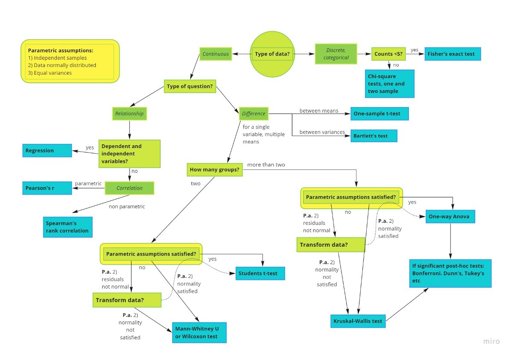

layout: true

```{r setup, echo = FALSE, message = FALSE, warning = FALSE}
source(here::here("scripts/setup.R"))
setup_presentation("statistical_testing", filename = "20_statistical_testing.Rmd")
```

---

# Things we'll learn

- How a *p*-value is defined.
- Differences between parametric and non-parametric tests.
- How to choose an appropriate test depending on our question and our data.
- Basic understanding of linear models.

---

class: title

# *p*-values

---

# History

.pull-left[
- Date as far back as the 18th century.
  - [John Arbuthnot](https://en.wikipedia.org/wiki/John_Arbuthnot) tested the sex ratio of newborns.
- Formally introduced by [Karl Pearson](https://en.wikipedia.org/wiki/Karl_Pearson) with the $\chi^2$ test in the early 1900s.
- Popularised by [Ronald Fisher](https://en.wikipedia.org/wiki/Ronald_Fisher) in his book [Statistical Methods for Research Workers](https://en.wikipedia.org/wiki/Statistical_Methods_for_Research_Workers) from 1925.
  - Also popularised the 0.05 significance level.
]

.pull-right[
> "From whence it follows, that it is Art, not Chance, that governs."
> .source[— John Arbuthnot]
]

???

---

# The lady tasting tea

.pull-left[
This was an experiment set up by Ronald Fisher in order to test the claim of [Muriel Bristol](https://en.wikipedia.org/wiki/Muriel_Bristol) that she could taste the difference in whether milk had been added to the tea, or the tea added to the milk.
She was given eight cups of tea with milk, where in four cups the milk had been added to the tea, and the four others the tea to the milk.

This test can be expressed as "what is the probability to correctly classify four cups of tea".
Mathematically, this can be expressed as

$$
\frac{1}{8 \choose 4} = \frac{1}{70} \approx 0.014
$$
The null hypothesis, i.e. that the woman would not be able to distinguish between the different ways of preparation, was rejected
]

.pull-right.center[
[](https://en.wikipedia.org/wiki/The_Lady_Tasting_Tea)
]

???

The book is a nice popular science perspective on the evolution of modern-day statistics.

---

# The null hypothesis

The null hypothesis, often denoted $H_0$, is an important part of hypothesis testing.
We can see it as the counter-point to whatever we are trying to test.

Let's say that we are testing whether the mean height of trees is different whether or not they have been fertilised.
Before we perform the experiment, we should set up our hypotheses.
The null hypothesis, i.e. our negative outcome, would be that the mean height is the same:
$$
H_0: \mu_1 = \mu_2
$$
and the alternative hypothesis would be
$$
H_1: \mu_1 \neq \mu_2
$$

???

So, what is a null hypothesis?
In this particular example, we don't care which way the comparison goes, we just care that they are different.
In other words, this is a two-sided test.

If we have a particular question in mind, we need to try to formulate what a negative outcome of that test would be.

Many times in our field of study, we aren't doing classical hypothesis testing such as this, but rather take a more explorative approach.
Then it might not make sense to think of an hypothesis before we perform the experiment.

Still, we have to think about this whenever we do statistical testing.
Every test that we do will have a set null hypothesis, and we have to make sure that this applies to what we are testing.
If not, it is probably not an appropriate test for us, and if we still decide to use it, the results might not reflect our question.

---

# The definition

A *p*-value is defined as the probability of a result as extreme as that we observe, or more extreme, given the null hypothesis is true.

.pull-left[
Consider a value $t$ sampled from an unknown distribution $T$.
$$
p = \Pr(T \geq t~|~H_0)
$$

If the *p*-value is less than our significance threshold $\alpha$ (often 0.05), then we reject the null hypothesis.

`r note("Note that this is not the same as saying the null hypothesis is false. It is simply a way of rejecting a scenario that is unlikely given our data.", "warning")`
]

.pull-right[
```{r p_definition, echo = FALSE, out.width = "100%"}
tibble(
  x = seq(-4, 4, length.out = 200),
  y = dnorm(x)
) %>% 
  ggplot(aes(x, y)) +
  geom_area(fill = colorspace::lighten("forestgreen", amount = 0.2)) +
  geom_area(data = tibble(
    x = seq(2, 4, length.out = 50),
    y = dnorm(x)
  ), fill = "forestgreen") +
  annotate("segment", x = 2, y = 0, xend = 2, yend = dnorm(2),
           linetype = "dashed") +
  annotate("point", x = 2, y = 0, size = 2) +
  annotate("segment", x = 3, y = 0.1, xend = 2.5, yend = 0.03,
           arrow = arrow(type = "closed", length = unit(12, "pt"))) +
  annotate("text", x = 3, y = 0.11, label = "p-value",
           size = 10, vjust = 0) +
  labs(x = "Value", y = "Density") +
  theme_classic()
```
]

???

The overall shape of the distribution represents all possible observations, given that the null hypothesis is true.
In other words, if the null hypothesis is true, we expect most values to be close to zero.
The further out towards the edges we get, the more unlikely an observation becomes.

A small p-value can either mean that we are observing something very unlikely, or that our null hypothesis is false.
If the p-value is lower than our threshold level $\alpha$, then we usually reject the null hypothesis.
What this esentially means is that we deem this event so unlikely that we accept that our observation might come from a different distribution entirely.

---

# An example

.pull-left[
Here we have height measurements of 20 trees each from two populations, one which has been fertilised, and one that has not.

```{r tree_mean_heights, echo = FALSE}
tree_heights <- tibble(
  height = c(rnorm(20, mean = 250, sd = 50), rnorm(20, mean = 300, sd = 50)),
  population = gl(2, 20, labels = c("non-fertilised", "fertilised"))
) 

ggplot(tree_heights, aes(height, group = population, fill = population)) +
  geom_histogram(position = "identity", alpha = 0.5) +
  labs(x = "Tree height (cm)", y = "Number of trees")
```
]

.pull-right[
```{r, echo = FALSE}
tree_heights %>% 
  group_by(population) %>% 
  summarise(mean_height = mean(height),
            sd_height = sd(height)) %>% 
  knitr::kable()
```
]

???

We could do a two-sample t-test on this in order to compare the means.
Keep in mind that t-tests assume a normal distribution.
In this case I know that the values come from a normal distribution, but this we can't always know.
Therefore you should always check for normality, for example with a Q-Q plot.

---

# An example

.pull-left[
```{r, echo = FALSE}
tree_heights %>% 
  group_by(population) %>% 
  summarise(mean_height = mean(height),
            sd_height = sd(height)) %>% 
  knitr::kable()
```

$$
t = 
  \frac{\overline{X_1} - \overline{X_2}}{s_p \sqrt{\frac{2}{n}}} = 
  \frac{311.6 - 255.3}{\sqrt{\frac{57.6^2 + 64.8^2}{2}} \sqrt{\frac{2}{20}}}
  \approx 2.9
$$

This is a two-sided test, which means we also have to consider the other extreme.
$$
p = 2 \min{\left(\Pr(T \geq t~|~H_0), \Pr(T \leq t~|~H_0)\right)}
$$
The p-value is then the sum of the areas of the distribution from the observations to infinity.
$$
p \approx 0.006
$$

]

.pull-right[
```{r t_distribution, echo = FALSE, out.width = "100%", fig.height = 4.5}
tibble(
  x = seq(-5, 5, length.out = 200),
  y = dt(x, 38)
) %>% 
  ggplot(aes(x, y)) +
  geom_area(fill = colorspace::lighten("forestgreen", amount = 0.2)) +
  geom_area(data = tibble(x = seq(2.9, 5, length.out = 50), y = dt(x, 38)),
            fill = "forestgreen") +
  geom_area(data = tibble(x = seq(-2.9, -5, length.out = 50), y = dt(x, 38)),
            fill = "forestgreen") +
  annotate("segment", x = 2.9, y = 0, xend = 2.9, yend = dt(2.9, 38),
           linetype = "dashed") +
  annotate("point", x = 2.9, y = 0) +
  labs(x = "t-statistic",
       y = "Density") +
  theme_classic()
```

`r note("Rejecting the null hypothesis if it is true is also known as <b>Type I error</b>. Failure to reject the null hypothesis if it is false is known as <b>Type II error</b>.", "tip", c("yellow", "small"))`
]

???

This test assumes that the samples come from a normal distribution, and that the variances are equal.

In this case, the distribution is symmetric around zero, so it doesn't matter which one we use.

This tail goes on to infinity, and this is also why we, at least theoretically, can't have p-values that are exactly zero or exactly one.

---

exclude: true

# The central limit theorem

---

exclude: true

# Why 0.05?

---

exclude: true

# What the *p*-value is not

- It is **not** the probability that the null hypothesis is true.

---

# Problems with multiple testing

.pull-left[
Another interpretation of the p-value is in terms of error rates.
We can say that at the $\alpha = 0.05$ level, there is a 5% chance that we reject the null hypothesis even though it is true.
The more tests we do, the more likely it is that we will see an extreme value purely by chance.

In these cases we have to adjust for *multiple testing*.
This means either modifying our p-values, or our significance level to reflect the number of tests that have been made.

If we do 100 tests at the $\alpha = 0.05$ level, then we expect to incorrectly reject the null hypothesis five times.
Compare this with performing a single test at the same confidence level and only having a 5% chance of rejecting the null hypothesis.
]

.pull-right.center[

]

---

# Multiple testing correction in R

In R, we can correct for multiple testing with the `p.adjust` function.

.pull-left[
```{r}
population <- rnorm(1000)
pvalues <- map_dbl(
  1:1000,
  ~ t.test(sample(population, 20),
           population)$p.value
)

pval_tbl <- tibble(
  p = pvalues,
  padj = p.adjust(p)
)

sum(pval_tbl$p < 0.05)
sum(pval_tbl$padj < 0.05)
```
]

.pull-right.small[
```{r padjust_example}
pval_tbl %>% 
  pivot_longer(everything()) %>% 
  ggplot(aes(value)) +
  facet_grid(cols = vars(name)) +
  geom_histogram() +
  geom_vline(xintercept = 0.05, colour = "firebrick2",
             linetype = "dashed") +
  labs(x = "p-value", y = "Number of observations")
```
]

???

`p.adjust` has a lot of different types of correction, but I will leave it to you to explore this.

---

class: title

# Types of tests

---

# Parametric tests

Any test that assumes that the data comes from a population that can be modeled by a distribution with a fixed set of parameters is a **parametric test**.

Here are some examples of parametric tests that assume that the data is sampled from a normal distribution:

- *t*-test
- ANOVA
- Pearson correlation

.pull-left[
```{r norm_histogram, echo = FALSE}
rnorm_tbl <- as_tibble(qqnorm(rnorm(1000), plot.it = FALSE))
ggplot(rnorm_tbl, aes(y)) +
  geom_histogram(bins = 50) +
  labs(x = "Observed value", y = "Number of observations")
```
]

.pull-right[
```{r norm_qq_plot, echo = FALSE}
qqline_params <- function(y, distribution = qnorm,
                          probs = c(0.25, 0.75), qtype = 7) {
  stopifnot(length(probs) == 2, is.function(distribution))
  y <- quantile(y, probs, names = FALSE, type = qtype, na.rm = TRUE)
  x <- distribution(probs)
  list(
    slope = diff(y)/diff(x),
    intercept = y[1] - (diff(y)/diff(x)) * x[1]
  )
}

ggplot(rnorm_tbl, aes(x, y)) +
  geom_point() +
  geom_abline(aes(slope = qqline_params(y)$slope,
                  intercept = qqline_params(y)$intercept),
              colour = "firebrick2", linetype = "dashed") +
  labs(x = "Expected value", y = "Observed value")
```
]

---

# Non-parametric tests

If we have data that doesn't fit a normal distribution, too few data points to safely assume a normal distribution, or outliers in our data, we should use non-parametric tests.
These don't make assumptions of the underlying distribution.

.small[
```{r, echo = FALSE}
tribble(
  ~`Parametric test`, ~`Non-parametric equivalent`,
  "Paired *t*-test", "Wilcoxon rank-sum test",
  "Unpaired *t*-test", "Mann-Whitney U test",
  "Pearson correlation", "Spearman correlation",
  "One-way ANOVA", "Kruskal-Wallis test"
) %>% knitr::kable()
```
]

.pull-left[
```{r beta_histogram, echo = FALSE}
rbeta_tbl <- as_tibble(qqnorm(rbeta(1000, 2, 5), plot.it = FALSE))
ggplot(rbeta_tbl, aes(y)) +
  geom_histogram(bins = 60) +
  labs(x = "Observed value", y = "Number of observations")
```
]

.pull-right[
```{r beta_qq_plot, echo = FALSE}
ggplot(rbeta_tbl, aes(x, y)) +
  geom_point() +
  geom_abline(aes(slope = qqline_params(y)$slope,
                  intercept = qqline_params(y)$intercept),
              colour = "firebrick2", linetype = "dashed") +
  labs(x = "Expected value", y = "Observed value")
```
]

---

class: title

# How to choose a test

---

# Why not always go non-parametric?

1. We are rarely interested in a significance test alone; we would like to say something about the population from which the samples came, and this is best done with estimates of parameters and confidence intervals.
2. Non-parametric tests are not as flexible, e.g. being able to take confounding factors into account using multiple regression.
3. Parametric tests usually have more statistical power than their non-parametric equivalents, i.e. you are more likely to detect significant differences if they actually exist.

???

So, if non-parametric tests can always be applied, why don't we always use this type of test, and just don't bother about normality assumptions?
Parametric tests are preferred for the following reasons.

---

# What test to choose?

.center[

.small.right[&copy; Benedicte Albrectsen]
]

---

class: title

# Exploratory analysis

---

# Exploratory analysis

So far we've been looking at classical hypothesis testing, which is generally governed by quite strict rules that make it difficult to get right.
First of all, each observation can only be used for exploration or confirmation; not both.
Secondly, if we have saved observations for our confirmation, we can only use them once.
If we use them more than once, it's no longer confirmation, but exploration.

## What if we don't have a hypothesis defined before we start?

We can see hypothesis testing as **hypothesis confirming**, but we can also go in blind and instead **generate hypotheses** by exploring our data.
Perhaps we find some interesting pattern that warrants a deeper look into that particular phenomenon.

---

class: title

# Linear models

???

On the slide with the different types of statistical tests, regression models were represented by a single box, but this is a huge family of related models.
Here I will try to show the basics of regression models, how they can handle multiple variables, confounding effects, and co-variates.

---

# What is a linear model?

When we want to check for a relationship between a response variable (dependent variable) and some independent variables.
The basic form of a linear model is
$$
y = \beta_0 + \beta_1 x_1 + \beta_2 x_2 + \ldots + \beta_nx_n
$$
where $y$ is our dependent variable, $x_1, x_2, \ldots, x_n$ are our dependent variables, and $\beta_0, \beta_1, \ldots, \beta_n$ are parameters (or coefficients) that have to be estimated.

---

# Linear models in R

.pull-left[
We can construct linear models in R using the `lm` function.

```{r sim1}
library(modelr)
ggplot(sim1, aes(x, y)) +
  geom_point()
```
]

.pull-right[
```{r}
sim1_mod <- lm(y ~ x, data = sim1)
coefficients(sim1_mod)
```

$$
\begin{align}
y &= \beta_0 + \beta_1 x_1 \\
y &= 4.221 + 2.052x
\end{align}
$$
]

???

The modelr package is a part of the tidyverse that provides some functions that enables us to use models in the context of dplyr and tidy data.

---

# Model predictions

.pull-left[
```{r}
grid <- data_grid(sim1, x) %>% 
  add_predictions(sim1_mod)
grid
```
]

.pull-right[
```{r sim1_predictions}
ggplot(sim1) +
  geom_point(aes(x, y)) +
  geom_line(aes(x, pred), data = grid, colour = "red")
```
]

---

# Model residuals

.pull-left[
```{r sim1_residual_lines, echo = FALSE}
sim1 %>% 
  add_residuals(sim1_mod) %>% 
  ggplot() +
  geom_segment(aes(x, y, xend = x, yend = y - resid),
               colour = "gray", linetype = "solid") +
  geom_point(aes(x, y)) +
  geom_line(aes(x, pred), data = grid, colour = "red")
```
]

.pull-right[
```{r}
sim1 <- add_residuals(sim1, sim1_mod)
sim1
```
]

???

The residuals are the distances between our points and the line, or the prediction error of our model.
These are important when it comes to the evaluation of our model.

---

# Model residuals

.pull-left[
```{r sim1_residuals}
ggplot(sim1, aes(x, resid)) +
  geom_ref_line(h = 0) +
  geom_point()
```
]

.pull-right[
```{r sim1_residuals_histogram}
ggplot(sim1, aes(resid)) +
  geom_histogram(bins = 10)
```
]

???

Thanks to how the model works, our residuals will be centered around zero.
If our model is good, we should see a random scatter around zero.
If we would see a pattern in this, then that can be a sign that there is some variable we should have taken into account, but we haven't.

The whole point of the model is to minimise the sum of the residuals, or rather the sum of squares of the residuals.

---

# Root-mean-squared deviation

.pull-left[
The goal of the model is to minimise the residuals, but how does it do this?
First of all, we have to be able to represent the residuals as a single number.
A common way to do this is by using the **root-mean-squared deviation**.
$$
\text{RMSD} = \sqrt{\frac{\sum_{i=1}^N{\left(y - \hat{y}\right)^2}}{N}}
$$
]

.pull-right[
```{r}
sqrt(mean((sim1$y - predict(sim1_mod))^2))
rmse(sim1_mod, sim1)
```
]

---

# Root-mean-squared deviation

.pull-left[
```{r random_models, echo = FALSE}
models <- tibble(
  a1 = c(runif(249, -20, 40), 4.221),
  a2 = c(runif(249, -5, 5), 2.052)
)

model1 <- function(a, data) {
  a[1] + data$x * a[2]
}

measure_distance <- function(mod, data) {
  diff <- data$y - model1(mod, data)
  sqrt(mean(diff ^ 2))
}

sim1_dist <- function(a1, a2) {
  measure_distance(c(a1, a2), sim1)
}

models <- models %>% 
  mutate(dist = purrr::map2_dbl(a1, a2, sim1_dist))

ggplot(sim1, aes(x, y)) +
  geom_point() +
  geom_abline(aes(intercept = a1, slope = a2),
              data = models, alpha = 0.2)
```

Here we have 250 random models, including the model we got from `lm` earlier.
]

.pull-right[
```{r random_models_distance, echo = FALSE}
ggplot(sim1, aes(x, y)) +
  geom_point() +
  geom_abline(aes(intercept = a1, slope = a2, colour = -dist),
              data = models %>% top_n(10, -dist), alpha = 1)
```

This is what we get if we filter the models to only include the 10 with the smallest RMSD, and also colouring them accordingly.
]

---

# Categorical independent variables

We are not restricted to using continuous independent variables, but we can also use categorical variables in order to explain a continuous variable. A typical example of this in biology research is genomic associations where we want to associate genetic variation with a quantitative trait.

.pull-left[
If we look back to the formula for a linear model
$$
y = \beta_0 + \beta_1 x_1 + \beta_2 x_2 + \ldots + \beta_n x_n
$$
we see that we cannot use a categorical variable directly in this, since it's not a number, and we cannot multiply it with the coefficients.
In order to get around this, R converts the variable into a number by creating a **model matrix**.

Only male is assigned here, and we can interpret it as `female` being the base level in our test.
]

.pull-right[
```{r}
tribble(
  ~sex, ~response,
  "male", 1,
  "female", 2,
  "male", 1,
  "female", 1
) %>% model_matrix(response ~ sex)
```
]

???

It wouldn't work if we also had a `sexfemale` column in our model matrix.
The reason for this is that we cannot have columns in our model matrix that can be perfectly predicted by another column in the model matrix.
The `sexfemale` column could be expressed as `1 - sexmale`.
What this implies for the model construction is that we have an infinite number of solutions to our regression problem, and this doesn't work out.

As you might be able to tell, this also causes problems if we have confounded variables in our data.

---

# Categorical independent variables

.pull-left[
```{r, echo = FALSE}
sim2 <- sim2 %>% 
  filter(x %in% c("a", "b", "c")) %>% 
  mutate(
    x = fct_recode(
      factor(x),
      "A/A" = "a", "A/C" = "c", "C/C" = "b") %>% 
      fct_relevel("C/C", after = 2))
```

```{r}
sim2

sim2_mod <- lm(y ~ x, data = sim2)

grid <- data_grid(sim2, x) %>% 
  add_predictions(sim2_mod)
```
]

.pull-right[
```{r sim2_prediction}
ggplot(sim2, aes(x, y)) +
  geom_point() +
  geom_point(aes(y = pred), data = grid,
             size = 3, colour = "red")
```
]

???

The predictions are simply the means of the three groups of data that we have.
This makes sense since the model is trying to minimise the residuals, and the mean in each group will do just that.

```{r}
predict(sim2_mod, )
```

???

One important difference between this model and models using continuous dependent variables is that we cannot predict levels that we don't have in our model.
For continous data, we can extrapolate, but this is not possible for a categorical variable.

---

# Categorical and continous independent variables

.pull-left[
```{r sim3}
ggplot(sim3, aes(x1, y)) +
  geom_point(aes(colour = x2))
```
]

.pull-right[
There are two ways we can make a model from this where we take both variables into account:

```{r}
sim3_mod1 <- lm(y ~ x1 + x2, data = sim3)
sim3_mod2 <- lm(y ~ x1 * x2, data = sim3)
```

The first will consider `x1` and `x2` as completely independent, so the effect of `x1` on `y` is independent from the effect of `x2` on `y`.
By using `*`, we also estimate the effect that the interaction between `x1` and `x2` has on `y`.
]

---

# Categorical and continous independent variables

.pull-left[
To be able to visualise the models we can use couple of new functions in modelr.

```{r}
grid <- data_grid(sim3, x1, x2) %>% 
  gather_predictions(sim3_mod1, sim3_mod2)
```
]

.pull-right[
```{r sim3_predictions}
ggplot(sim3, aes(x1, y, colour = x2)) +
  geom_point() +
  geom_line(data = grid, aes(y = pred)) +
  facet_grid(cols = vars(model))
```
]

???

`gather_predictions` will add the model name and its predictions to the grid data frame.

We can see here that the model that uses `+`, i.e. the independent effects of `x1` and `x2` on `y` has a different intercept for each level of `x2`, but the same slope.
When we use `*`, i.e. considering the interaction between the two, both the intercept and the slope are different.

---


# Categorical and continous independent variables

.pull-left[
Here are the residuals for these two models.

.small[
```{r sim3_resid}
sim3 <- gather_residuals(sim3, sim3_mod1, sim3_mod2)
ggplot(sim3, aes(x1, resid, colour = x2)) +
  geom_point() +
  facet_grid(rows = vars(model), cols = vars(x2))
```
]
]

.pull-right[
```{r}
rmse(sim3_mod1, sim3)
rmse(sim3_mod2, sim3)
```
]

???

From this we can see that there is a pattern in the residuals for the first model, indicating that there is something that we are not accounting for.
In the second model, however, these patterns are gone.

You might think of this as a hand-wavy way of saying that the second model is better, and this is true.
Precisely determining which model is better requires a lot of maths, and for all our intents and purposes this is enough.

We could also calculate the error and see that it is actually lower for the second model.

---

# Multiple continuous independent variables

.pull-left[
```{r}
sim4_mod1 <- lm(y ~ x1 + x2, data = sim4)
sim4_mod2 <- lm(y ~ x1 * x2, data = sim4)

grid <- sim4 %>% 
  data_grid(
    x1 = seq_range(x1, 5),
    x2 = seq_range(x2, 5)
  ) %>% 
  gather_predictions(sim4_mod1, sim4_mod2)
```
]

.pull-right[
```{r sim4_pred}
ggplot(grid, aes(x1, x2)) +
  geom_tile(aes(fill = pred)) +
  facet_grid(cols = vars(model))
```
]

???

`seq_range` will take the extreme points of the input data and create 5 points spread out across this interval.

Here it might look like the two models are the same, but we are quite bad at comparing shades of colour visually, so let's try a different approach.

---

# Multiple continuous independent variables

.pull-left[
```{r sim4_pred_lines1}
ggplot(grid, aes(x1, pred, colour = x2, group = x2)) + 
  geom_line() +
  facet_grid(cols = vars(model))
```
]

.pull-right[
```{r sim4_pred_lines2}
ggplot(grid, aes(x2, pred, colour = x1, group = x1)) + 
  geom_line() +
  facet_grid(cols = vars(model))
```
]

???

Here we can imagine that we are looking at the surface from the previous slide from the side.
Then we can see that the angle of the plane varies for the interaction model depending on `x1` and `x2`.

As you see, already for two variables it becomes difficult to visualise these models.

This is an example from R for Data Science, and in section 23.4.5 there is an exercise to look at the residuals of these two models, so I will leave that to you.

---

# Other types of model families

Here we've only looked at regular linear models where the response has to be continuous.
These can be extended in a multitude of ways.

One example is **[generalised linear models](https://en.wikipedia.org/wiki/Generalized_linear_model)** (`stats::glm`) where, as the name implies, the model is generalised so that it can have a non-continuous response variable.

Another example is **[robust linear models](https://en.wikipedia.org/wiki/Robust_regression)** (`MASS::rlm`) where the influence of points far away is lowered, resulting in models that are less sensitive to outliers.

---

# Take-home messages

- Always check the assumptions for any test you want to do.
- Correct results for multiple testing.
- Don't use your data both for exploratory analysis and hypothesis confirmation.
- See these types of analysis as a way of exploring the data and uncover relationships that can be investigated with new, more targeted, experiments.

---

# Suggested reading

- [R for Data Science: Modelling](https://r4ds.had.co.nz/model-intro.html)
- [An Introduction to Statistical Learning](https://www.statlearning.com/)
- [Testing For Normality — Clearly Explained](https://www.youtube.com/watch?v=02I84i8Knas)

???

I especially think you should take a look at chapters 23 and 24 in R for Data Science, together with the exercises that you'll find there.