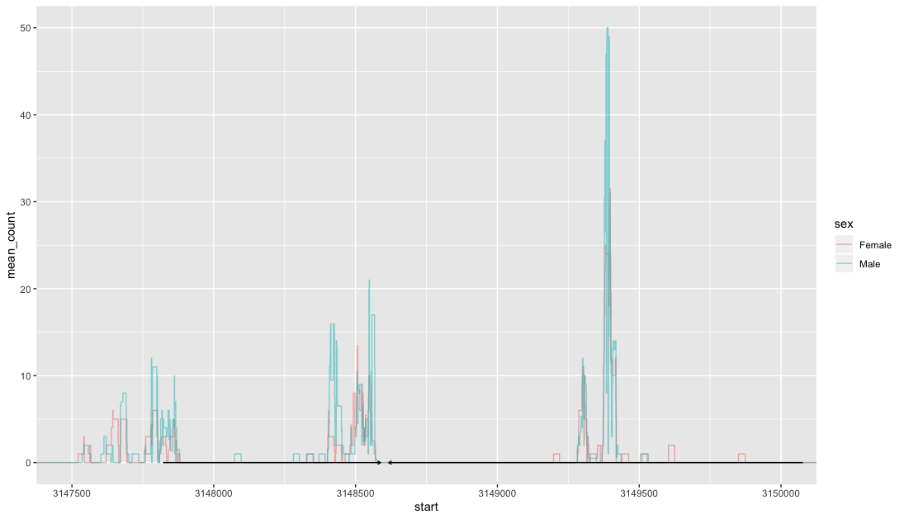
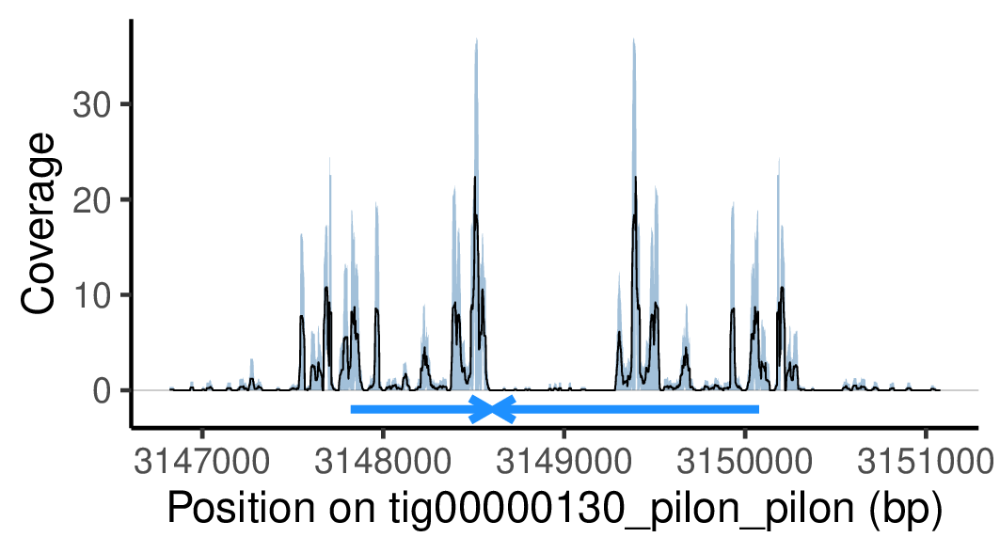
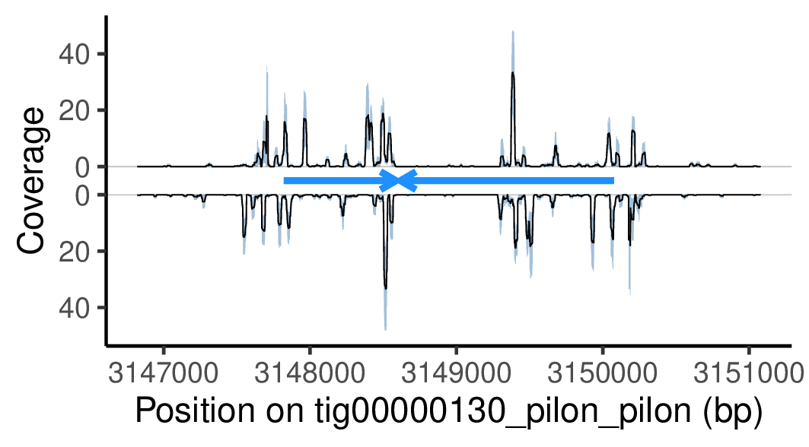
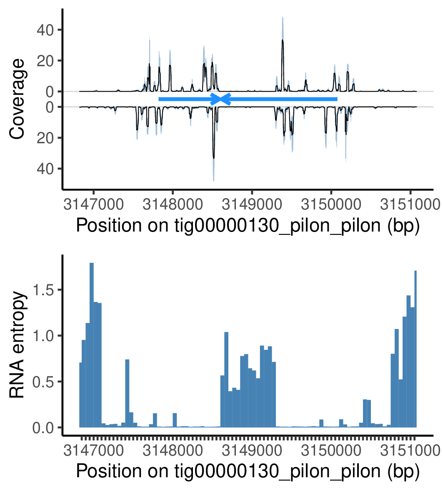
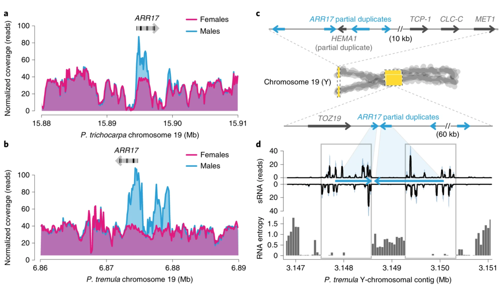
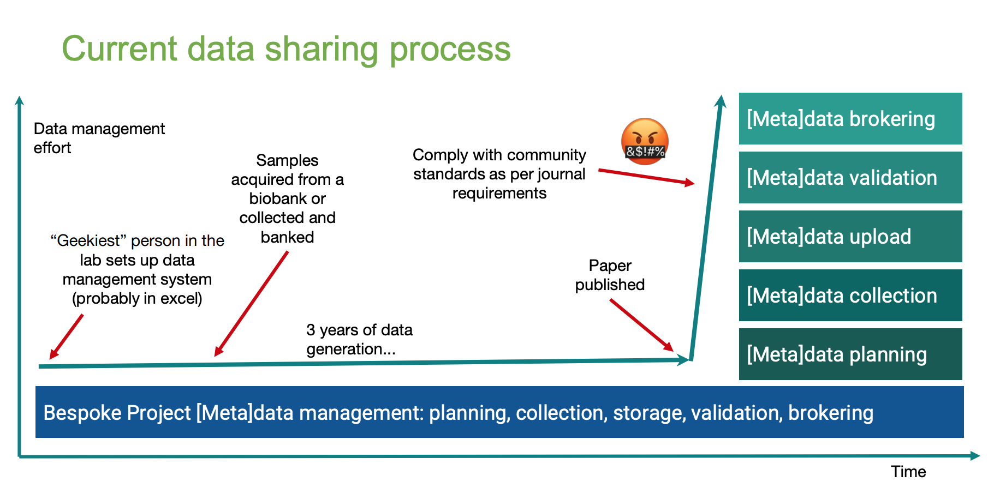
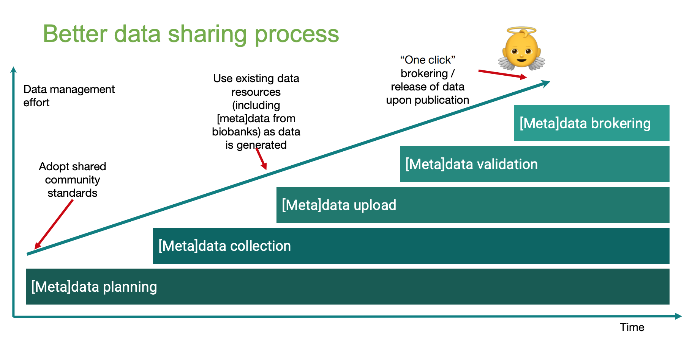

layout: true

```{r setup, echo = FALSE, message = FALSE, warning = FALSE}
source(here::here("scripts/setup.R"))
setup_presentation("journal_guidelines_for_authors", filename = "23_journal_guidelines_for_authors.Rmd")
```

---

# From exploration to publication

The way from plotting your first figure related to a certain dataset to a figure ready for publication is long.

I will show you some snapshots of the process of making a figure for the paper titled [A single gene underlies the dynamic evolution of poplar sex determination](https://doi.org/10.1038/s41477-020-0672-9).

The basic idea was that I would map reads from sRNA to a region in the genome of *Populus tremula* in order to support the hypothesis that this region produced sRNAs that in turn silenced a gene further upstream which results in sex-determination in these trees.

---



???

I started out with this.

---

.center[

]

---

.center[

]

---

.center[

]

---

.center[

.right[[Müller et al. 2020](https://doi.org/10.1038/s41477-020-0672-9)]
]

???

In the end, this is what made it into the paper.

---

# Let's look at some guidelines

We'll look at the author guidelines for a couple different journals to see what they say about

- Figure formatting
- Statistical analyses
- Data sharing
- Code sharing

## Guidelines

- [New Phytologist](https://nph.onlinelibrary.wiley.com/hub/journal/14698137/about/author-guidelines)
- [eLife](https://reviewer.elifesciences.org/author-guide/full)
- [PLOS ONE](https://journals.plos.org/plosone/s/submission-guidelines)
- [F1000 Research](https://f1000research.com/for-authors/article-guidelines/research-articles)

---

# Fully reproducible articles

The publisher eLife has made an effort to allow for researchers to publish fully reproducible articles.

.https://www.nature.com/articles/nmeth.2837center[

]

So far there are only a few articles of this kind published, but I hope (and think) that this will be an integral part of publishing in the future.

???

Even though this platform was developed by eLife and Stencila, they made it open-source and available for other publishers to use.

Let's look at an example paper using this system: https://elifesciences.org/articles/30274/executable

---

# Image editing

.pull-left[
More and more journals require authors to submit raw images of gels and such.


```{r, echo = FALSE}
article_tile(
  "One in 25 papers contains inappropriately duplicated images, study finds",
  "Elisabeth Bik, a microbiologist at Stanford, has for years been a behind-the-scenes force in scientific integrity, anonymously submitting reports on plagiarism and image duplication to journal editors. Now, she’s ready to come out of the shadows.",
  date = "2016-04-19",
  source = "Retraction Watch",
  source_url = "https://retractionwatch.com/2016/04/19/one-in-25-papers-contains-inappropriately-duplicated-images-screen-finds/",
  style = "max-width: 100;"
)
```
]

.pull-right[
<blockquote class="twitter-tweet"><p lang="en" dir="ltr">Looks like someone got really creative with their gel image. <a href="https://t.co/g9oxOXzJhH">pic.twitter.com/g9oxOXzJhH</a></p>&mdash; Elisabeth Bik (@MicrobiomDigest) <a href="https://twitter.com/MicrobiomDigest/status/901677063161004032?ref_src=twsrc%5Etfw">August 27, 2017</a></blockquote> <script async src="https://platform.twitter.com/widgets.js" charset="utf-8"></script>
]

---

# Conclusions

- Reproducibility is becoming of greater and greater concern, and more and more journals are becoming conscious about this.
- Carefully read the author guidelines for the journal you want to submit your manuscript to.
- Think about things like data sharing and transparent analyses already at the start of the project.

---


.right[[Tony Burdett: "Open access data sharing and submission"](https://www.youtube.com/watch?v=VF12vht2qmE)]

---


.right[[Tony Burdett: "Open access data sharing and submission"](https://www.youtube.com/watch?v=VF12vht2qmE)]

---

# Suggested reading

## On publishing

- [Introducing eLife's first computationally reproducible article](https://elifesciences.org/labs/ad58f08d/introducing-elife-s-first-computationally-reproducible-article)
  - [Replication Study: Transcriptional amplification in tumor cells with elevated c-Myc](https://elifesciences.org/articles/30274/executable)
- [Welcome to a new ERA of reproducible publishing](https://elifesciences.org/labs/dc5acbde/welcome-to-a-new-era-of-reproducible-publishing)

## On plotting

- [Visualizing samples with box plots](https://www.nature.com/articles/nmeth.2813)
  - [BoxPlotR](http://shiny.chemgrid.org/boxplotr/)
- [Kick the bar chart habit](https://www.nature.com/articles/nmeth.2837)
- [Bar charts and box plots](https://www.nature.com/articles/nmeth.2807)
- [Show the dots in plots](https://www.nature.com/articles/s41551-017-0079)

## On statistics

- [It's time to talk about ditching statistical significance](https://www.nature.com/articles/d41586-019-00874-8)
- [Scientists rise up against statistical significance](https://www.nature.com/articles/d41586-019-00857-9)