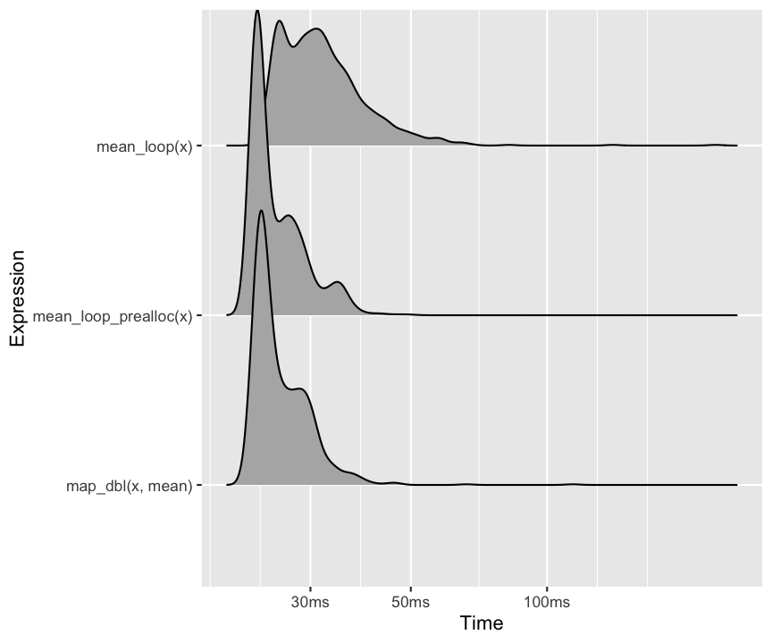

layout: true

```{r setup, echo = FALSE, message = FALSE, warning = FALSE}
source(here::here("scripts/setup.R"))
setup_presentation("vectorisation_and_functional_programming", filename = "24_vectorisation_and_functional_programming.Rmd")
```

---

# What we'll learn

- The concept of vectorisation
- How to identify situations when we can make use of vectorisation
- The basics of functional programming
- How to use the map functions in purrr

---

class: title

# Vectorisation

---

# What is vectorisation?

We have already used vectorisation quite a bit already, but we haven't put a name on it.
It is whenever we act upon a whole vector at once instead of individual values in the vector.

```{r}
x <- c(1, 2, 3, 10, 15, 75, 199, 12, 3, 65)
mean(x)
```

Vectorisation is a **property of functions**.
If a function is vectorised, it can act on a vector as a whole.
Two important attributes of a vectorised function are:

1. They make problems simpler by allowing us to think of a collection of values instead of individual values that we have to iterate over.
2. They are much faster than the equivalent looping implementation.

Oftentimes, it is a matter of finding the function that best fits the problem you are trying to solve.

---

# Looping vs vectorisation

For matrices, there are a collection of vectorised functions for summarising columns and rows: `rowSums()`, `rowMeans()`, `colSums()`, `colMeans()`.

```{r}
x <- matrix(rnorm(2000 * 100), ncol = 100)
```

.pull-left[
```{r}
rowsums_loop <- function(x) {
  sums <- c()
  for (i in seq_len(nrow(x))) {
    sums <- c(sums, sum(x[i, ]))
  }
  sums
}
```
]

.pull-right[
```{r}
rowsums_loop_prealloc <- function(x) {
  sums <- double(nrow(x))
  for (i in seq_len(nrow(x))) {
    sums[i] <- sum(x[i, ])
  }
  sums
}
```
]

```{r}
all(
  rowSums(x) == rowsums_loop(x),
  rowSums(x) == rowsums_loop_prealloc(x)
)
```

---

# Looping vs vectorisation

.pull-left[
```{r rowsums_benchmark, eval = FALSE, fig.show = "hide", fig.height = 5}
benchmark <- bench::mark(
  rowsums_loop(x),
  rowsums_loop_prealloc(x),
  rowSums(x),
  min_time = 2
)

autoplot(benchmark, "ridge") +
  labs(x = "Time", y = "Expression")
```

Not only is it easier to read the code that uses the built-in `rowSums()` function, it is also about 15 times faster than our looping implementation.
]

.pull-right[

]

---

# Other examples of vectorisation

.left-column[
## Indexing
]

.right-column[
```{r}
x <- c(1, 2, 3, 10, 15, 75, 199, 12, 3, 65)
x[x < 10]
x[x > 10] <- NA
x
```
]

---

# Other examples of vectorisation

.left-column[
## Indexing
## Linear algebra
]

.right-column[
Linear algebra is a general example of vectorisation.
If we can formulate a problem in the form of linear algebra, we are almost always guaranteed to have a fast solution.
The reason for this being fast is that the computation is handled by external libraries like [BLAS](https://en.wikipedia.org/wiki/Basic_Linear_Algebra_Subprograms) that are highly optimised for this type of computation.

One example of converting a problem into a linear algebra problem is that of the R package [Matrix eQTL](http://www.bios.unc.edu/research/genomic_software/Matrix_eQTL/).
An eQTL is an association between a genetic variant (usually a SNP) and the expression of a gene.
Instead of performing expensive linear regressions for each pair of SNP and gene, they boil the problem down to a matrix multiplication.

$$
g = \alpha + \beta s + \epsilon \rightarrow \sum_{i=0}^N s_i g_i = \langle s, g \rangle
$$
$$
\mathbf{GS}^\intercal
$$

.right[[Shabalin 2012, Bioinformatics](https://doi.org/10.1093/bioinformatics/bts163)]
]

---

# Writing our own vectorised functions

If you are struggling with finding a vectorised solution to your problem, one alternative is to write your own.
This requires some C++ skills, though.

You can read more about this in [chapter 25 of Advanced R](https://adv-r.hadley.nz/rcpp.html#rcpp).

---

class: title

# Functional programming

---

# Functions make your code simpler

- The DRY principle: Don't Repeat Yourself.
- The intention of the code becomes more clear.
- If you have to change something in your code, you only have to change it in one place, and don't have to locate all the places where it was copy-pasted.

---

# R is to a large extent a functional language

Every programming language has functions, so what makes a language functional?

- Functions are **first-class**, i.e. they behave like any other object.
- Functions are **pure**
  - The output is dependent on the input, and nothing else. If you call a function with the same input, you should get the same output. This would exclude functions like `rnorm()` and `read_csv()`.
  - There should be no side-effects, i.e. the function should not do anything but perform a calculation on the input to produce the output. This would exclude functions like `ggplot()` and `print()`.
  
R doesn't require you to write pure functions, so in that sense it is not purely a functional language. It will however allow you to write parts of your code in a functional manner.

---

# Imperative programming vs functional programming

[Imperative programming](https://en.wikipedia.org/wiki/Imperative_programming) is a paradigm where states are used to change the state of a program.

[Functional programming](https://en.wikipedia.org/wiki/Functional_programming), on the other hand, is centered around functions, and the composition of functions.

???

`for` and `while` loops are parts of imperative programming.
They are straightforward in what they do, but they require quite a bit of code to set up, and they can be hard to read due to this.
What the loop is trying to do is largely obscured by all the mechanics around the loop itself.

---

# The purrr package

purrr is a core package in tidyverse, and it contains tools for functional programming

.center[
[](https://purrr.tidyverse.org/)
]

---

# The map functions

For loops where we want to save some data from each iteration is very common pattern.
Instead of writing loops explicitly, the map functions do exactly this, but in a more concise and readable way.

.pull-left[
```{r}
x <- list(1:100, rnorm(100), runif(100))
```

```{r}
means <- vector("list", length(x))
for (i in seq_along(x)) {
  means[[i]] <- mean(x[[i]])
}
str(means)
```
]

.pull-right[
```{r}
means <- purrr::map(x, mean)
str(means)
```

There are functions in base R that behave similarly to the map functions, mainly the `apply()` family of functions.
The main reason I choose to through the `map()` functions instead is due to their more consistent behaviour and syntax.

If you're interested, check out `?apply` and `?lapply`.
]

---

# The map functions

Depending on the output that you want, there are different map functions:

- `map(.x, .f)` creates lists.
- `map_lgl(.x, .f)` creates a logical vector.
- `map_int(.x, .f)` creates an integer vector.
- `map_dbl(.x, .f)` creates a double vector.
- `map_chr(.x, .f)` creates a character vector.

.pull-left[
All of them take a sequence (vector or list) and applies a function to each element, and returns a new sequence (vector or list, depending on the function) that has the same length as the input.

Functions that take a function as an argument are known as **functionals**.

Check `?map` for details, and related functions.
]

.pull-right[

]

???

These are just some of the map functions that are available to us.

---

# Are loops slow?

Sometimes you hear the argument that you should use `map()`-like functions in R due to `for` loops being slow. This is not really an argument.

.pull-left[
```{r, echo = TRUE}
x <- map(runif(1000, min = 0, max = 10),
         ~ rnorm(10000, mean = .))
str(x)
```
]

.pull-right[
```{r}
mean_loop <- function(x) {
  means <- c()
  for (i in seq_along(x)) {
    means <- c(means, mean(x[[i]]))
  }
  means
}

mean_loop_prealloc <- function(x) {
  means <- double(length(x))
  for (i in seq_along(x)) {
    means[i] <- mean(x[[i]])
  }
  means
}
```
]

---

# Are loops slow?

.pull-left[
```{r loop_map_benchmark, eval = FALSE, fig.height = 5, fig.show = "hide"}
bench::mark(
  mean_loop(x),
  mean_loop_prealloc(x),
  map_dbl(x, mean),
  min_time = Inf,
  max_iterations = 1000,
  memory = FALSE,
  check = FALSE
) %>%
  autoplot("ridge") + 
  labs(x = "Time", y = "Expression")
```

The main reason to prefer a functional programming approach, such as the map functions are for readability purposes, and the fact that you reduce the amount of code you have to write.
]

.pull-right[

]

---

# Data frames are also lists

Since data frames can be seen as lists with the restriction that each element must have the same length, we can also use the map functions directly on a data frame.

```{r}
head(iris)
iris[, -5] %>% 
  map_dbl(mean)
```

---

# Some features of the map functions

## `...` passes arguments to the functions

```{r}
x <- list(c(1:25, NA, 1:74), rnorm(100), runif(100))
map_dbl(x, mean, trim = 0.2, na.rm = TRUE)
```

## Names are preserved

```{r}
z <- list(x = 1:3, y = 4:5)
map_int(z, length)
```

---

# Anonymous functions

Imagine that we want to construct a linear model for different parts of our data.
In this case, we don't want to bother with writing a separate function for this and giving it a name, so we use an **anonymous function**.

```{r}
models <- mpg %>% 
  split(.$cyl) %>% 
  map(function(df) lm(hwy ~ displ, data = df))
```

--

purrr has a shorthand way of writing this, using a one-sided formula.

```{r}
models <- mpg %>% 
  split(.$cyl) %>% 
  map(~ lm(hwy ~ displ, data = .))
```

--

If we want to extract some statistics from these models, we can utilise the map functions once again.

.pull-left[
```{r}
models %>% 
  map(coefficients) %>% 
  map_dbl(~ .[2])
```
]

.pull-right[
`r note("Whenever digging out details from objects like these, the <code>str</code> function can be of great help.", "tip")`
]

---

# List columns

Like we got the models on the previous slide, we converted the data frame into a list of data frames with `split()`.
We can keep everything in a data frame with the help of list columns.

```{r}
mpg %>% 
  nest_by(cyl) %>% 
  summarise(model = list(lm(hwy ~ displ, data = data))) %>% 
  mutate(r2 = map_dbl(model, ~ summary(.)$r.squared))
```

???

`nest_by()` is closely related to `group_by()` that we have seen many times before,
but instead of storing the grouping as metadata for the data frame, it is done explicitly by creating a single row for each group, and having all the data in a list column.

Live demo.

---

# When things go wrong

Normally, if the application of the function to one of the elements results in an error, the whole thing fails, and we get no information on which element failed.

```{r, error = TRUE}
x <- list(5, 4, "x")
map(x, log10)
```

In cases where we might expect errors to occur, we can wrap the function we want to use in `safely()`.
This is a function that takes a function as an argument and gives back another function.
In functional programming, this is known as a **function operator**.
If dplyr functions can be seen like verbs, then functional operators can be seen as adverbs.

```{r}
safe_log10 <- safely(log10)
str(safe_log10("x"))
```

???

Instead of just return the result of the function, it returns a list with two items: `result` and `error`.
If the function succeeds without error, the `result` element will contain the result, and `error` will be `NULL`.
Conversely, if the function fails, the `result` will be `NULL` and the `error` will contain the error message.

---

# Mapping safely

The `safely()` function fits very well into the map framework.
For tips and tricks for how do deal with these results, check out [chapter 21.6 in R for Data Science](https://r4ds.had.co.nz/iteration.html#dealing-with-failure).

```{r}
x <- list(5, 4, "x")
map(x, safely(log10))
```

---

# Mapping possibly

Another adverb we can use is `possibly()`. This creates a function that returns the value if the function succeeds, or a default value if it fails.

```{r}
possibly_log10 <- possibly(log10, NA)
possibly_log10("x")
```

```{r}
x <- list(5, 4, "x")
map_dbl(x, possibly(log10, NA))
```

---

# Multiple arguments

Not seldom do we need multiple variables for the function that we want to use.
For example, consider the `rnorm()` function:

```{r}
args(rnorm)
```

```{r}
mu <- list(5, 10, -3)
map(mu, rnorm, n = 5)
```

???

In this example we only pass in the mean value of the distribution we want to sample from.
What if we also want to set the standard deviation?

---

# Multiple arguments

```{r}
mu <- list(5, 10, -3)
sigma <- list(1, 5, 10)
str(map2(mu, sigma, rnorm, n = 5))
```


---

# Multiple arguments

In `map()`, the current element can be referred to with `.`, as we have seen.
In `map2()`, this would be ambiguous, so we can instead refer to them as `.x` and `.y`.

```{r}
mu <- list(5, 10, -3)
sigma <- list(1, 5, 10)
str(map2(mu, sigma, ~ rnorm(5, mean = .x, sd = .y)))
```

--

We can also refer to them according with their indices with `..1` and `..2`.

```{r}
mu <- list(5, 10, -3)
sigma <- list(1, 5, 10)
str(map2(mu, sigma, ~ rnorm(5, mean = ..1, sd = ..2)))
```

---

# Even more arguments

Let's also modify the number of values that we sample from our distribution.
You could imagine a `map3()` function, but this does not exists.
Instead we have a more general function called `pmap()`, for parallel map.
It takes a list of elements as input and maps them in parallel.

```{r}
x <- list(
  c(1, 3, 5),
  c(5, 10, -3),
  c(1, 5, 10)
)
x %>% 
  pmap(rnorm) %>% 
  str()
```

???

In the previous examples we always generated 5 random numbers for each element.
What if we want to get different numbers of values for each element.

Here we need the elements in the correct order

---

# Even more arguments

If the list is named, the names are used to assign the values to the arguments of the function.

```{r}
x <- list(
  sd = c(1, 5, 10),
  mean = c(5, 10, -3),
  n = c(1, 3, 5)
)
x %>% 
  pmap(rnorm) %>% 
  str()
```

---

# Even more arguments

Just as for `map()`, we can also refer to the variables using their index in the list.

```{r}
x <- list(
  sd = c(1, 5, 10),
  mean = c(5, 10, -3),
  n = c(1, 3, 5)
)
x %>% 
  pmap(~ rnorm(n = ..3, mean = ..2, sd = ..1)) %>% 
  str()
```

---

# Finding the optimal solution for *your* problem

## Issue

You have a problem.
You need to search for a solution to this problem.
But you don't know what the problem is called, so it becomes really hard to search for.

## "Solution"

Read a lot.
With reading, your vocabulary will expand, and you become better and better at expressing yourself.
This is true for any field of study, not just data science or programming.

---

# Take-home messages

- Try to use vectorised solutions, these will be faster than anything else you can write in R.
- Use functional programming principles in order to write more concise and more readable code.
- Don't let anyone discourage you from using loops in R, they are generally not slower than other iteration methods.
- Use preallocation if you write loops.

---

# Suggested reading

## Vectorisation

- [R for Data Science: 20.4.3 Scalars and recycling rules](https://r4ds.had.co.nz/vectors.html#scalars-and-recycling-rules)
- [Advanced R: 24.5 Vectorise](https://adv-r.hadley.nz/perf-improve.html#vectorise)

## Functional programming

- [R for Data Science: Iteration](https://r4ds.had.co.nz/iteration.html)
- [Advanced R: Functional Programming](https://adv-r.hadley.nz/fp.html)